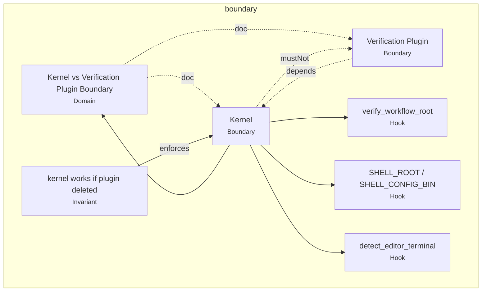
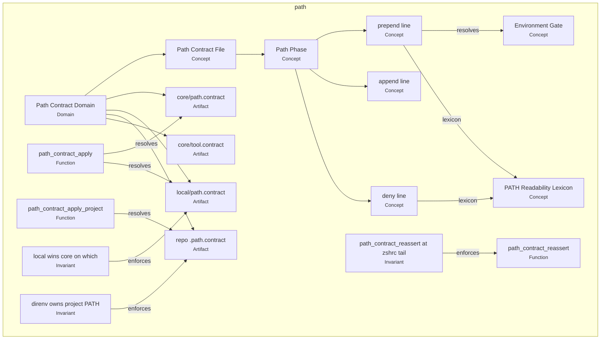
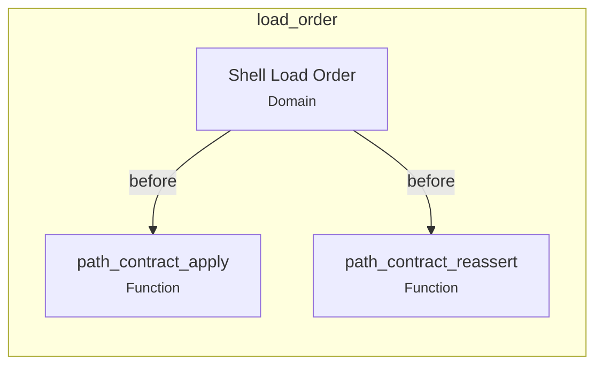

# Ontology graph — visualization

**Source:** [shell-kernel.graph.yaml](shell-kernel.graph.yaml) · **Index:** [INDEX.md](INDEX.md) · **Schema:** [ontology.schema.json](ontology.schema.json)

*Last updated: 2026-06-22*

---

## Best way to view (this repo)

| Method | When to use | Renders where |
|--------|-------------|---------------|
| **This file (curated Mermaid)** | Reading architecture, PR review, agents | GitHub, Cursor markdown preview |
| **`bin/render-ontology-graph.sh`** | After graph edits; CI/drift later (SN-O1) | stdout → paste or pipe to file |
| **INDEX.md tables** | Lookup concept → files without diagram | Everywhere |

**Why Mermaid:** already used in [architecture.md](../../arch-design/architecture.md) and [coming-next.md](../../arch-design/coming-next.md); zero install; diffs stay readable. Full auto-layout of 40+ nodes is a hairball — use **subgraph views** below, not one mega-chart.

**Regenerate:**

```bash
bin/render-ontology-graph.sh --subgraph boundary
bin/render-ontology-graph.sh --subgraph path
bin/render-ontology-graph.sh --subgraph load_order
bin/render-ontology-graph.sh --subgraph all > .agents/ontology/graph.generated.mmd
```

---

## Boundary subgraph (kernel vs plugin)



**Post–SN-4a:** implementation lives in `plugins/verification/`; `bin/*` shims + `verification_script_path` keep stable entrypoints.

---

## PATH subgraph (contract domain)



---

## Load order subgraph



Detail sequence: [architecture.md § PATH precedence](../../arch-design/architecture.md#path-precedence).

---

## SN-O1 (next)

Verification bridge nodes (`ab`, `av`, `at`, `cockpit-mcp`, resolver artifacts) will extend the **boundary** subgraph. Drift gate: `check-ontology.sh` compares extracted facts to this graph.

---

## Decision overlay

Material kernel/plugin choices: [shell-kernel-decision-hooks.md](../../arch-design/overlays/shell-kernel-decision-hooks.md) (HODA).
