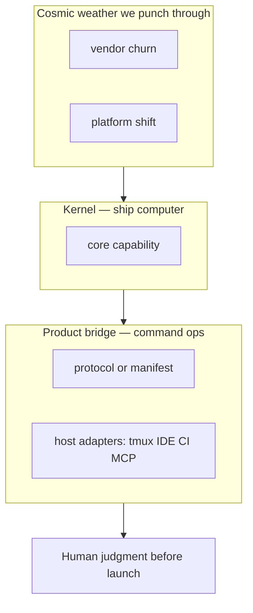
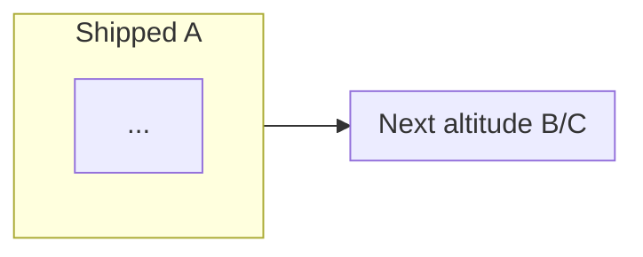
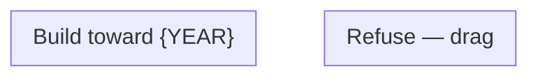

# Stellar Roadmap — Document template (copy into target file)

Replace `{PROJECT}`, `{DATE}`, links, and bracketed placeholders.

```markdown
# Coming next — {PROJECT}

**Audience:** You · implementer · agents  
**Style:** Short words. Diagrams over prose. Optimism grounded in evidence.  
**Contract:** [{boundary-doc}]({path}) · [{risk-doc-if-any}]({path})  
**Method:** [stellar-roadmap skill](~/.cursor/skills/stellar-roadmap/SKILL.md) · collab-finder blueprint style

*Last updated: {DATE}*

---

## 0. Mission (one sentence)

{One sentence: thrive through platform shifts; kernel + evolving bridge/product.}

---

## 0b. Ten-year thrive picture ({YEAR} — not survival, ascent)

{One line: why tailwinds matter.}



| {YEAR} role | What it is | Why it still wins |
|-------------|------------|-------------------|
| **Kernel** | | |
| **Bridge** | | |
| **Boundary** | | |

**Design bet:** {What you are betting on forever vs what is today's renderer.}

---

## 1. Scorecard — what landed ({milestone})



| Area | Grade | One line | Evidence |
|------|-------|----------|----------|
| | | | |

**Plain rule:** {one line}

---

## 2. System map (today)


---

## 3. {Precedence / data-flow title}

```mermaid
sequenceDiagram
  ...
```

| Layer | Owns | Must not |
|-------|------|----------|

---

## 4. Musk five-step — applied to backlog

| Step | Question | Verdict |
|------|----------|---------|

---

## 5. Trajectory forces (evidence-weighted)

| Force | P(horizon) | Effect on us | Response |
|-------|------------|--------------|----------|

**Acceleration trigger:** {when to invest more, not shrink}

---

## 6. Trajectory guardrails



| Risk | Guard | Status |

---

## 7. Blueprint cards — next work

### SN-1 · Dogfood gate (no new code)

**Problem:** ...

| Step | Pass if |
|------|---------|

### SN-N · {Title}

**Problem:** ...

```mermaid
...
```

| File | Work |
|------|------|

**Done when:** ...

**Verify:** ...

---

## 8. Scope lock (user decision)


---

## 9. Sprint order

```mermaid
gantt
  title Backlog order
  dateFormat YYYY-MM-DD
  ...
```

---

## 10. Monitoring signals (command the mission)

| Signal | Healthy | Invest more when |
|--------|---------|------------------|

---

## 11. Done log ({milestone})

| # | Item | Area |

---

## 12. File touch map

```mermaid
mindmap
  root((Coming next))
  ...
```

---

## 13. References

| Doc | Use |
|-----|-----|
| {project boundary} | |
| {architecture depth} | |
| [intuitive-shell-plan](https://github.com/p10ns11y/collab-finder/blob/main/reports/intuitive-shell-plan.md) | Blueprint cards |
| [batch-2-blueprints](https://github.com/p10ns11y/collab-finder/blob/main/reports/batch-2-engineering-blueprints.md) | Scorecard, gantt |
| [single-pr-intuitive-product](https://github.com/p10ns11y/collab-finder/blob/main/reports/single-pr-intuitive-product.md) | Musk 5-step, 2nd/3rd order |
| [stellar-roadmap SKILL](~/.cursor/skills/stellar-roadmap/SKILL.md) | This doc format |

---

*Plain rule: {footer}*
```
