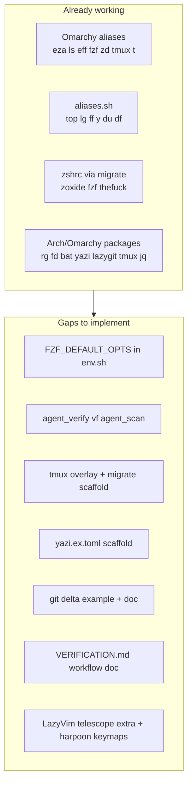

# Lightning-Fast Verification Workflow (Complete Plan)

## Current state vs preplan

Your stack already covers ~60% of the preplan. The work is to **wire the missing 40% into the right layer** and **resolve naming conflicts** — not paste the preplan verbatim into `~/.zshrc`.



### Overlap and conflicts (do not duplicate)

| Preplan item | Your stack today | Decision |
|--------------|------------------|----------|
| `ls` / `eza` | [Omarchy `default/bash/aliases`](file:///home/sustainableabundance/.local/share/omarchy/default/bash/aliases) | Leave in Omarchy |
| `ff` = fastfetch | [aliases.sh](aliases.sh) overrides Omarchy's `ff` = fzf | Keep; use `fzf` / Omarchy `eff` for fuzzy pick |
| `y` = yazi | `y()` in [aliases.sh](aliases.sh) (cd-on-exit) | Keep `y()`; optional `alias y=y` only if you want both |
| `z` / zoxide | `.zshrc` + Omarchy `zd` cd wrapper | No change |
| `top`/`du`/`df` | aliases.sh → btop/dust/duf | Done |
| `lg` | aliases.sh | Done |
| tmux prefix `C-a` | Omarchy uses **`C-Space`** | **Extend Omarchy tmux**, do not replace |
| `eval "$(mise activate)"` in editor | `detect_editor_terminal` + shims | Keep guard; cockpit runs in **Ghostty/tmux**, not Cursor integrated terminal |
| `cat`/`grep`/`find` → bat/rg/fd | Not aliased yet | Add **guarded** aliases in aliases.sh (`command -v` checks) |
| `procs` | Not installed (optional) | Guard alias; document `pacman -S procs` in doc |
| `delta` | Not in git config | Add `git.ex.config` example + migrate copy when absent |

---

## Architecture: where each piece lives

| Concern | Location | Rationale |
|---------|----------|-----------|
| Philosophy + super-flow | New [VERIFICATION.md](VERIFICATION.md) | Git-tracked playbook (like [shell.md](shell.md)) |
| Portable aliases/functions | [aliases.sh](aliases.sh), [functions.sh](functions.sh), [env.sh](env.sh) | Repo source of truth |
| tmux base | Copy Omarchy → `~/.config/tmux/tmux.conf` | Omarchy-owned; user config path expected by [omarchy-restart-tmux](file:///home/sustainableabundance/.local/share/omarchy/bin/omarchy-restart-tmux) |
| tmux verify overlay | `~/.config/tmux/verify.conf` + `%include` at end of base | Small, non-destructive extension |
| yazi defaults | [yazi.ex.toml](yazi.ex.toml) in repo → `~/.config/yazi/yazi.toml` | Mirror [starship.ex.toml](starship.ex.toml) pattern |
| git delta | [git.ex.config](git.ex.config) snippet | Example only; migrate copies to `~/.config/git/config` fragment or documents `git config --global` |
| nvim | `~/.config/nvim/lua/plugins/verification-workflow.lua` | Outside shell repo; linked from VERIFICATION.md |
| migrate scaffolding | [bin/migrate.sh](bin/migrate.sh) | First-run copy for tmux/yazi/git when absent |
| checks | [bin/check-shell.sh](bin/check-shell.sh) | Warn if tmux.conf missing; ok if helpers exist |

---

## Phase 1 — Shell layer (highest impact)

### 1a. `env.sh` — fzf defaults

Add after PATH block (exports section):

```sh
# fzf — bat preview for verification sweeps (matches Omarchy eff/ff style)
export FZF_DEFAULT_OPTS='--height 50% --layout=reverse --border rounded'
export FZF_DEFAULT_OPTS="${FZF_DEFAULT_OPTS} --preview 'bat --style=numbers --color=always --line-range :300 {}'"
export FZF_DEFAULT_OPTS="${FZF_DEFAULT_OPTS} --preview-window=right:60%:wrap"
export FZF_CTRL_T_OPTS='--preview-window=right:60%:wrap'
if command -v fd >/dev/null 2>&1; then
    export FZF_DEFAULT_COMMAND='fd --type f --hidden --follow --exclude .git'
fi
```

Skip preview in `SHELL_IN_EDITOR_TERMINAL=yes` sessions if bat preview causes noise (optional guard using `detect_editor_terminal`).

### 1b. `aliases.sh` — guarded speed aliases

Add only when binaries exist (never break bare systems):

- `cat` → `bat --style=plain` (Omarchy already uses bat for `MANPAGER`)
- `grep` → `rg`
- `find` → `fd`
- `ps` → `procs` (if installed)
- `tt` → `tmux new-window -n test -c "#{pane_current_path}"` (Omarchy-style path token works inside tmux)

Do **not** re-add `ls`, `ff`, `y`, `lg`, `top` — already covered.

### 1c. `functions.sh` — verification cockpit helpers

**`vf`** — fuzzy open in nvim (complements Omarchy `eff`):

```bash
vf() {
  local f
  f="$(fd --type f --hidden --exclude .git 2>/dev/null | fzf --preview 'bat --style=numbers --color=always {}')"
  [ -n "$f" ] && "${EDITOR:-nvim}" "$f"
}
```

**`agent_scan`** — structured post-agent sweep (3–5s reflex):

```bash
agent_scan() {
  local dir="${1:-.}"
  rg -n 'TODO|FIXME|panic!|unwrap\(|ERROR|error:' "$dir" 2>/dev/null | head -30
  command -v dust >/dev/null && dust -s "$dir" 2>/dev/null | head -15
  for f in "$dir"/report.json "$dir"/output.json; do
    [ -f "$f" ] && jq '.summary // .issues // .' "$f" 2>/dev/null | bat -l json
  done
}
```

**`agent_verify`** — tmux cockpit layout (core deliverable):

- Args: `[dir]` (default `$PWD`)
- Early exit with message when `SHELL_IN_EDITOR_TERMINAL=yes` (Cursor phantom-tab / no-tmux UX)
- Requires `tmux` on PATH
- Creates window `verify` with layout:

```
+----------+----------+
| nvim     | lazygit  |
+----------+----------+
| yazi (modified sort hint in doc) |
+----------+----------+
| btop (split)                     |
+----------------------------------+
```

Implementation: use `tmux new-window`, `split-window -h/-v`, `-c "$dir"`, `select-layout` (tiled or main-vertical), send-keys to panes (`yazi`, `btop`, `lazygit`), leave pane 0 for shell/nvim.

Bind convenience alias: `av` → `agent_verify`.

### 1d. `detect_editor_terminal` integration

All tmux-heavy helpers call `detect_editor_terminal` first and print:

> Run in Ghostty/tmux (`t` or Super+Alt+Return), not Cursor integrated terminal.

---

## Phase 2 — tmux (extend Omarchy)

You chose **extend Omarchy** — keep `C-Space` prefix and existing bindings from [omarchy/config/tmux/tmux.conf](file:///home/sustainableabundance/.local/share/omarchy/config/tmux/tmux.conf).

### 2a. migrate.sh scaffold

New step (after starship copy pattern):

1. If `~/.config/tmux/tmux.conf` missing → copy Omarchy template
2. Append managed marker block if absent:

```tmux
# Managed by ~/.config/shell/bin/migrate.sh
%include ~/.config/tmux/verify.conf
```

3. Write [tmux.verify.conf.ex](tmux.verify.conf.ex) to repo; copy to `~/.config/tmux/verify.conf` when absent

### 2b. `tmux.verify.conf.ex` contents (minimal overlay)

- `bind V run-shell '~/.config/shell/bin/agent-verify-layout.sh "#{pane_current_path}"'` — delegates layout to script (easier to maintain than inline send-keys)
- `bind Z resize-pane -Z` — zoom pane (preplan `Prefix+z`)
- Optional: `bind Space next-layout` if not conflicting with prefix

**Do not** change Omarchy prefix, `h`/`v` split semantics, or Hyprland `Super+Alt+Return` tmux binding.

### 2c. `bin/agent-verify-layout.sh`

Standalone script (callable from tmux `run-shell` and `agent_verify` function):

- Input: target directory
- Idempotent: if window `verify` exists, `select-window` instead of duplicating
- Sets layout + launches tools per pane
- Uses Omarchy path tokens: `#{pane_current_path}`

### 2d. TPM plugins (optional, documented only)

Document in VERIFICATION.md — **not** auto-installed (Omarchy tmux.conf has no TPM today):

- `tmux-resurrect` + `tmux-continuum` for session persistence
- User installs TPM manually if desired

---

## Phase 3 — yazi + git pretty diffs

### 3a. `yazi.ex.toml`

Repo example with verification-focused defaults:

- `[opener]` — `e` opens in `$EDITOR` (nvim)
- `[mgr]` — sort by modified (document `o` then `m` in VERIFICATION.md)
- Preview uses built-in or bat adapter if available

migrate.sh: copy to `~/.config/yazi/yazi.toml` when absent (create `~/.config/yazi/`).

### 3b. `git.ex.config`

Snippet for delta + lazygit synergy:

```ini
[core]
    pager = delta
[interactive]
    diffFilter = delta --color-only
[delta]
    navigate = true
    side-by-side = true
```

Document: `git config --global include.path ~/.config/git/verification` or paste manually. migrate optionally writes `~/.config/git/verification` and suggests one `include.path` line.

---

## Phase 4 — Neovim (full Telescope per your choice)

LazyVim currently defaults to **snacks.nvim** picker. You chose **full Telescope**.

### 4a. Enable Telescope picker

Create `~/.config/nvim/lua/plugins/verification-workflow.lua`:

```lua
vim.g.lazyvim_picker = "telescope"
return {
  { import = "lazyvim.plugins.extras.editor.telescope" },
  -- harpoon for pinned verify files
  {
    "ThePrimeagen/harpoon",
    branch = "harpoon2",
    dependencies = { "nvim-lua/plenary.nvim" },
    keys = { ... verification pins ... },
  },
}
```

This pulls the full keymap set from [LazyVim telescope extra](file:///home/sustainableabundance/.local/share/nvim/lazy/LazyVim/lua/lazyvim/plugins/extras/editor/telescope.lua): `<leader>sg` live_grep, `<leader>ff` find_files, `<leader>sq` quickfix, etc.

### 4b. Verification-specific nvim keymaps (additive)

| Key | Action |
|-----|--------|
| `<leader>sg` | live_grep (root) — already from extra |
| `<leader>/` | live_grep — already from extra |
| `<leader>va` | `agent_scan` equivalent: Telescope live_grep with preset `TODO\|FIXME\|panic\|unwrap` |
| `<leader>vf` | find_files sorted by mtime (custom picker opts) |
| `<leader>vh` | Harpoon: add file |
| `<leader>hj` / `<leader>hk` | Harpoon: next/prev |
| `<leader>ht` | Harpoon: quick menu |

### 4c. Quickfix bridge from terminal

Document in VERIFICATION.md:

```bash
rg --vimgrep 'pattern' src/ | nvim -q -
```

Works with Telescope quickfix integration when already in nvim.

---

## Phase 5 — Documentation and checks

### 5a. New [VERIFICATION.md](VERIFICATION.md)

Sections:

1. **Philosophy** — frictionless feedback loops (from preplan, trimmed)
2. **Tool map** — what lives where (Omarchy vs shell repo vs tmux vs nvim)
3. **Cockpit layout** — ASCII diagram + Omarchy key reference (`C-Space`, `h`/`v` splits, `M-1..9` windows)
4. **Agent super-flow** — 7-step loop with concrete commands (`z`, `y`, `agent_scan`, `lg`, `av`)
5. **Daily rhythm** — `ff` → `t` → `z project` → verify
6. **Cursor vs native terminal** — when to use Ghostty/tmux vs editor terminal
7. **Optional installs** — procs, delta, TPM plugins

Cross-link from [README.md](README.md) Maintenance/Troubleshooting (one row + link).

### 5b. `check-shell.sh` additions

- OK/WARN: `agent_verify` / `vf` defined in functions.sh
- WARN: `~/.config/tmux/tmux.conf` missing (run migrate)
- WARN: `FZF_DEFAULT_OPTS` not in env.sh
- Optional: nvim plugin file exists (informational, outside repo)

### 5c. `migrate.sh` template sync

Update embedded `aliases.sh` / `functions.sh` / `env.sh` heredocs to match live modules (same pattern as recent mise guard changes).

---

## Implementation order

1. **env.sh** FZF exports + **aliases.sh** guarded aliases (immediate terminal win)
2. **functions.sh** `vf`, `agent_scan`, `agent_verify` + **bin/agent-verify-layout.sh**
3. **tmux** scaffold + verify overlay + migrate step
4. **VERIFICATION.md** + README link
5. **yazi.ex.toml** + **git.ex.config** + migrate copies
6. **nvim** verification-workflow.lua (Telescope extra + Harpoon)
7. **check-shell.sh** checks + migrate heredoc sync

---

## Verification test plan

After implementation:

```bash
source ~/.zshrc
~/.config/shell/bin/check-shell.sh
shell_debug                    # Editor terminal line visible
detect_editor_terminal; echo $SHELL_IN_EDITOR_TERMINAL
vf                             # fuzzy open (native terminal)
agent_scan .                   # rg + dust output
t                              # Omarchy tmux attach
# inside tmux:
agent_verify ~/path/to/project # cockpit layout
# Prefix+V if bound
lg                             # lazygit in review pane
```

In nvim: `:Lazy` → confirm telescope extra loaded; `<leader>sg` opens live_grep; `<leader>vh` adds harpoon pin.

In Cursor integrated terminal: `agent_verify` should **refuse** gracefully; mise hook remains skipped.

---

## Out of scope (explicit)

- Replacing Omarchy tmux prefix/bindings with preplan `C-a` layout
- Installing TPM/tmux-resurrect automatically
- Changing LazyVim core beyond enabling telescope extra + verification plugin
- Agent/Cursor hooks for sandbox PATH (separate from this verification cockpit)
