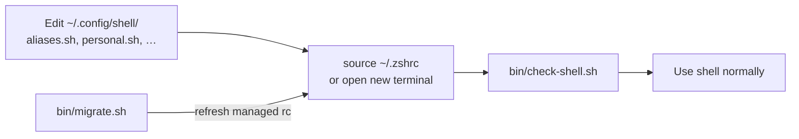

# ~/.config/shell/

Clean, portable, and low-maintenance shell configuration that works across **bash**, **zsh**, and **fish**.

## Audience

**This is for advanced users only.** You should already be comfortable fixing a broken shell environment and recovering a system when things go wrong.

Shell config touches `PATH`, login files, and tool initialization. A bad edit can leave new terminals unusable — wrong `PATH`, syntax errors on `source`, or broken hooks — so the very tools you normally use to fix things (`git`, `nvim`, `mise`, your editor, even `cd`) may not be available in that session.

Before changing anything here, know how you would recover without relying on a working interactive shell: a root/rescue TTY, a minimal `bash --norc`, booting from another user, restoring from `backups/*/revert.sh`, or fixing dotfiles from a graphical file manager or SSH session that does not load your broken rc.

If that sounds stressful, use a simpler, distribution-default setup instead.

## Philosophy

- **Minimal duplication** across shells
- **Single source of truth** for environment and aliases
- **Respect Omarchy** as your personal base layer
- **Easy to maintain** long-term
- **Git tracked** for history and easy syncing across machines

## Directory Structure

```
~/.config/shell/
├── README.md
├── shell.md            # Load-order reference and architecture
├── env.sh              # Portable PATH + environment variables
├── aliases.sh          # Generic aliases + personal.sh chain
├── personal.sh         # Your work/personal specific aliases
├── functions.sh        # Custom functions (optional)
├── bin/
│   ├── migrate.sh      # Master migration / setup script
│   └── check-shell.sh  # Verify load order and guardrails
└── backups/            # Timestamped backups + revert.sh
```

## File Responsibilities

| File            | Purpose                                      | Edit Frequency | Notes |
|-----------------|----------------------------------------------|----------------|-------|
| `env.sh`        | PATH setup, exports, environment variables   | Rarely         | Sourced by all shells |
| `aliases.sh`    | Generic useful aliases                       | Occasionally   | Sourced by bash, zsh, fish (via bass) |
| `personal.sh`   | Your work-specific aliases (agrepos, etc.)   | Frequently     | Chained from `aliases.sh` tail only |
| `functions.sh`  | Custom shell functions                       | Rarely         | Sourced by bash + zsh rc files |
| `migrate.sh`    | One-command setup / migration script         | Rarely         | Regenerates dotfiles; preserves existing modules |
| `check-shell.sh`| Load-order and reserved-name verification    | Never          | Run after edits or before migrate |

## Shell files, switching, and workflow

Your config lives in two layers:

| Layer | Where | What you edit day-to-day |
|-------|--------|---------------------------|
| **Portable modules** | `~/.config/shell/` (git) | `env.sh`, `aliases.sh`, `personal.sh`, `functions.sh` |
| **Per-shell entrypoints** | `~/.zshrc`, `~/.bashrc`, fish config | Rarely — thin wrappers that `source` the modules |

The rc/profile files in `$HOME` are **not** the source of truth. They only wire each shell into `~/.config/shell/`. See [shell.md — Startup files](shell.md#startup-files-what-rc-profile-mean) for the full load-order map.

### Quick glossary

| File | Shell | When it runs |
|------|-------|--------------|
| `~/.zshenv` | zsh | Every zsh (scripts too) — cargo, vite-plus |
| `~/.zprofile` | zsh | Login zsh only — sources `env.sh` |
| `~/.zshrc` | zsh | Interactive zsh — full stack |
| `~/.profile` | POSIX/bash | Login — GPG, `env.sh`, cargo, vite-plus |
| `~/.bash_profile` | bash | Login bash — sources `~/.bashrc`, vite-plus |
| `~/.bashrc` | bash | Interactive bash — full stack |
| `~/.config/fish/config.fish` | fish | Interactive fish — single combined config |

**Login** = you started a session as a login shell (TTY login, some terminal emulators, `zsh -l`, `bash -l`). **Interactive** = you have a prompt. A normal terminal tab is usually both.

### How to switch shells

**Change your default** (new terminals use this):

```bash
chsh -s /usr/bin/zsh    # or /usr/bin/bash, /usr/bin/fish
```

**Try another shell temporarily** (leaves default unchanged):

```bash
exec zsh      # switch current session to zsh
exec bash     # switch to bash
exec fish     # switch to fish
exit          # leave a subshell and return to the parent shell
```

**Run a one-off command in another shell:**

```bash
bash -lc 'echo $SHELL; alias ff'
zsh -ic 'reload'
```

Check what is actually running: `echo $0` or `ps -p $$ -o comm=`. `$SHELL` is only your *login default*, not the current process.

### Day-to-day workflow



1. **Change aliases, PATH, exports** → edit `~/.config/shell/`, not rc files.
2. **Reload** → `source ~/.zshrc` (or `reload` in zsh) or open a new terminal.
3. **Verify** → `~/.config/shell/bin/check-shell.sh`.
4. **Re-apply rc templates** → `migrate.sh` (only touches managed `~/.zshrc` / `~/.bashrc` / fish config).

### When switching shells makes sense

You do **not** need to switch often. Pick one default (zsh) and stay there unless the situation calls for another shell.

| Situation | Shell | Why |
|-----------|-------|-----|
| Daily dev, local terminal | **zsh** (default) | Full tooling: thefuck, grok completions, modular Omarchy |
| SSH to a server or container | **bash** | Usually the only installed shell; scripts assume it |
| Running a third-party install script | **bash** | Many scripts hardcode `#!/bin/bash` or bash-isms |
| Debugging "works in my terminal" issues | **bash -l** or **zsh -l** | Reproduce login vs non-login PATH differences |
| Writing portable automation | **none / sh** | Scripts should not rely on your interactive rc |
| Experimenting with fish UI | **fish** (temporary `exec fish`) | Optional; incomplete `ga`/`gd` parity |
| CI, Docker, Makefile `SHELL=` | **bash** | Non-interactive; minimal env |

**Rule of thumb:** interactive work → zsh; compatibility and servers → bash; scripts → explicit shebang, do not assume your dotfiles loaded.

## Recommended Shell Usage

### zsh (Recommended Daily Driver)

**Use for:** Interactive development work, daily terminal use.

**Why:**
- Excellent balance of power and modernity
- Native support for `starship`, `mise activate zsh`, `zoxide init zsh`, `fzf --zsh`
- Fast startup with the current setup
- Great plugin ecosystem (without needing Oh My Zsh)
- Works very well with the current `env.sh` + `aliases.sh` + `personal.sh` structure

**When to use:**
- Most of your daily work
- When you want beautiful prompt + smart completions + modern tools

### bash

**Use for:** Maximum compatibility, scripts, servers, CI/CD, containers.

**Why:**
- Ubiquitous — available on almost every Unix-like system
- Required for many scripts and legacy tools
- Shares the same `env.sh` and `aliases.sh` layer as zsh, with Omarchy loaded via its `rc` bundle

**When to use:**
- Writing portable scripts
- Working on remote servers or containers
- Running third-party scripts that assume bash

### fish

**Use for:** Modern interactive experience (optional).

**Why:**
- Very user-friendly defaults (autosuggestions, syntax highlighting out of the box)
- Clean syntax
- Best-effort parity via `bass` for `env.sh`, Omarchy aliases, and `aliases.sh`

**When to use:**
- When you want a very polished interactive shell
- Experimentation or personal preference
- Not recommended as your only shell (due to compatibility)

**Limitations:** Omarchy worktree functions (`ga`, `gd`) need fish-native ports. Fish gets direnv, fzf, thefuck (native), and `functions.sh` via bass.

## How Sourcing Works

Load order is consistent across bash and zsh: Omarchy loads **before** your layer so its functions (like `ga`) are defined first; `aliases.sh` loads **after** so your overrides win.

### zsh and bash

1. `env.sh` — PATH, exports, Omarchy envs
2. `direnv` hook (when installed)
3. Omarchy — modular parts in zsh (`aliases`, `functions`); monolithic `rc` in bash
4. `functions.sh` — your custom functions
5. `aliases.sh` — generic aliases
6. `personal.sh` — chained at the tail of `aliases.sh`
7. Shell-native tool inits (`starship`, `mise`, `zoxide`, etc.)

### fish (best-effort)

1. `bass` → `env.sh`
2. `direnv hook fish`
3. `bass` → Omarchy aliases
4. `bass` → `functions.sh`
5. `bass` → `aliases.sh` (includes `personal.sh`)
6. Native fish inits for `starship`, `zoxide`, `mise`, `fzf`, `thefuck`

This order ensures:
- Omarchy functions like `ga()` are never shadowed by a premature `alias ga=`
- Your aliases (`ff`, `gs`, `top`, etc.) win over Omarchy when names overlap
- Work shortcuts in `personal.sh` are available in bash, zsh, and fish

## Reserved Names

Do not alias these — Omarchy owns them as functions:

| Name | Meaning |
|------|---------|
| `ga` | `git worktree add` helper |
| `gd` | remove worktree + branch |

`ff` is intentionally overridden to `fastfetch` in `aliases.sh` (Omarchy defines it as fzf). Use `fzf` or Omarchy's `eff` for file picking.

## How to Add New Aliases

### Generic / Commonly Useful
→ Add to `~/.config/shell/aliases.sh`

### Work / Personal Specific
→ Add to `~/.config/shell/personal.sh`

### API keys / secrets
→ `~/.config/secrets/dev.env` (outside git; loaded via `personal.sh`)

Do **not** put `.envrc` in `~/.config/shell/` — Cursor uses that folder as workspace cwd, and direnv would fire on every prompt.

### Custom Functions
→ Add to `~/.config/shell/functions.sh`

Example in `personal.sh`:

```bash
alias myproject="cd ~/Work/my-important-project"
alias deploy="make deploy"
```

After editing, reload and verify:

```bash
source ~/.zshrc   # or: source ~/.bashrc
~/.config/shell/bin/check-shell.sh
```

## Maintenance

- Run `~/.config/shell/bin/check-shell.sh` after editing rc files or shell modules
- Run `~/.config/shell/bin/migrate.sh` to refresh **managed** rc files (`~/.zshrc`, `~/.bashrc`, fish config)
- Hand-edited rc files (no managed marker) are **skipped** — use `migrate.sh --force-rc` to overwrite
- `migrate.sh` **preserves** existing `env.sh`, `aliases.sh`, and `functions.sh` — it only regenerates them on first setup
- The `backups/` folder contains timestamped backups + a `revert.sh`
- Everything important lives under `~/.config/shell/` and is git tracked
- See [shell.md](shell.md) for startup files, load order, switching, and remaining caveats

## Notes

- This setup treats **Omarchy** as your personal foundation and layers modern tooling on top without fighting it.
- The goal is **low cognitive load** — you should rarely need to edit `~/.zshrc` or `~/.bashrc` directly.
- **PATH** is owned by `env.sh` (`path_prepend` / `path_append`; `path_add` aliases prepend). Last `path_prepend` wins. Use `path_debug` in `functions.sh`. Omarchy still prepends its bin dir via envs.