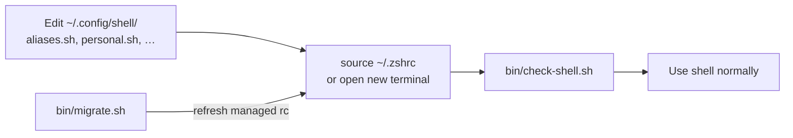

# ~/.config/shell/

Clean, portable, and low-maintenance shell configuration that works across **bash**, **zsh**, and **fish**.

## Audience

**This is for advanced users only.** You should already be comfortable fixing a broken shell environment and recovering a system when things go wrong.

Shell config touches `PATH`, login files, and tool initialization. A bad edit can leave new terminals unusable — wrong `PATH`, syntax errors on `source`, or broken hooks — so the very tools you normally use to fix things (`git`, `nvim`, `mise`, your editor, even `cd`) may not be available in that session.

Before changing anything here, know how you would recover without relying on a working interactive shell: a root/rescue TTY, a minimal `bash --norc`, `~/.config/shell/bin/recover-shell.sh`, booting from another user, restoring from `backups/*/revert.sh`, or fixing dotfiles from a graphical file manager or SSH session that does not load your broken rc.

If that sounds stressful, use a simpler, distribution-default setup instead.

## Getting started

Use this path on a **new machine** or after cloning the repo. Existing setups can skip to [Maintenance](#maintenance).

### Prerequisites

| Requirement | Why |
|-------------|-----|
| **Omarchy** at `~/.local/share/omarchy` | `ga`/`gd` worktree helpers, alias layer, bash `rc` bundle |
| **direnv** (recommended) | Managed rc templates guard `direnv hook` with `command -v direnv` (fish: `type -q`). zsh uses a shell-aware hook when sourcing `.zshrc` from bash |
| **fish + bass** (fish only) | Fish loads portable modules via the bass plugin; without bass, env/aliases fail silently (`or true`) |
| **paru** (Arch only, optional) | `bin/migrate.sh` tries `paru -S yazi thefuck procs difftastic` when missing; other distros install those manually |

### First install

**One-liner** (fetches the full config from GitHub, then migrates):

```bash
curl -fsSL https://raw.githubusercontent.com/p10ns11y/shellyxz.sh/refs/heads/master/bin/migrate.sh | bash
```

The script detects `curl | bash`, downloads missing repo files (`lib.sh`, `env.sh`, `bin/check-shell.sh`, `bin/recover-shell.sh`, docs, …) from the same branch, then runs migration. Override source with `SHELL_CONFIG_RAW=...` for forks.

**Or clone + run:**

```bash
# 1. Clone the repo
git clone git@github.com:p10ns11y/shellyxz.sh.git ~/.config/shell

# 2. Run migration (backs up dotfiles, generates rc + login templates)
~/.config/shell/bin/migrate.sh

# 3. Optional: secrets (personal.sh ships from repo; edit for your machine)
mkdir -p ~/.config/secrets
# add API keys to ~/.config/secrets/dev.env (loaded by personal.sh)

# 4. Reload and verify
source ~/.zshrc                            # or: source ~/.bashrc
git config --global include.path ~/.config/git/verification   # enable delta (lazygit + git pager)
~/.config/shell/bin/check-shell.sh

# Verification aliases (after procs/difftastic installed): ps, gdf, gdfs — see VERIFICATION.md
# Starship: migrate copies starship.ex.toml → ~/.config/starship.toml when absent
# Mamba/conda: env.sh sets CONDA_CHANGEPS1=false; Starship [conda] module shows (env) inline
```

**What `bin/migrate.sh` does on first run:**

- Bootstraps missing files from GitHub when piped or when `lib.sh` / helper scripts are absent (`--bootstrap` to retry fetch)
- Backs up existing dotfiles to `backups/TIMESTAMP/` (gitignored) with `revert.sh`
- Generates `env.sh`, `aliases.sh`, `functions.sh` only if still missing after bootstrap (preserves existing)
- Regenerates managed `~/.zshrc`, `~/.bashrc`, fish config (skips hand-edited rc files)
- Generates login dotfiles (`~/.zprofile`, `~/.zshenv`, `~/.profile`, `~/.bash_profile`) when missing or managed
- Installs `~/.config/starship.toml` from `starship.ex.toml` when absent
- Creates empty `completions/` placeholder directory
- Bootstraps `starship.ex.toml` example in the repo
- Runs `git init` + initial commit inside `~/.config/shell` if no `.git` exists
- Does **not** create secrets (`~/.config/secrets/dev.env`)

## Philosophy

- **Minimal duplication** across shells
- **Single source of truth** for environment and aliases
- **Respect Omarchy** as your personal base layer
- **Easy to maintain** long-term
- **Git tracked** for history and easy syncing across machines

## Directory Structure

```
~/.config/shell/
├── README.md
├── VERIFICATION.md           # Agent verification cockpit workflow
├── human-in-the-loop-workflow.md  # Repeatable agent-review rituals (simple → complex)
├── shell.md                    # Load-order reference and architecture
├── SHELL-env-var-behavior.md   # Why $SHELL lies; truth seeker; Ghostty gtk-single-instance
├── starship.ex.toml            # Example Starship config (copy to ~/.config/starship.toml)
├── tmux.verify.conf.ex         # tmux verify overlay (→ ~/.config/tmux/verify.conf)
├── yazi.ex.toml                # yazi defaults (→ ~/.config/yazi/yazi.toml)
├── git.ex.config               # git delta snippet (→ ~/.config/git/verification)
├── lib.sh              # Safe sourcing helpers (Omarchy, secrets, permissions)
├── env.sh              # Portable PATH + environment variables
├── aliases.sh          # Generic aliases + personal.sh chain (bash)
├── personal.sh         # Your work/personal specific aliases
├── functions.sh        # Custom functions (bash)
├── bin/
│   ├── README.md           # Detailed usage for every script in bin/
│   ├── migrate.sh      # Master migration / setup script
│   ├── check-shell.sh  # Load order, shellcheck, reserved names
│   ├── recover-shell.sh # Nuclear recovery when rc files break
│   ├── agent-verify-layout.sh  # tmux verification cockpit
│   └── fzf-preview.sh  # fzf bat preview (internal)
└── backups/            # Created by migrate.sh (gitignored) — timestamped + revert.sh
```

`backups/` is empty in git; it appears after the first `bin/migrate.sh` run. Use `backups/<timestamp>/revert.sh` to roll back dotfiles.

## File Responsibilities

| File            | Purpose                                      | Edit Frequency | Notes |
|-----------------|----------------------------------------------|----------------|-------|
| `lib.sh`        | Safe loaders (Omarchy paths, secrets, permissions) | Rarely         | Sourced by env.sh and personal.sh |
| `env.sh`        | PATH setup, exports, environment variables   | Rarely         | Sourced by all shells |
| `aliases.sh`    | Generic useful aliases                       | Occasionally   | bash shebang; sourced by bash, zsh, fish (via bass) |
| `personal.sh`   | Your work-specific aliases (agrepos, etc.)   | Frequently     | Chained from `aliases.sh` tail only |
| `functions.sh`  | Custom shell functions (`path_debug`, `reload`) | Rarely      | bash shebang; sourced by bash + zsh rc files |
| `bin/migrate.sh`    | One-command setup / migration script         | Rarely         | Regenerates dotfiles; preserves existing modules |
| `bin/check-shell.sh`| Load order, shellcheck, reserved names, zsh runtime checks | Never | `shellcheck` always; `--audit` adds secrets permissions |
| `bin/recover-shell.sh` | Nuclear recovery when rc files break      | Never          | Works without sourcing broken rc files |

### Shebang policy

| File | Shebang | Why |
|------|---------|-----|
| `lib.sh`, `env.sh`, `personal.sh` | `sh` | POSIX-portable loaders; fish via bass |
| `aliases.sh`, `functions.sh` | `bash` | `local`, `source`, `y()` need bash/zsh semantics |

`check-shell.sh` runs `shellcheck -s sh` or `-s bash` per file accordingly.

### `lib.sh` and secrets (summary)

See [shell.md — lib.sh helpers](shell.md#libsh-helpers) for the full API.

| Concern | Mechanism |
|---------|-----------|
| Omarchy paths | `source_omarchy`, `omarchy_file` — optional install, `OMARCHY_WARN=1` for missing modules |
| External dotfiles | `source_if_safe` — ownership + not world-writable |
| Secrets | `load_secrets_file` on `~/.config/secrets/dev.env` (mode **600**, `KEY=value` only) |
| `$SHELL` accuracy | `shell_truth_seeker` in `env.sh` (default on); `SHELL_TRUTH_SEEKER=0` to keep inherited value |

Deep dive on `$SHELL` inheritance vs truth seeker: [SHELL-env-var-behavior.md](SHELL-env-var-behavior.md).

## Shell files, switching, and workflow

Your config lives in two layers:

| Layer | Where | What you edit day-to-day |
|-------|--------|---------------------------|
| **Portable modules** | `~/.config/shell/` (git) | `env.sh`, `aliases.sh`, `personal.sh`, `functions.sh` |
| **Per-shell entrypoints** | `~/.zshrc`, `~/.bashrc`, fish config | Rarely — thin wrappers that `source` the modules |

The rc/profile files in `$HOME` are **not** the source of truth. They only wire each shell into `~/.config/shell/`. See [shell.md — Startup files](shell.md#startup-files-what-rc-profile-mean) for the full load-order map.

### Quick glossary

| File | Shell | When it runs |
|------|-------|--------------|
| `~/.zshenv` | zsh | Every zsh (scripts too) — cargo, vite-plus |
| `~/.zprofile` | zsh | Login zsh only — sources `env.sh` |
| `~/.zshrc` | zsh | Interactive zsh — full stack |
| `~/.profile` | POSIX/bash | Login — GPG, `env.sh`, cargo, vite-plus |
| `~/.bash_profile` | bash | Login bash — sources `~/.bashrc`, vite-plus |
| `~/.bashrc` | bash | Interactive bash — full stack |
| `~/.config/fish/config.fish` | fish | Interactive fish — single combined config |

**Login** = you started a session as a login shell (TTY login, some terminal emulators, `zsh -l`, `bash -l`). **Interactive** = you have a prompt. A normal terminal tab is usually both.

### How to switch shells

**Change your default** (new terminals use this):

```bash
chsh -s /usr/bin/zsh    # or /usr/bin/bash, /usr/bin/fish
```

After `chsh`, **log out and back in** (or `exec /usr/bin/zsh -l` in the current tab). Ghostty uses your login shell from passwd; with `gtk-single-instance`, run `killall ghostty` after `chsh` so new windows pick it up (closing windows is not enough). Do not edit `~/.config/ghostty/config` for shell choice — Omarchy maintains it.

**`$SHELL` before config loads** is often stale (inherited from when the terminal tab opened). After `source ~/.zshrc`, `shell_truth_seeker` in `env.sh` sets `$SHELL` to the live interpreter by default. Use `shell_debug`, `echo $0`, or `ps -p $$` when debugging — see [SHELL-env-var-behavior.md](SHELL-env-var-behavior.md).

**Try another shell temporarily** (leaves default unchanged):

```bash
exec zsh      # switch current session to zsh
exec bash     # switch to bash
exec fish     # switch to fish
exit          # leave a subshell and return to the parent shell
```

**Run a one-off command in another shell:**

```bash
bash -lc 'echo $SHELL; alias ff'
zsh -ic 'reload'   # or bash -ic 'reload' (now works in both)
```

Check what is actually running: `echo $0` or `ps -p $$ -o comm=`. `$SHELL` is only your *login default*, not the current process.

### Day-to-day workflow



1. **Change aliases, PATH, exports** → edit `~/.config/shell/`, not rc files.
2. **Reload** → `reload` (works in both bash and zsh; sources the right rc file) or `source ~/.zshrc` / `source ~/.bashrc`, or open a new terminal.
3. **Verify** → `~/.config/shell/bin/check-shell.sh`.
4. **Re-apply rc templates** → `bin/migrate.sh` (only touches managed `~/.zshrc` / `~/.bashrc` / fish config).

### When switching shells makes sense

You do **not** need to switch often. Pick one default (zsh) and stay there unless the situation calls for another shell.

| Situation | Shell | Why |
|-----------|-------|-----|
| Daily dev, local terminal | **zsh** (default) | Full tooling: thefuck, grok completions, modular Omarchy |
| SSH to a server or container | **bash** | Usually the only installed shell; scripts assume it |
| Running a third-party install script | **bash** | Many scripts hardcode `#!/bin/bash` or bash-isms |
| Debugging "works in my terminal" issues | **bash -l** or **zsh -l** | Reproduce login vs non-login PATH differences |
| Writing portable automation | **none / sh** | Scripts should not rely on your interactive rc |
| Experimenting with fish UI | **fish** (temporary `exec fish`) | Optional; incomplete `ga`/`gd` parity |
| CI, Docker, Makefile `SHELL=` | **bash** | Non-interactive; minimal env |

**Rule of thumb:** interactive work → zsh; compatibility and servers → bash; scripts → explicit shebang, do not assume your dotfiles loaded.

## Recommended Shell Usage

### zsh (Recommended Daily Driver)

**Use for:** Interactive development work, daily terminal use.

**Why:**
- Excellent balance of power and modernity
- Native support for `starship`, `mise activate zsh`, `zoxide init zsh`, `fzf --zsh`
- Fast startup with the current setup
- Great plugin ecosystem (without needing Oh My Zsh)
- Works very well with the current `env.sh` + `aliases.sh` + `personal.sh` structure

**When to use:**
- Most of your daily work
- When you want beautiful prompt + smart completions + modern tools

### bash

**Use for:** Maximum compatibility, scripts, servers, CI/CD, containers.

**Why:**
- Ubiquitous — available on almost every Unix-like system
- Required for many scripts and legacy tools
- Shares the same `env.sh` and `aliases.sh` layer as zsh, with Omarchy loaded via its `rc` bundle

**When to use:**
- Writing portable scripts
- Working on remote servers or containers
- Running third-party scripts that assume bash

### fish

**Use for:** Modern interactive experience (optional).

**Why:**
- Very user-friendly defaults (autosuggestions, syntax highlighting out of the box)
- Clean syntax
- Best-effort parity via `bass` for `env.sh`, Omarchy aliases, and `aliases.sh`

**When to use:**
- When you want a very polished interactive shell
- Experimentation or personal preference
- Not recommended as your only shell (due to compatibility)

**Prerequisites:** Install the [bass](https://github.com/edc/bass) fish plugin. Without bass, `env.sh` / `aliases.sh` sourcing fails silently.

**Limitations:** Omarchy worktree functions (`ga`, `gd`) need fish-native ports. Fish gets direnv, fzf, thefuck (native), and `functions.sh` via bass.

## How Sourcing Works

Load order is consistent across bash and zsh: Omarchy loads **before** your layer so its functions (like `ga`) are defined first; `aliases.sh` loads **after** so your overrides win.

### zsh and bash

1. `env.sh` — PATH, exports, Omarchy envs (`CONDA_CHANGEPS1=false` for Starship conda module)
2. `direnv` hook — guarded with `command -v direnv`; zsh: zsh/bash-aware when sourced from bash
3. Omarchy — modular parts in zsh (`aliases`, `functions`); monolithic `rc` in bash
4. `functions.sh` — your custom functions
5. `aliases.sh` — generic aliases
6. `personal.sh` — chained at the tail of `aliases.sh`
7. Shell-native tool inits — **mamba** (when installed), then `mise`, `starship`, `zoxide`, etc.

### fish (best-effort)

1. `bass` → `env.sh`
2. `direnv hook fish`
3. `bass` → Omarchy aliases
4. `bass` → `functions.sh`
5. `bass` → `aliases.sh` (includes `personal.sh`)
6. Native fish inits for `starship`, `zoxide`, `mamba`, `mise`, `fzf`, `thefuck`

This order ensures:
- Omarchy functions like `ga()` are never shadowed by a premature `alias ga=`
- Your aliases (`ff`, `gs`, `top`, etc.) win over Omarchy when names overlap
- Work shortcuts in `personal.sh` are available in bash, zsh, and fish

## Reserved Names

Do not alias these — Omarchy owns them as functions:

| Name | Meaning |
|------|---------|
| `ga` | `git worktree add` helper |
| `gd` | remove worktree + branch |
| `n` | nvim wrapper (`n` with no args opens `.`) |

`ff` is intentionally overridden to `fastfetch` in `aliases.sh` (Omarchy defines it as fzf). Use `fzf` or Omarchy's `eff` for file picking.

## How to Add New Aliases

### Generic / Commonly Useful
→ Add to `~/.config/shell/aliases.sh`

### Work / Personal Specific
→ Add to `~/.config/shell/personal.sh`

### API keys / secrets
→ `~/.config/secrets/dev.env` (outside git; loaded via `load_secrets_file` in `lib.sh` / `personal.sh`)

Keep `dev.env` mode **600**. Use `KEY=value` lines only — no `set -a`, no shell commands.

Do **not** put `.envrc` in `~/.config/shell/` — Cursor uses that folder as workspace cwd, and direnv would fire on every prompt.

### Custom Functions
→ Add to `~/.config/shell/functions.sh`

Example in `personal.sh`:

```bash
alias myproject="cd ~/Work/my-important-project"
alias deploy="make deploy"
```

After editing, reload and verify:

```bash
source ~/.zshrc   # or: source ~/.bashrc
~/.config/shell/bin/check-shell.sh
```

## Maintenance

- Run `~/.config/shell/bin/check-shell.sh` after edits — runs **shellcheck on all `*.sh`** plus load-order and reserved-name checks
- Script reference: [bin/README.md](bin/README.md) — migrate, check-shell, recover, agent-verify-layout, fzf-preview
- Add `--audit` for extra permission checks (`dev.env` mode 600, `recover-shell.sh` executable, `lib.sh` present)
- Run `~/.config/shell/bin/migrate.sh` to refresh **managed** rc files (`~/.zshrc`, `~/.bashrc`, fish config)
- Hand-edited rc files (no managed marker) are **skipped** — use `bin/migrate.sh --force-rc` to overwrite
- `bin/migrate.sh` **preserves** existing `env.sh`, `aliases.sh`, and `functions.sh` — it only regenerates them on first setup
- Each migrate run writes `backups/TIMESTAMP/` (gitignored) with `revert.sh` for dotfile rollback
- **Portable modules** (`env.sh`, `aliases.sh`, `personal.sh`, `functions.sh`) live here and are git tracked; **login dotfiles**, Omarchy, `~/.config/secrets/`, and fish's bass plugin live outside this repo
- See [shell.md](shell.md) for startup files, load order, login dotfile templates, lib.sh API, and remaining caveats
- See [VERIFICATION.md](VERIFICATION.md) for agent verification cockpit (`av`, tmux layout, nvim Telescope keymaps, `ps`/`gdf`/`gdfs`, delta via git include)
- See [human-in-the-loop-workflow.md](human-in-the-loop-workflow.md) for repeatable post-agent rituals (`agent_scan` vs `av`, worked examples)
- See [SHELL-env-var-behavior.md](SHELL-env-var-behavior.md) for why `$SHELL` is stale before config load and how truth seeker corrects it

## Troubleshooting

| Symptom | Likely cause | Fix |
|---------|--------------|-----|
| `source ~/.zshrc` errors on direnv | direnv not installed | `pacman -S direnv` (or your package manager) |
| Duplicate `(env)` on prompt | mamba changeps1 + Starship conda | `CONDA_CHANGEPS1=false` in env.sh; copy `starship.ex.toml`; `conda config --set changeps1 false` |
| Still bash after `chsh` in Ghostty | gtk-single-instance stale process | `killall ghostty` then Super+Return (Omarchy owns ghostty config) |
| `check-shell.sh` reports reserved-name violation | `alias ga=`, `alias gd=`, or `alias n=` added | Remove from `aliases.sh` / `personal.sh` |
| Hand-edited rc not updating | migrate skips non-managed files | `bin/migrate.sh --force-rc` |
| Fish missing aliases/PATH | bass not installed | Install bass plugin; or use zsh/bash |
| `ga`/`gd` missing | Omarchy not at `~/.local/share/omarchy` | Install/sync Omarchy |
| PATH differs in `zsh` vs `zsh -l` | login dotfiles missing | Run `bin/migrate.sh` (generates `~/.zprofile` when absent) |
| `path_debug` shows wrong order | prepend order in `env.sh` | Edit `env.sh`; last `path_prepend` wins |
| All rc files broken | syntax error on every `source` | `bash --norc ~/.config/shell/bin/recover-shell.sh` then `revert.sh` or `migrate.sh --force-rc` |
| `agent_verify` refuses in Cursor | editor terminal guard | Use Ghostty/tmux (`t` or Super+Alt+Return); see [VERIFICATION.md](VERIFICATION.md) |
| Plain git/lazygit diffs (no color) | `include.path` not set | `git config --global include.path ~/.config/git/verification` |
| `gdf`/`gdfs` unknown | difftastic not on PATH | `paru -S difftastic` (Arch) or install `difft`; `source ~/.zshrc` |

`.gitignore` excludes `backups/` and secret patterns (`*.key`, `secrets/`, `.envrc`) so backups and local secrets never enter git.

### Nuclear recovery

When `source ~/.zshrc` fails and you cannot use git/nvim/mise:

```bash
bash --norc ~/.config/shell/bin/recover-shell.sh
```

This sets a minimal PATH and prints restore options (latest `backups/*/revert.sh`, `zsh -f`, edit `env.sh`, `migrate.sh --force-rc`).

## Notes

- This setup treats **Omarchy** as your personal foundation and layers modern tooling on top without fighting it.
- The goal is **low cognitive load** — you should rarely need to edit `~/.zshrc` or `~/.bashrc` directly.
- **PATH** is owned by `env.sh` (`path_prepend` / `path_append`; `path_add` aliases prepend). Last `path_prepend` wins. Use `path_debug` in `functions.sh`. Omarchy still prepends its bin dir via envs.