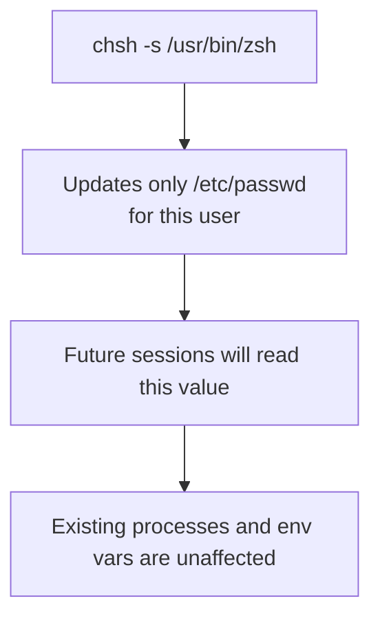
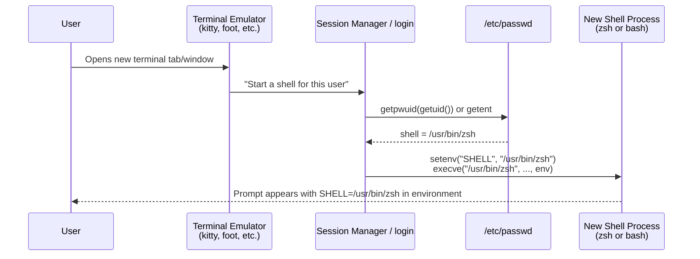
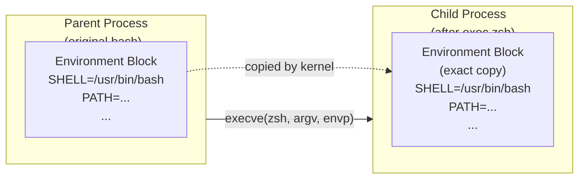
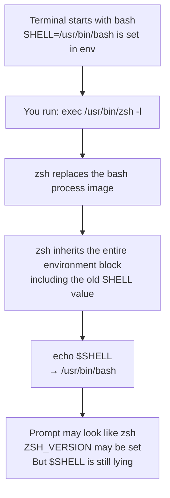
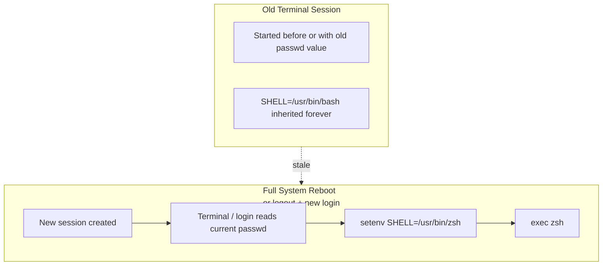
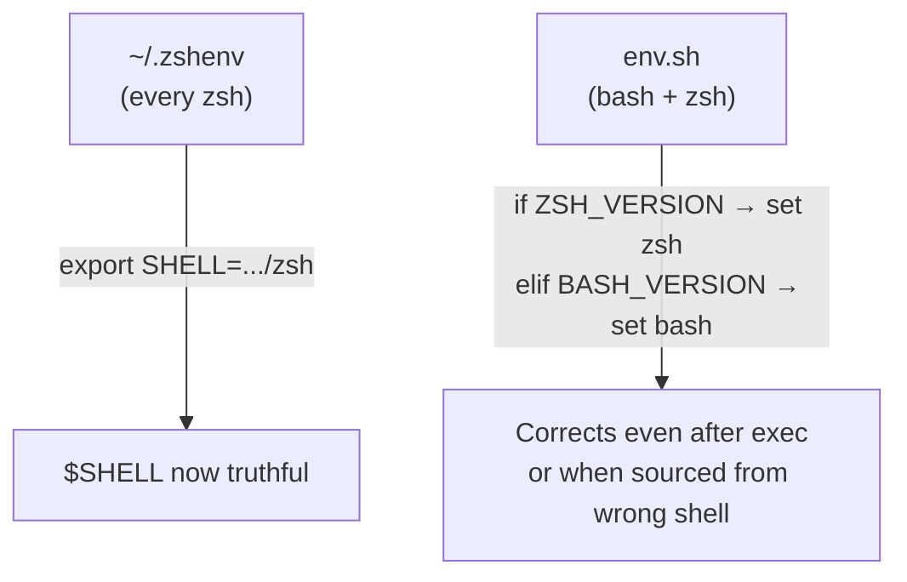

# Understanding the `$SHELL` Environment Variable

This document explains why `chsh` + `exec` often does **not** update `echo $SHELL`, why a full reboot usually does, and how environment variables actually flow in Unix-like systems.

It is written from the perspective of a user who has just changed their shell and is confused why `$SHELL` still lies.

---

## TL;DR


| Concept                                  | What it represents                                 | Updated by `chsh`? | Updated by `exec zsh`? | Fresh terminal after reboot? |
| ---------------------------------------- | -------------------------------------------------- | ------------------ | ---------------------- | ---------------------------- |
| **passwd shell** (`getent passwd $USER`) | Your configured login shell                        | Yes                | No                     | Yes                          |
| **Current process** (`$0`, `ps -p $$`)   | The binary actually running right now              | No                 | Yes                    | Yes                          |
| `**$SHELL` env var**                     | Usually the value set when this *session* was born | No                 | No (inherits)          | Yes (new session)            |


`**chsh` only updates the database.**  
`**$SHELL` is set at session *birth* by the terminal/login process and then inherited.**  
`**exec` replaces the process but keeps the old environment.**

---

## The Three Different "Shells"

When debugging shell changes, people mix up three different things:

1. **Login shell (from passwd)**
  ```bash
   getent passwd $USER | cut -d: -f7
  ```
   This is what `chsh` changes.
2. **Currently executing process**
  ```bash
   echo $0
   ps -p $$ -o comm=
   echo ${ZSH_VERSION:+zsh} ${BASH_VERSION:+bash}
  ```
3. `**$SHELL` environment variable**
  ```bash
   echo $SHELL
  ```

These three are allowed to disagree, and the system makes no attempt to keep them in sync.

---

## What `chsh` Actually Does

`chsh -s /usr/bin/zsh` performs **one** action:

- Writes the new path into your entry in `/etc/passwd` (or the system user database).

It does **nothing** to:

- Running processes
- Environment variables
- Already open terminal tabs
- The kernel




---

## How a Brand New Terminal Session Is Born

When you reboot (or log out and open a completely fresh terminal), this is the normal sequence:




At this point `$SHELL` is set **before** the shell binary even starts running. The value comes from the database at session creation time.

---

## Environment Variable Inheritance (The Core Mechanism)

Unix processes do not share memory. When one process starts another, it uses `execve(2)` (or `posix_spawn`, etc.).

The kernel simply copies the **environment block** (a list of `KEY=VALUE` strings) from the parent to the child.




There is **no** kernel magic that rewrites `SHELL` when you change your passwd entry or replace the process image.

---

## Why `exec /usr/bin/zsh -l` Usually Does **Not** Update `$SHELL`




This is exactly what happened in the user's sessions. The process changed, but the environment did not.

---

## When `$SHELL` **Does** Get the Correct Value

A completely new session must be created after the `chsh` change:




After reboot + opening a terminal:

- `getent passwd $USER` → `/usr/bin/zsh`
- `echo $SHELL` → `/usr/bin/zsh` (set at birth of this session)
- Current process is also zsh

---

## Your Custom "Truth Seeker" Code

Because stale `$SHELL` is so common during development and debugging, this repo adds overrides in two places:

- `~/.zshenv` (runs for **every** zsh, very early)
- `~/.config/shell/env.sh` (sourced by bash, zsh, and fish via bass)




These overrides are **not** standard behavior. They are a deliberate local policy to make `$SHELL` reflect reality in your day-to-day use.

---

## Recommended Commands (Always Tell the Truth)

```bash
# The three values that matter
echo "passwd (what chsh controls):   $(getent passwd $USER | cut -d: -f7)"
echo "current process:               $(ps -p $$ -o comm=)  ($0)"
echo "SHELL env var:                 $SHELL"

# Convenience helper (provided by this repo)
shell_debug
```

---

## Common Gotchas

- **Reopening the terminal app** is not always enough — some emulators remember the shell used for existing profiles.
- **tmux / screen / zellij** reattach old sessions and keep their original environment.
- **Terminal emulators** sometimes have their own "default shell" setting that can override or ignore `chsh`.
- **Agents and wrappers** (build tools, remote development servers, etc.) often start under whatever shell the parent had.
- `$SHELL` is **not** "the shell I am currently in." It is "the shell that was given to this session when it started."

---

## Summary

- `chsh` updates only the database.
- `$SHELL` is set by the **session creator** (terminal / login) at birth and then inherited.
- `exec` gives you a new process but the same environment.
- A full reboot (or clean new login session) is the only reliable way to get a fresh `$SHELL` value from passwd without custom overrides.
- The "truth seeker" logic in this repo exists precisely because the above behavior is surprising and inconvenient in practice.

This document lives in the shell config repo so future you (or collaborators) can understand why things behave the way they do.