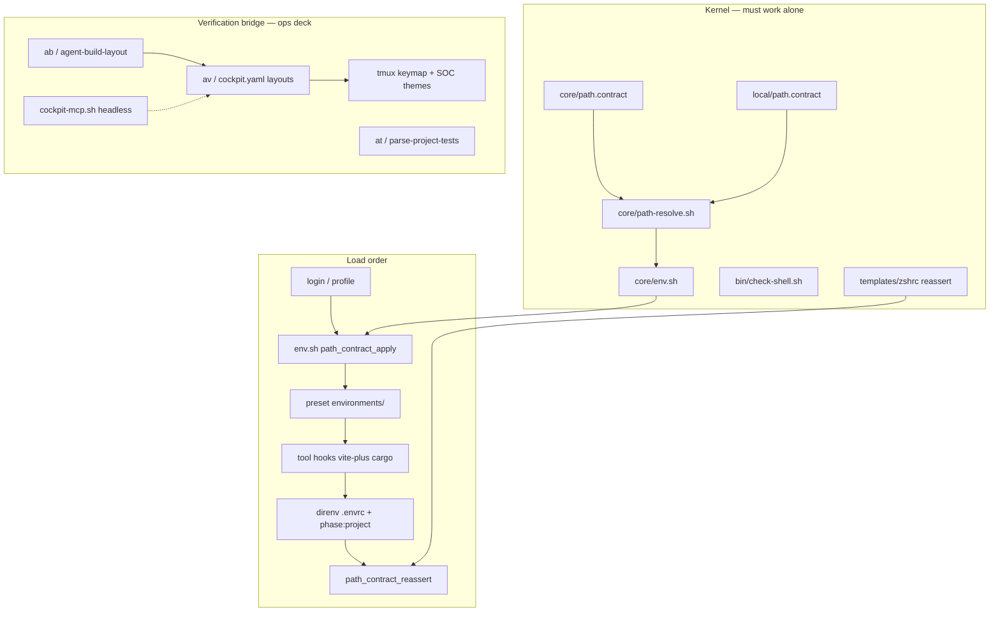
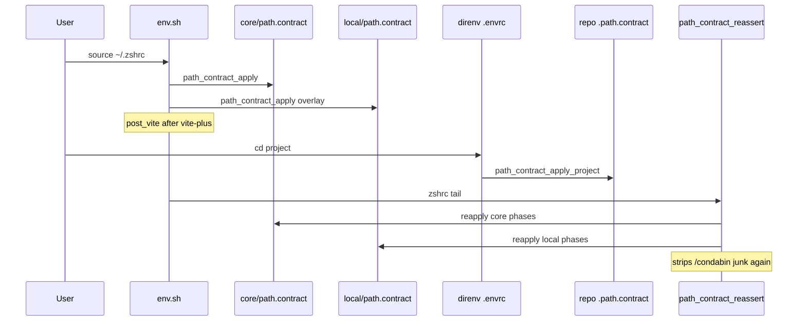
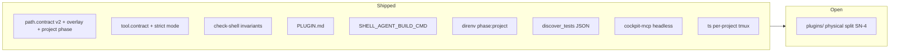
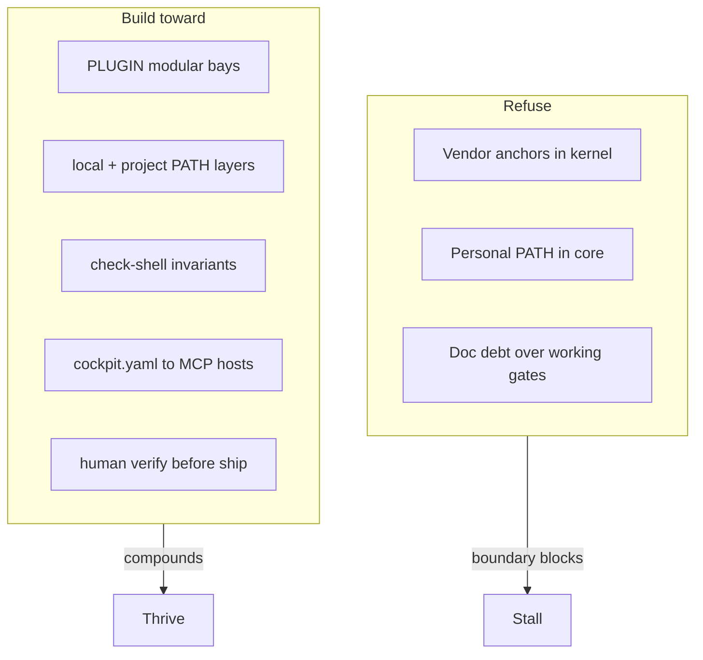
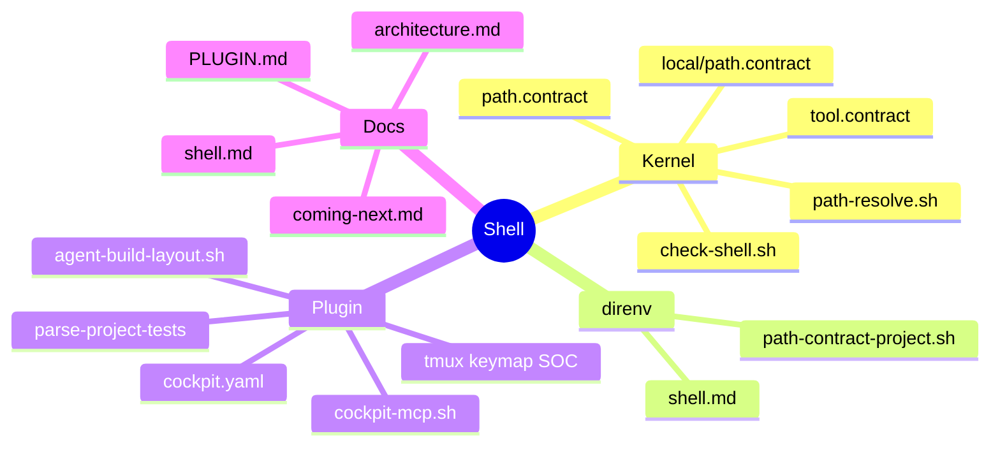

# Architecture — current state

**Audience:** You · implementer · agents  
**Update this file** when kernel or verification bridge shape changes on `master`.  
**Backlog:** [coming-next.md](coming-next.md) · **Shipped epics:** [../planned-features/done/](../planned-features/done/)

*Last updated: 2026-06-19 (SN-TS + SN-8)*

---

## Mission

**Build the dev environment that punches through every platform shift** — portable shell kernel (PATH, migrate, recover) **plus** human verification bridge (tmux, agents, tests, MCP) that evolves with each generation of AI tools.

North-star risk/thrive analysis: [test-of-travelled-time-from-future.md](test-of-travelled-time-from-future.md). Kernel vs plugin contract: [PLUGIN.md](../PLUGIN.md).

---

## System map (today)

**Rules:**

- `path_contract_apply` runs **core then local** (local wins `which`). Verify ranks **local before core** — `check-shell` guards line order.
- **Project PATH** is direnv-scoped: repo `.path.contract` with `phase:project` only ([shell.md § PATH layers](shell.md#path-layer-precedence-machine-vs-project)).
- **Headless bridge:** `bin/cockpit-mcp.sh verify|test|scan` — same verbs as tmux, for MCP/CI ([VERIFICATION.md](VERIFICATION.md)).

---

## PATH precedence

**direnv owns project; contract owns machine.**

| Layer | Owns | Must not |
|-------|------|----------|
| `core/path.contract` | Forkable defaults | Personal toolchains |
| `local/path.contract` | Machine overlay | Project repo paths |
| repo `.path.contract` | `phase:project` prepend/append | Replace global contract |
| `.envrc` (direnv) | Load project fragment | Rebuild full PATH |
| `tool.contract` | Pin clear/tput/git + shadow warn | Pin every binary |
| Plugin | `SHELL_AGENT_BUILD_CMD`, strict PATH | Change kernel load order |

Detail: [shell.md](shell.md).

---

## Scorecard

| Area | Grade | One line | Evidence |
|------|-------|----------|----------|
| PATH declarative + verify | **A** | Phased contract, runtime check, deny list, project phase | `path_contract_verify`, PR #6 + #8 |
| Kernel forkability | **A-** | Personal paths in `local/` not `core/` | `check-shell` personal-token grep |
| Per-project PATH (direnv) | **A-** | `phase:project` + `path-contract-project.sh` | [PR #8](../planned-features/done/sprint-jun-2026-pr8.md) |
| Plugin boundary docs | **B+** | PLUGIN.md + arch split | Still one tree until SN-4 |
| Agent vendor decoupling | **B+** | Env vars; no hardcoded agent in layout | `agent-build-layout.sh` |
| Agent PATH hardening | **B+** | Pins, shadow report, `ab --strict` | `tool.contract`, PR #8 |
| Cockpit daily driver | **A-** | ab/av/at + navigators + MCP verbs | tmux + `cockpit-mcp.sh` |
| Test runner portability | **A-** | `discover-tests.sh` canonical emitter; py parity test | `test-allowlist.sh`, SN-8 |
| Modular packaging | **B** | PLUGIN boundary done; physical split next | SN-4 |

---

## Guardrails

| Risk | Guard | Status |
|------|-------|--------|
| Kernel polluted by agent/vendor | PLUGIN.md + local overlay | **Done** |
| Overlay rank regression | `check-shell` invariant | **Done** |
| direnv vs contract collision | Precedence + `phase:project` | **Done** |
| Cockpit stuck on one TUI | Manifest-first; tmux one renderer | **Done** — headless `cockpit-mcp.sh` shipped (PR #8) |
| Cockpit stuck on one agent | `SHELL_AGENT_BUILD_CMD` + MCP | **In progress** |
| One tmux session all projects | `ts` per-repo session | **Done** — SN-TS |
| Test discovery drift (py/sh) | Single JSON emitter | **Done** — SN-8 |

---

## File touch map

---

## References

| Doc | Use |
|-----|-----|
| [shell.md](shell.md) | Load order, PATH contract detail |
| [VERIFICATION.md](VERIFICATION.md) | ab/av/at, cockpit-mcp |
| [PLUGIN.md](../PLUGIN.md) | Kernel must / must not |
| [coming-next.md](coming-next.md) | Next backlog items |
| [../planned-features/done/](../planned-features/done/) | Shipped sprint archives |
