# Coming next — shellyxz shell

**Audience:** You · implementer · agents  
**Style:** Short words. Diagrams over prose. Optimism grounded in evidence.  
**Contract:** [PLUGIN.md](../PLUGIN.md) · [test-of-travelled-time-from-future.md](test-of-travelled-time-from-future.md)  
**Method borrowed from:** [intuitive-shell-plan](https://github.com/p10ns11y/collab-finder/blob/main/reports/intuitive-shell-plan.md) · [batch-2-engineering-blueprints](https://github.com/p10ns11y/collab-finder/blob/main/reports/batch-2-engineering-blueprints.md) · [single-pr-intuitive-product](https://github.com/p10ns11y/collab-finder/blob/main/reports/single-pr-intuitive-product.md)

*Last updated: 2026-06-18*

---

## 0. Mission (one sentence)

**Build the dev environment that punches through every platform shift** — a portable shell kernel (PATH, migrate, recover) **plus** a human verification bridge (tmux, agents, tests) that **evolves with each generation of AI tools** instead of fighting them.

---

## 0b. Ten-year thrive picture (2036 — not survival, ascent)

Agents get faster. Trust gets scarcer. **That is thrust, not drag** for this project.

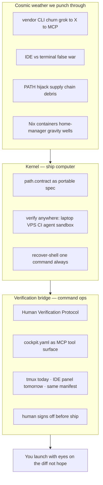

| 2036 role | What it is | Why it still wins |
|-----------|------------|-------------------|
| **Kernel** | Declarative PATH + migrate + recover | POSIX and PATH outlive every agent brand |
| **Verification bridge** | Verify-build-test ritual + layouts + navigators | Fast agents increase need for **human audit**, not less |
| **Boundary (PLUGIN)** | Modular bays — swap agent engine, keep hull | Upgrade without rewriting dotfiles |
| **cockpit.yaml** | Project verification manifest | Becomes host-agnostic (MCP, CI, tmux, future IDE) |
| **ab / av / at** | Stable verbs: build · verify · test | Same muscle memory; different TUIs underneath |

**What thriving looks like day-to-day:** Agent proposes a diff in any host (IDE, CLI, cloud). You open **one** verification surface — tmux bridge today, embedded panel later — with tests, git, scan, and layout you already trust. Kernel guarantees `git`, `node`, `clear` are the real binaries. You approve. Launch.

**Design bet:** We are not betting on tmux forever. We are betting on **human-in-the-loop verification** forever. tmux is today's command bridge; the manifest and rituals are the spacecraft.

---

## 1. Scorecard — what landed (PR #6 + path-contract-v2)

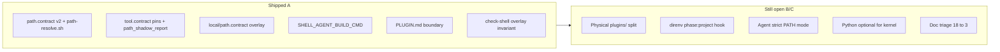

| Area | Grade | One line | Evidence |
|------|-------|----------|----------|
| PATH declarative + verify | **A** | Phased contract, runtime 1:1 check, deny list | `path_contract_verify`, PR #6 tests pass |
| Kernel forkability | **A-** | Personal paths in `local/` not `core/` | `check-shell` personal-token grep |
| Plugin boundary docs | **B+** | PLUGIN.md + 10y review | Still one tree, not split repo |
| Agent vendor decoupling | **B** | Env vars, no hardcoded grok in layout | `agent-build-layout.sh` |
| Cockpit daily driver | **B+** | ab/av/at + navigators; evolves to MCP | Ghostty+tmux now; manifest is the constant |
| Per-project PATH (direnv) | **C+** | Hooked; project fragment next | `check-shell` direnv guards; SN-2 unlocks thrive |
| Agent PATH hardening | **B-** | Pins + shadow report; strict mode next | Foundation for agent-sandbox trust |
| Modular packaging | **B** | PLUGIN boundary done; physical split when scale needs it | Clarity without abandoning the bridge |

**Plain rule:** Strengthen the ship computer (kernel PATH) **and** upgrade the command bridge (verification + MCP) — modular hull bays, on purpose.

---

## 2. System map (today)

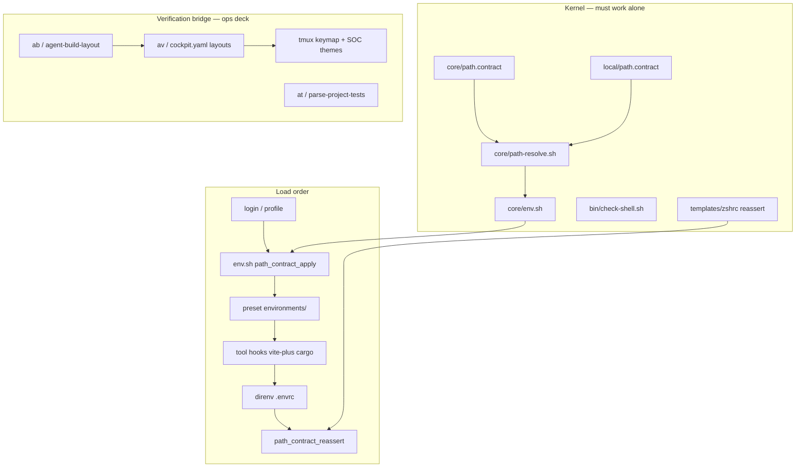

**Rule that bites:** `path_contract_apply` runs **core then local** (local wins `which`). Verify ranks **local before core** — `check-shell` guards line order.

---

## 3. PATH precedence (target mental model)

Aligns with industry PATH-hijack advice and Grok-on-X sketch (parser + core + shadow audit). **direnv owns project; contract owns machine.**

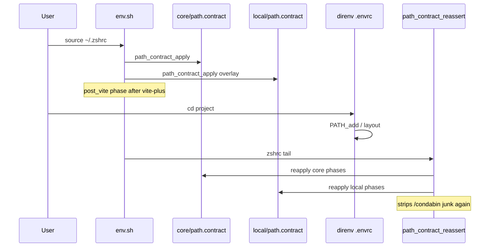

| Layer | Owns | Must not |
|-------|------|----------|
| `core/path.contract` | Forkable defaults | Personal toolchains |
| `local/path.contract` | Machine overlay | Project repo paths |
| `.envrc` (direnv) | Per-repo PATH/env | Replace global contract |
| `tool.contract` | Pin clear/tput | Pin every binary |
| Plugin | `SHELL_AGENT_BUILD_CMD` | Change kernel load order |

---

## 4. Musk five-step — applied to backlog (strict order)

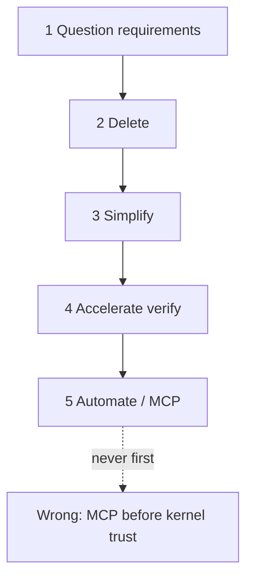

| Step | Shell question | Verdict |
|------|----------------|---------|
| ① Who needs fish in core? | No external user | **contrib/fish** later |
| ① Who needs 18 arch MD files? | Maintainer only | **Triage to 3** |
| ② Delete | Duplicate `.cursor/skills` | **Symlink to `.agents/`** |
| ② Delete | curl pipe install primary | **Clone + migrate only** |
| ③ Simplify | `parse-project-tests.py` | **Thin sh default; py plugin** |
| ④ Accelerate | PATH debug | **`path_check` + invariant in check-shell** ✓ |
| ⑤ Automate | MCP for cockpit | **Step 5: export manifest to MCP hosts** |

**Add back ≤10%:** keymap TSV, SOC themes, golden-ratio tiers (navigation — user decision: keep with layouts).

---

## 5. Trajectory forces (evidence-weighted)

| Force | P(3–7y) | Effect on us | Response |
|-------|---------|--------------|----------|
| More agent-generated code | ~90% | **Demand for human verify rises** | Cockpit + HITL workflow |
| IDE agents mainstream | ~75% | Cockpit **feeds** review; not replaced by it | MCP export of cockpit.yaml; same rituals |
| Agent CLI vendor churn | ~80% | Noise | `SHELL_AGENT_BUILD_CMD` ✓; MCP next |
| PATH shadowing / hijack | ~70% | Trust crisis for agents | `tool.contract`, strict mode, verify |
| `path.contract` as portable pattern | ~55% | **Kernel becomes reference impl** | Keep core forkable; document spec |
| Nix / containers / devcontainers | ~40% | migrate less central; **verify more central** | Contract as runtime checker in CI |
| tmux UI fashion | ~60% | Surface changes | Manifest + navigators survive UI swap |

**Acceleration trigger:** When IDE agents run builds for you daily → **invest in bridge MCP + verify manifest**, expand thrust. The bottleneck moved from typing to **judgment**.

---

## 6. Trajectory guardrails — what we refuse vs what we build toward

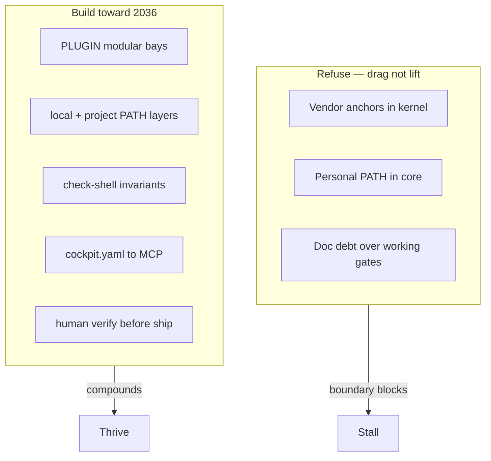

| Risk | Guard in tree | Status |
|------|---------------|--------|
| Kernel polluted by agent/vendor | PLUGIN.md + local overlay | **Done** |
| Overlay rank regression | `check-shell` invariant | **Done** |
| Cockpit stuck on one TUI | Manifest-first; tmux is one renderer | **Open → SN-7** |
| Cockpit stuck on one agent | `SHELL_AGENT_BUILD_CMD` + MCP | **In progress** |
| direnv vs contract collision | Precedence doc + `phase:project` | **Open → SN-2** |

---

## 7. Blueprint cards — next work

Priority order. Each: problem → flow → files → done when → verify.

---

### SN-1 · Dogfood gate (no new code)

**Problem:** Lock in kernel trust, then expand the command bridge.

| Step | Pass if |
|------|---------|
| Generic fork | `core/path.contract` only → shell loads |
| Overlay | With `local/path.contract` → verify OK |
| Plugin | `ab` with env set; unset → clear error |
| Gate | `bash bin/check-shell.sh` clean |

---

### SN-2 · direnv `phase:project` fragment (not full parser in .envrc)

**Problem:** Two PATH truths — global contract vs per-repo `.envrc`. Grok sketch suggests direnv; **wrong** pattern is rebuilding full PATH in `.envrc`.

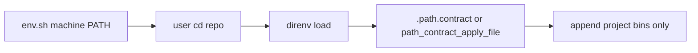

| File | Work |
|------|------|
| `core/path-resolve.sh` | Optional `phase:project` filter (or document `append` in repo file) |
| `bin/path-contract-project.sh` | Thin: `path_contract_apply_file "$PWD/.path.contract"` |
| `arch-design/shell.md` | Precedence table (§3 above) |
| `.envrc.example` | `source ~/.config/shell/bin/path-contract-project.sh` |

**Done when:** Repo `bin/` on PATH in project dir; `path_contract_verify` still passes at home.

**Evidence:** direnv already hooked (`check-shell`); secrets stay out of repo partly because of direnv + Cursor cwd.

---

### SN-3 · Agent strict PATH mode (plugin only)

**Problem:** Agents run arbitrary commands; shadowed `git`/`clear`/`python` is a real class (conda, AppImage, malicious PATH).

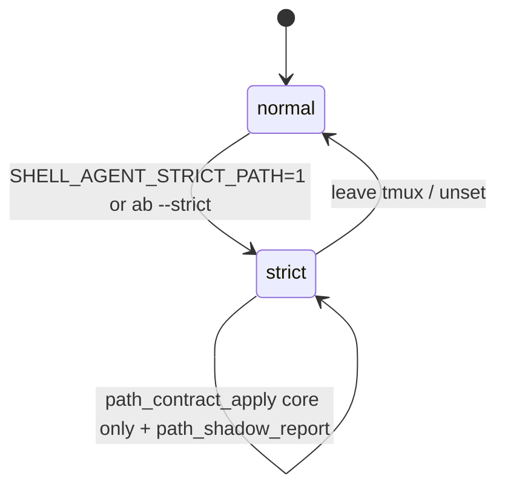

| File | Work |
|------|------|
| `bin/agent-build-layout.sh` or plugin wrapper | Optional strict pre-launch check |
| `core/tool.contract` | Extend `warn_shadow` list as needed |
| `PLUGIN.md` | Document plugin-only scope |

**Done when:** Strict mode warns on shadow before agent launch; kernel default unchanged.

**Not in kernel:** Mandatory wrappers for every command (too heavy).

---

### SN-4 · Modular `plugins/verification/` (scale, not abandonment)

**Problem:** One repo carries two **composable** bays — clarity for contributors and forks; the bridge launches with the hull.

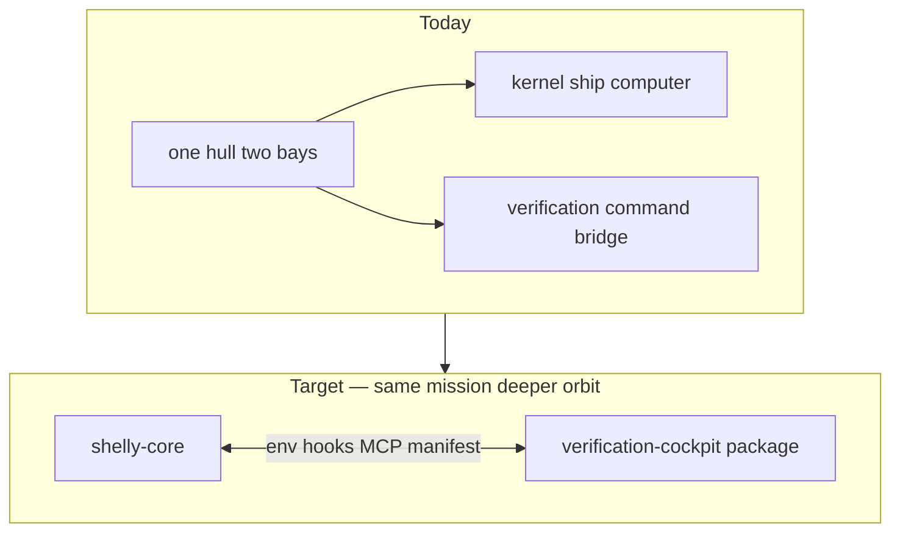

| Phase | Work |
|-------|------|
| 4a | `plugins/verification/` directory; shims in `bin/` |
| 4b | Optional separate repo; **cockpit installs beside kernel** |

**Done when:** Kernel and cockpit version independently; **both** remain first-class install targets.

---

### SN-5 · Cockpit simplify (not navigators)

**Problem:** Python required to `source` shell on minimal VPS — violates portable story.

| Cut / simplify | Keep |
|----------------|------|
| `parse-project-tests.py` optional path | keymap TSV, SOC themes, golden-ratio |
| sh-only default test discovery | `cockpit.yaml` freeze (no new pane types) |
| | `verify_workflow_root`, `agent_scan` |

**Done when:** `source ~/.zshrc` on VPS without python; `at` degrades with message.

---

### SN-7 · Verification bridge MCP surface (thrive bet)

**Problem:** IDE agents are not the enemy — they are a **new dock module**. Bridge rituals should run there too.

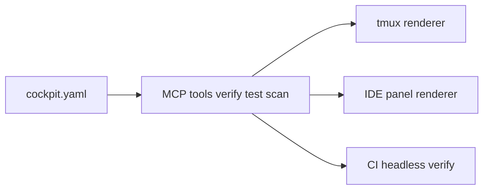

| File | Work |
|------|------|
| `.agents/verification/cockpit.yaml` | Stable manifest schema |
| Future `bin/cockpit-mcp-*` | Expose verify / test / scan as tools |
| `arch-design/VERIFICATION.md` | Document host-agnostic verbs |

**Done when:** Same project manifest drives `av` in tmux **and** an MCP client's verify step.

**Why now in backlog:** This is how the verification bridge **reaches orbit** when agent hosts multiply.

---

### SN-6 · Doc triage + skills collapse

| ID | Action |
|----|--------|
| SN-6a | Canonical 3: `README.md`, `arch-design/shell.md`, `PLUGIN.md` |
| SN-6b | `.cursor/skills` → symlink `.agents/skills` |
| SN-6c | Omarchy → `local/omarchy.sh` overlay (preset stays thin in core) |

---

## 8. Bridge scope lock — navigators stay (user decision)

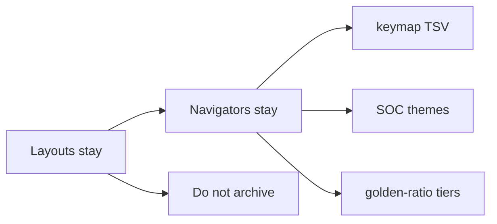

**Fair game:** parser complexity, python default, new YAML pane types without external user.

---

## 9. Sprint order

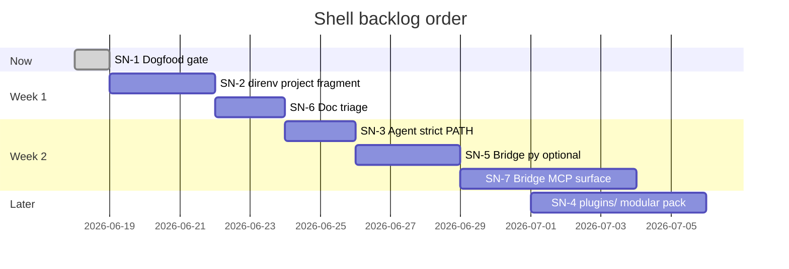

---

## 10. Monitoring signals (command the mission)

| Signal | Healthy | Invest more when |
|--------|---------|------------------|
| Agent commits / kernel commits | Both grow | Cockpit outpacing kernel **and** you verify daily → SN-7 MCP |
| `path_contract_verify` failures | Rare | Spike after installs → `capture-shell-init` |
| External forks | Core + cockpit copies | Others adopt manifest pattern |
| Agent CLI churn | Env vars updated | New host → add MCP tool not new pane |
| IDE + tmux both in use | Hybrid workflow | **Expected orbit** — bridge hosts, don't abandon either |

---

## 11. Done log (path-contract-v2)

| # | Item | Commit area |
|---|------|-------------|
| 1 | `local/path.contract` overlay | `path-resolve.sh`, debloated core |
| 2 | `SHELL_AGENT_BUILD_CMD` | `agent-build-layout.sh`, `local/personal.sh` |
| 3 | `PLUGIN.md` | kernel vs plugin contract |
| 4 | Overlay invariant | `check-shell.sh` line-order guard |

---

## 12. File touch map

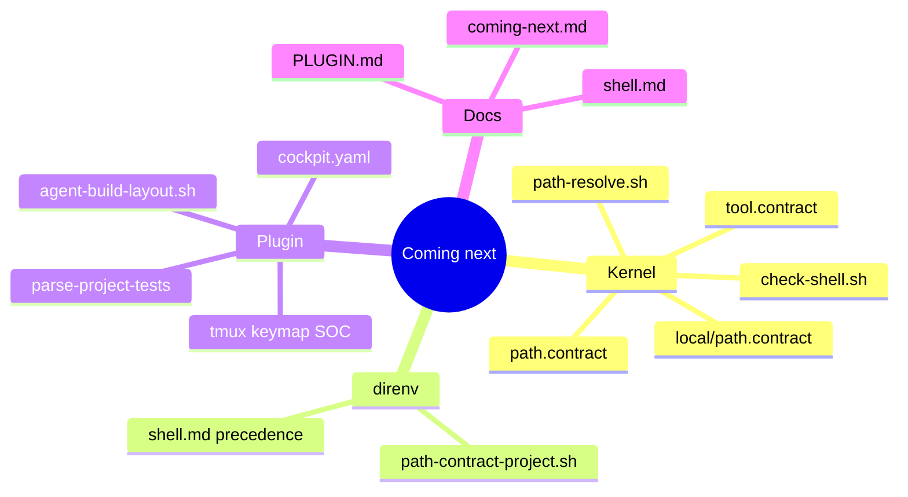

---

## 13. References

| Doc | Use |
|-----|-----|
| [test-of-travelled-time-from-future.md](test-of-travelled-time-from-future.md) | Risk analysis; **§0b here = thrive north star** |
| [PLUGIN.md](../PLUGIN.md) | Kernel must / must not |
| [shell.md](shell.md) | PATH contract v2 detail |
| [VERIFICATION.md](VERIFICATION.md) | ab/av/at flows |
| [collab-finder intuitive-shell-plan](https://github.com/p10ns11y/collab-finder/blob/main/reports/intuitive-shell-plan.md) | Blueprint card + diagram style |
| [collab-finder batch-2-blueprints](https://github.com/p10ns11y/collab-finder/blob/main/reports/batch-2-engineering-blueprints.md) | Scorecard, gantt, done-when tables |
| [collab-finder single-pr-intuitive-product](https://github.com/p10ns11y/collab-finder/blob/main/reports/single-pr-intuitive-product.md) | Musk 5-step, 2nd/3rd order guards |

---

*Plain rule: harden the ship computer (kernel PATH), grow the command bridge (verification + MCP), punch through cosmic weather — direnv handles per-planet ops, not ship-wide navigation.*
