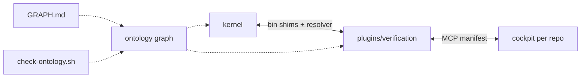

# Coming next — shellyxz shell

**Backlog only** — short. **Current architecture:** [architecture.md](architecture.md) · **Shipped epics:** [../planned-features/done/](../planned-features/done/)

*Last updated: 2026-06-22 (post–SN-O1)*

**Next:** [SN-4b](#sn-4--modular-pluginsverification-4a-shipped) · **Shipped:** SN-O1 ontology drift gate · ontology viz + HODA ([#12](../planned-features/done/ontology-viz-hoda-pr12.md)) · SN-4a + SN-O0 ([#11](../planned-features/done/sn-o0-sn4a-pr11.md))

---

## Next up

### SN-4 · Modular `plugins/verification/` (4a shipped)

**Problem:** One repo, two bays — clarify for forks; version kernel and cockpit independently.

| Phase | Work | Status |
|-------|------|--------|
| 4a | `plugins/verification/` + shims in `bin/` | **Shipped** — [#11](../planned-features/done/sn-o0-sn4a-pr11.md) |
| 4b | Optional separate repo; cockpit installs beside kernel | Backlog |

---

## Trajectory forces (2036-oriented)

| Force | Response | Confidence |
|-------|----------|------------|
| Agent hosts multiply (IDE, MCP, headless) | Manifest-first cockpit; stable `bin/` shims | **High** — SN-4a + MCP shipped |
| PATH drift across machines | Contract + verify + `check-shell` invariants | **High** — path.contract v2 |
| Kernel/plugin coupling | PLUGIN.md + ontology + resolver + HODA overlay | **High** — SN-O1 drift gate shipped |
| Ontology comprehension | Curated Mermaid subgraphs + render script | **High** — [#12](../planned-features/done/ontology-viz-hoda-pr12.md) |
| Verification repo fork (SN-4b) | Bootstrap version pins; graph `Artifact` remap | **Med** — defer until external consumers |

Decision overlay: [overlays/shell-kernel-decision-hooks.md](overlays/shell-kernel-decision-hooks.md) (HODA).

---

## Recently done (last 10)

| # | Item | PR / commit |
|---|------|-------------|
| 1 | SN-O1 VerificationBridge + skill + drift gate | [sn-o1-ontology-verification.md](../planned-features/done/sn-o1-ontology-verification.md) |
| 2 | Ontology GRAPH.md + `render-ontology-graph.sh` | [#12](../planned-features/done/ontology-viz-hoda-pr12.md) |
| 3 | HODA shell-kernel decision overlay | [#12](../planned-features/done/ontology-viz-hoda-pr12.md) |
| 4 | SN-4a `plugins/verification/` + bin shims + resolver | [#11](../planned-features/done/sn-o0-sn4a-pr11.md) |
| 5 | SN-O0 ontology graph (path + boundary + load order) | [#11](../planned-features/done/sn-o0-sn4a-pr11.md) |
| 6 | SN-TS + SN-8 (`ts`, discover_tests, ab --strict fix) | [#9](https://github.com/p10ns11y/shellyxz.sh/pull/9) |
| 7 | capture-shell-init false-positive fix | #8 `c0496d9` |
| 8 | Mermaid fix in shell.md | #8 `0d204d2` |
| 9 | Doc split architecture / planned-features | #8 `4bfedc6` |
| 10 | SN-7 cockpit-mcp headless verbs | #8 `c589765` |

Full blueprint cards + diagrams: [planned-features/done/](../planned-features/done/).

---

## Monitoring

| Signal | Healthy | Invest when |
|--------|---------|-------------|
| `path_contract_verify` failures | Rare | Spike → `capture-shell-init` |
| `ab`/`av`/`at` after plugin move | Work via resolver | Hardcoded `bin/lib` paths return |
| Remote bootstrap | Full `plugins/verification/*` | Partial fetch only |
| Ontology vs tree | `check-ontology.sh` green | Moved files, stale graph |
| Mermaid in GRAPH.md | Renders on GitHub | `==>` or `-.x` edge syntax returns |
| Agent vs kernel commits | Both grow | Cockpit only → MCP depth |

---

## References

| Doc | Use |
|-----|-----|
| [architecture.md](architecture.md) | **Current state** (update on structural merges) |
| [shell.md](shell.md) | PATH / load order detail |
| [VERIFICATION.md](VERIFICATION.md) | ab/av/at / cockpit-mcp |
| [PLUGIN.md](../PLUGIN.md) | Kernel boundary |
| [plugins/verification/README.md](../plugins/verification/README.md) | Verification plugin tree (SN-4a) |
| [.agents/ontology/GRAPH.md](../.agents/ontology/GRAPH.md) | Ontology Mermaid views |
| [.agents/skills/shell-kernel-ontology/SKILL.md](../.agents/skills/shell-kernel-ontology/SKILL.md) | Agent subgraph router |
| [overlays/shell-kernel-decision-hooks.md](overlays/shell-kernel-decision-hooks.md) | HODA material decisions |
| [stellar-roadmap skill](../.agents/skills/stellar-roadmap/SKILL.md) | Backlog doc format |

*Plain rule: update `architecture.md` when shape changes; append `planned-features/done/` when an epic ships; keep this file short.*
