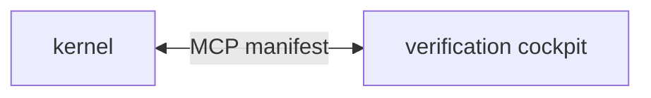

# Coming next — shellyxz shell

**Backlog only** — short. **Current architecture:** [architecture.md](architecture.md) · **Shipped epics:** [../planned-features/done/](../planned-features/done/)

*Last updated: 2026-06-18 (post–PR #8 merge)*

**PR #8 merged** — sprint kernel shipped. Next: [SN-TS](#sn-ts--per-project-tmux-session-ts), [SN-8](#sn-8--unified-test-discovery-json), [SN-4](#sn-4--modular-pluginsverification).

---

## Next up

### SN-TS · Per-project tmux session (`ts`)

**Problem:** Omarchy `t` → one session (`Work`). Multi-repo work hijacks shared `build`/`verify` windows.

| File | Work |
|------|------|
| `core/functions.sh` | `ts()` attach-or-create from git basename |
| `arch-design/VERIFICATION.md` | Document `t` vs `ts` |
| `local/personal.sh` | Optional alias |

**Done when:** `ts` from repo A and B → two sessions; isolated `ab`/`av`/`at`.

**Deferred:** `tls` — only if `tmux ls` insufficient.

---

### SN-8 · Unified test discovery JSON

**Problem:** `discover()` duplicated in `parse-project-tests.py`, `parse-project-tests-discover.sh`, and allowlists in `project-tests.sh` / `parse-project-tests-run.sh` — drift tax on every `at` / cockpit change (PR #8 review follow-up).

| Work | Detail |
|------|--------|
| Emitter | `discover_tests(root) → JSON` once (py or sh) |
| Consumers | `run-project-tests.sh`, `cockpit-mcp.sh test`, tmux `at` |
| Guard | Contract test: single allowlist; py/sh outputs match if both remain |

**Done when:** one source of truth; fewer tokens on bridge edits.

---

### SN-4 · Modular `plugins/verification/`

**Problem:** One repo, two bays — clarify for forks; version kernel and cockpit independently.

| Phase | Work |
|-------|------|
| 4a | `plugins/verification/` + shims in `bin/` |
| 4b | Optional separate repo; cockpit installs beside kernel |

Detail when scheduled: [sprint archive template](../planned-features/done/sprint-jun-2026-pr8.md).

---

## Recently done (last 10)

| # | Item | PR / commit |
|---|------|-------------|
| 1 | PR #8 merge close-out (strict PATH docs + backlog) | [#8](https://github.com/p10ns11y/shellyxz.sh/pull/8) `876abf0` |
| 2 | capture-shell-init false-positive fix | #8 `c0496d9` |
| 3 | Mermaid fix in shell.md | #8 `0d204d2` |
| 4 | Doc split architecture / planned-features | #8 `4bfedc6` |
| 5 | SN-7 cockpit-mcp headless verbs | #8 `c589765` |
| 6 | SN-5 sh test discovery | #8 `50f4e52` |
| 7 | `which` aliases/functions fix | #8 `1891f57` |
| 8 | SN-3 agent strict PATH | #8 `2c76358` |
| 9 | SN-6 doc triage + omarchy overlay | #8 `f7dafb1` |
| 10 | SN-2 direnv `phase:project` | #8 `afb4fc0` |

Full blueprint cards + diagrams: [planned-features/done/](../planned-features/done/).

---

## Monitoring

| Signal | Healthy | Invest when |
|--------|---------|-------------|
| `path_contract_verify` failures | Rare | Spike → `capture-shell-init` |
| Agent vs kernel commits | Both grow | Cockpit only → SN-TS / MCP depth |
| IDE + tmux both in use | Hybrid | Expected — bridge hosts multiply |

---

## References

| Doc | Use |
|-----|-----|
| [architecture.md](architecture.md) | **Current state** (update on structural merges) |
| [shell.md](shell.md) | PATH / load order detail |
| [VERIFICATION.md](VERIFICATION.md) | ab/av/at / cockpit-mcp |
| [PLUGIN.md](../PLUGIN.md) | Kernel boundary |
| [stellar-roadmap skill](../.agents/skills/stellar-roadmap/SKILL.md) | Backlog doc format |

*Plain rule: update `architecture.md` when shape changes; append `planned-features/done/` when an epic ships; keep this file short.*
