# Shell environment architecture

How `~/.config/shell/` composes portable core, environment presets, Omarchy, and shell-native tooling across **zsh**, **bash**, and **fish**.

For day-to-day editing guidance see [README.md](../README.md). This document is the **accurate load-order reference** — verified against live dotfiles and `bin/migrate.sh`.

**Prerequisites:** optional `environment` or `SHELL_ENVIRONMENT`, direnv (recommended), bass (fish only). Omarchy is **optional** — enable via `environments/omarchy/`. See [environments/README.md](../environments/README.md).

Not to be confused with `~/.profile` (POSIX login) or `templates/login/profile`.

---

## Overview

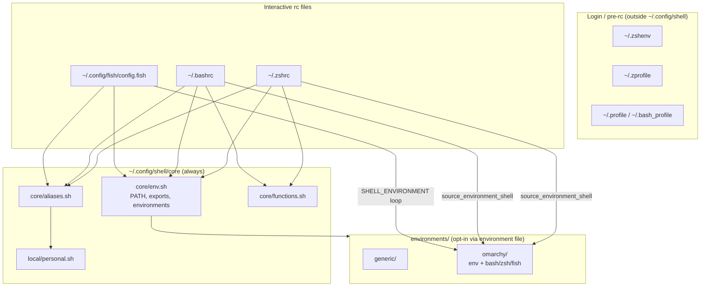

**Key idea:** `core/env.sh` loads `environments/*` from `environment` / `SHELL_ENVIRONMENT` (or auto-detect). Rc files call `source_environment_shell` for interactive hooks. `core/functions.sh` and `core/aliases.sh` load after presets so your overrides win.

---

## Startup files: what rc, profile mean

Unix shells do not read one config file. They read **different files depending on shell name, login vs non-login, and interactive vs non-interactive**. Your setup keeps heavy logic in `~/.config/shell/` and uses home-directory files as thin entrypoints.

### The files on this machine

| File | Role | Loaded when | What it does here |
|------|------|-------------|-------------------|
| `~/.zshenv` | zsh env | **Every** zsh (including scripts) | Sets `$SHELL` to zsh path only (`templates/login/zshenv`) |
| `~/.zprofile` | zsh login | Login zsh only (`zsh -l`, some terminals) | Sources `env.sh` for early PATH on login |
| `~/.zshrc` | zsh interactive | Interactive zsh (normal terminal) | Full stack: `env.sh` → direnv → environment hooks → `functions.sh` → `aliases.sh` → tool inits |
| `~/.profile` | POSIX login | Login sh/bash (when `bash_profile` absent) | GPG agent + sources `env.sh` |
| `~/.bash_profile` | bash login | Login bash | Sources `~/.bashrc` only |
| `~/.bashrc` | bash interactive | Interactive bash | Full stack via `env.sh` + environment hooks + modules |
| `~/.config/fish/config.fish` | fish main | Interactive fish | Fish has no separate profile/rc split — one file does it all |

**PATH, cargo, vite-plus:** owned by `core/env.sh` (`path_prepend` + `source_if_safe` for `~/.vite-plus/env`). Login files delegate via `env.sh`; they do **not** source `~/.cargo/env` or `~/.local/bin/env`.

### Login vs interactive vs non-interactive

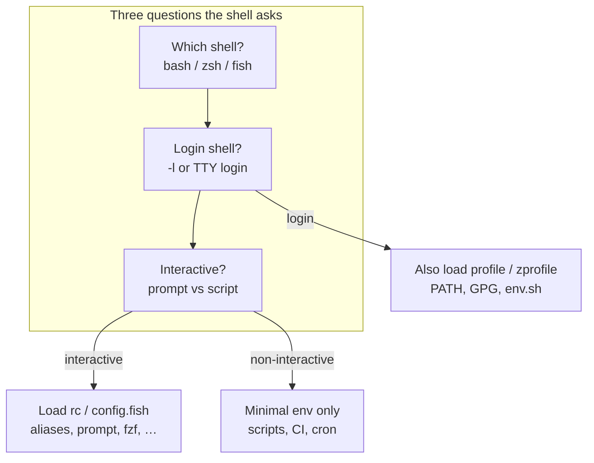

| Session type | Example | Typical files read (zsh) |
|--------------|---------|---------------------------|
| Interactive login | New terminal tab (most emulators) | `zshenv` → `zprofile` → `zshrc` |
| Interactive non-login | `zsh` from inside bash | `zshenv` → `zshrc` |
| Non-interactive | `zsh -c 'npm test'`, CI | `zshenv` only (often nothing you care about) |
| Script shebang | `#!/usr/bin/env bash` in Makefile | **No rc** unless bash is invoked as login/interactive |

That is why `path_debug` can differ between `zsh` and `zsh -l`: login adds `zprofile` → `env.sh` an extra time.

### Where to put changes

| You want to… | Edit this | Not this |
|--------------|-----------|----------|
| Add an alias | `aliases.sh` or `personal.sh` | `~/.zshrc` |
| Fix PATH | `env.sh` | `~/.zprofile` (already delegates to `env.sh`) |
| Add a function | `functions.sh` | rc files |
| Change load order or add a tool init | `migrate.sh` template, then `--force-rc` | hand-edit rc without migrating |
| One-off experiment | `exec fish` / `bash -l` | `chsh` |

### Switching shells

**Default shell** (what new login sessions use) is stored in `/etc/passwd`, changed with:

```bash
chsh -s /usr/bin/zsh   # list options: chsh -l
```

**Current shell** is the running process.

**`echo $SHELL` before config loads** is frequently stale after `chsh`, `exec`, or in long-lived terminal tabs — it is inherited from the session creator.

**After `env.sh` runs**, `shell_truth_seeker` (default `SHELL_TRUTH_SEEKER=1`) sets `$SHELL` to the live zsh/bash interpreter. So in a normal interactive session, `echo $SHELL` is truthful *after* rc load. Running `check-shell.sh` from bash without sourcing `env.sh` may still warn about `$SHELL` vs passwd — that is expected.

Use these for ground truth at any point:

```bash
shell_debug          # new helper (prints $0, ps, ZSH_VERSION/BASH_VERSION, passwd, etc.)
echo $0
ps -p $$ -o pid,comm,args
echo "zsh? ${ZSH_VERSION:-no}   bash? ${BASH_VERSION:-no}"
```

`getent passwd $USER | cut -d: -f7` tells you the *default login shell*.

The check script and `shell_debug` now scream about this.

| Action | Command | Effect |
|--------|---------|--------|
| Temporary switch | `exec zsh` / `exec bash` / `exec fish` | Replaces current process; `exit` closes terminal |
| Subshell try-out | `fish` or `bash` (no exec) | Nested; `exit` returns to parent |
| Login simulation | `bash -l`, `zsh -l` | Runs profile + rc — good for PATH debugging |
| Non-interactive test | `bash -c 'cmd'` | Does not load your interactive aliases |

Fish is **opt-in**: use `exec fish` to try it without changing `chsh`. Switch back by opening a new terminal (if zsh is default) or `exec zsh`.

**After `chsh -s /usr/bin/zsh` (or any switch):** the change only affects *new* terminal sessions/logins.

**Ghostty (Omarchy):** with `gtk-single-instance`, run `killall ghostty` after `chsh` so new windows pick up passwd — closing windows is not enough. Do not edit `~/.config/ghostty/config` for shell choice.

Your existing terminal tab keeps:
- The old process binary until you `exec` or open a new tab.
- The old `$SHELL` environment variable (often forever, even after `exec /usr/bin/zsh -l`).

Do this to replace the current process:

```bash
exec /usr/bin/zsh -l
```

Then run `shell_debug` or the verification one-liner. `ZSH_VERSION` + `ps -p $$` confirm you're in zsh. `echo $SHELL` is corrected once `env.sh` loads; before that it may still show the inherited value. See [SHELL-env-var-behavior.md](SHELL-env-var-behavior.md).

### Workflow: edit → reload → verify

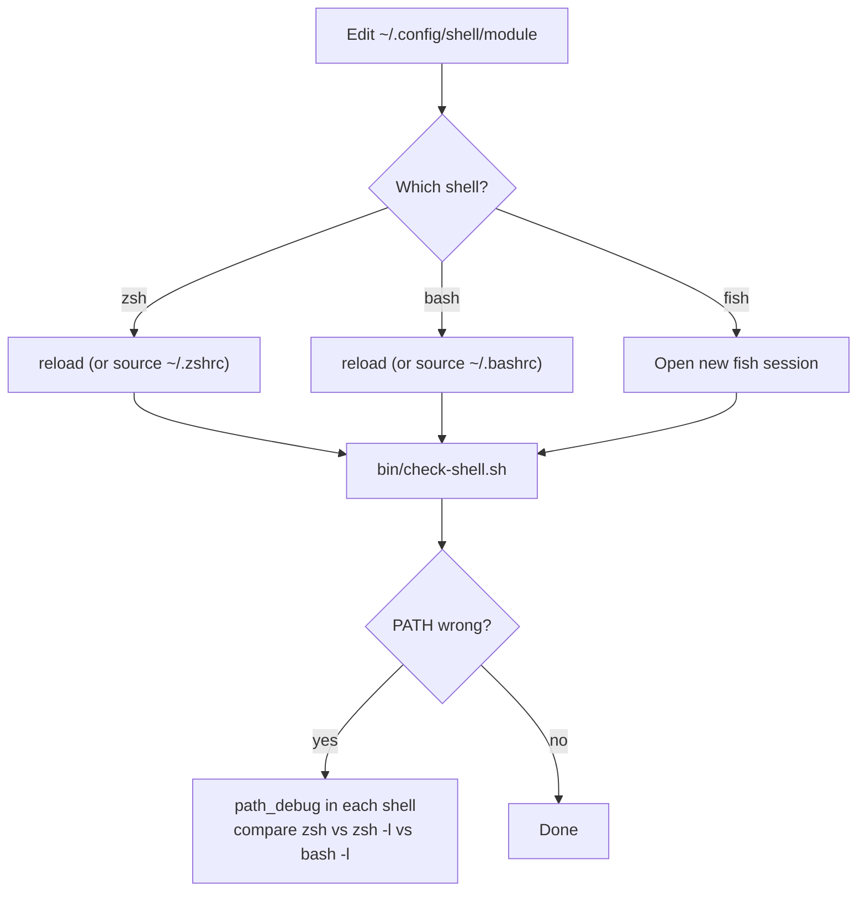

### When you actually need another shell

| Use case | Shell | Notes |
|----------|-------|-------|
| Local daily work | zsh | Default; all tools wired |
| Remote SSH, VPS, Docker exec | bash | Often only `/bin/bash`; your `env.sh` layer still applies if dotfiles synced |
| Vendor install script | bash | Run as `bash ./install.sh`, not `source` |
| Reproduce user bug | match their shell | `bash -l` vs `bash` changes PATH |
| Portable script / CI | `#!/usr/bin/env bash` or `sh` | Do not source `aliases.sh`; set explicit env in script |
| Fish autosuggestions experiment | fish (temporary) | `ga`/`gd` not ported; use zsh for git worktrees |

You rarely need `chsh`. Most switching is **temporary** (`exec bash` on a server session) or **implicit** (scripts spawn their own shell from shebang).

---

## `~/.config/shell` modules

| File | Role | Sourced by |
|------|------|------------|
| `lib.sh` | Safe sourcing (Omarchy, secrets, permission checks) | `env.sh`, `personal.sh` |
| `env.sh` | `path_prepend`/`path_append`, `path_drop`, exports, `source_environments`, vite-plus via `source_if_safe` | zsh, bash, fish (via bass) |
| `aliases.sh` | yazi `y()`, guarded `cat`/`grep`/`find`/`ps`, `gdf`/`gdfs`, monitoring (`top`→btop), `ff`/`lg`; **chains** `personal.sh` | zsh, bash, fish (via bass) |
| `personal.sh` | Work aliases (`agrepos`, …); loads `~/.config/secrets/dev.env` via `load_secrets_file` | via `aliases.sh` tail only |
| `functions.sh` | Custom functions (`path_debug`, `shell_debug`, `reload`) | zsh, bash rc files; fish (via bass) |
| `bin/migrate.sh` | Generates dotfiles, backups; preserves existing modules | manual run |
| `bin/check-shell.sh` | Load order, reserved names, shellcheck (`--audit` for permissions) | manual run |
| `bin/recover-shell.sh` | Nuclear recovery when rc files are broken | manual run |
| `bin/agent-build-layout.sh` | tmux agent build layout (`build` window) | `ab` / Prefix+B |
| `bin/agent-verify-layout.sh` | tmux verification cockpit layout | `av` / Prefix+V |
| `bin/fzf-preview.sh` | fzf preview helper (files + Ctrl+R history) | via `FZF_CTRL_T_OPTS` / `FZF_CTRL_R_OPTS` in `env.sh` |
| `git.ex.config` | delta snippet → `~/.config/git/verification`; enable with `git config --global include.path …` | migrate copy-when-absent |
| [bin/README.md](../bin/README.md) | Detailed usage for every script in `bin/` | reference |

### `lib.sh` helpers

| Function | Purpose |
|----------|---------|
| `_is_interactive_session` | Returns true when stdin and stdout are ttys (gates SSH/GPG exports in `env.sh`) |
| `source_if_safe` | Source a file only when owned by you/root and not world-writable |
| `omarchy_file` | Print path to `default/bash/{envs,aliases,functions,rc}` or return 1 |
| `source_omarchy` | Load an Omarchy module when present; no-op when absent |
| `load_secrets_file` | Parse `KEY=value` secrets without `set -a` |
| `shell_truth_seeker` | Set `$SHELL` to the live interpreter (`SHELL_TRUTH_SEEKER=0` to disable) |

**Omarchy layout** (pinned in `lib.sh`):

```
~/.local/share/omarchy/default/bash/envs
~/.local/share/omarchy/default/bash/aliases   # includes n()
~/.local/share/omarchy/default/bash/functions # ga, gd
~/.local/share/omarchy/default/bash/rc        # bash bundle
```

Set `OMARCHY_WARN=1` to print missing-module warnings. Override root with `OMARCHY_ROOT=...`.

### `$SHELL` truth seeker

`env.sh` calls `shell_truth_seeker` by default so `$SHELL` matches the running interpreter (zsh/bash) **after rc load**. Stock Unix behavior (inherited stale `$SHELL` across `exec`) is documented in [SHELL-env-var-behavior.md](SHELL-env-var-behavior.md). **Downside:** tools that expect the passwd default before config loads may disagree. Disable per-session:

```bash
export SHELL_TRUTH_SEEKER=0
source ~/.zshrc
```

### What `env.sh` sets up

```mermaid
flowchart LR
    subgraph path_prepend["path_prepend (last call wins)"]
        p1["tool bins: bun, pnpm, cargo, …"]
        p2["mamba"]
        p3["mise shims"]
        p4["~/bin"]
        p5["~/.local/bin (highest)"]
    end

    subgraph path_append["path_append (fallbacks)"]
        a1["condabin"]
        a2["/opt/rocm/bin"]
    end

    subgraph exports["exports"]
        e1["PNPM_HOME"]
        e2["PIP_CACHE_DIR, TMPDIR"]
        e3["OMP/MKL threads, HSA_OVERRIDE"]
        e4["SSH_AUTH_SOCK, GPG_TTY"]
    end

    subgraph loaders["post-PATH in env.sh"]
        l1["source_environments"]
        l2["~/.vite-plus/env (source_if_safe)"]
        l3["local/overwrite.sh (optional)"]
    end

    path_prepend --> path_append --> exports --> loaders
```

### PATH contract (v2)

Forkable kernel PATH: [`core/path.contract`](../core/path.contract). Machine-specific overlay: [`local/path.contract`](../local/path.contract) (copy from [`local/path.contract.example`](../local/path.contract.example)). Executed by [`core/path-resolve.sh`](../core/path-resolve.sh) via `path_contract_apply` in `env.sh` — **core first, then local** (local prepends win higher priority within a phase). Runtime 1:1 validation: `path_check` or `path_contract_verify`.

**Format:** resolution order within phases (top line = highest `which` priority). Phases apply in build order `environment` → `core` → `append`; `post_vite` runs after `~/.vite-plus/env` (typically in `local/path.contract`). Deny list strips junk (`/condabin`, `~/.local/share/../bin`) at start and end of `env.sh`, and again via `path_contract_reassert` in `.zshrc` after tool hooks.

**Hybrid system commands:** [`core/tool.contract`](../core/tool.contract) pins execution (`clear` → `/usr/bin/clear`) and `check-shell` warns on PATH shadowing.

**Core** (`core/path.contract` — forkable defaults):

| Priority (`which`) | Segment | Phase |
|-------------------:|---------|-------|
| 1 | `$HOME/bin` | core |
| 2 | `$HOME/.local/bin` | core |
| 3 | `$HOME/.local/share/mise/shims` | core |
| 4 | `$HOME/.cargo/bin` | core |
| 5 | `$PNPM_HOME` | core |
| 6 | `$HOME/.bun/bin` | core |
| 7 | `$OMARCHY_PATH/bin` | environment (omarchy preset) |
| — | inherited system `PATH` | inherit |

**Local overlay** (`local/path.contract` — your machine; see example):

| Segment | Phase |
|---------|-------|
| mamba, vector, grok, risc0, opencode, solana, vite-plus | core |
| `$HOME/bin` re-assert | post_vite |
| miniconda/condabin, `/opt/rocm/bin` | append |

Debug: `path_debug` (shows contract status). Verify: `path_check` or `zsh -lic path_contract_verify`.

**Installer drift:** after a tool adds init to `~/.zshrc`, run `~/.config/shell/bin/capture-shell-init.sh --dry-run`. Registry: [`templates/tool-init.manifest`](../templates/tool-init.manifest).

**Not in the contract** (expected in some sessions until reassert):

| Segment | Source | Notes |
|---------|--------|--------|
| `tmp/.mount_cursor*/…` | Cursor AppImage | Editor terminal only |
| `~/.local/share/mise/installs/*/bin` | `mise activate` | Skipped when shims on PATH |
| `/condabin` | mamba hook | Stripped by `path_contract_reassert` in managed `.zshrc` |

---

## Login vs interactive layers

Some environment is applied **before** `~/.zshrc` or `~/.bashrc` run.

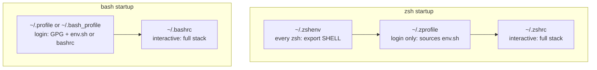

**Caveat:** PATH ownership is documented in [PATH contract](#path-contract) (`core/path.contract`). Login files delegate to `env.sh`. Use `path_debug` when troubleshooting.

---

## zsh load order (managed `~/.zshrc` template)

Daily driver. Preset env exports load in `env.sh` via `source_environments`; interactive Omarchy hooks load via `source_environment_shell zsh` → `environments/omarchy/zsh.sh`.

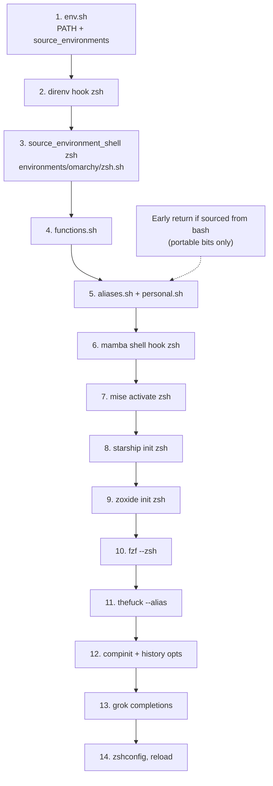

| Step | File / command | Notes |
|------|----------------|-------|
| 1 | `env.sh` | `source_environments` loads `environments/<preset>/env.sh`; `CONDA_CHANGEPS1=false` |
| 2 | `direnv` | zsh/bash-aware hook if `.zshrc` sourced from bash; **requires direnv on PATH** |
| 3 | `source_environment_shell zsh` | Omarchy: aliases + functions from `environments/omarchy/zsh.sh` — **never alias `ga`** |
| 5 | `aliases.sh` | `ff` = **fastfetch** (wins over Omarchy) |
| 6–11 | tool inits | mamba → mise → starship → zoxide → fzf → thefuck |
| — | bash `source` | If `ZSH_VERSION` unset, returns before step 6 (zsh-only inits skipped) |

---

## bash load order (managed `~/.bashrc` template)

Same portable stack as zsh. Preset hooks via `source_environment_shell bash` → `environments/omarchy/bash.sh` (modular `source_omarchy` parts, or fallback to Omarchy `rc` files).

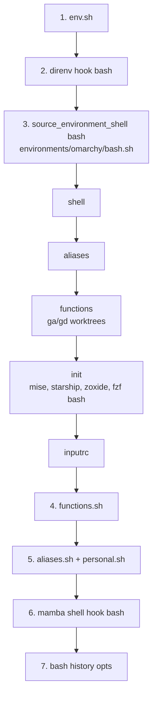

Omarchy functions like `ga()` load **before** `aliases.sh`, so bash does not hit `syntax error near unexpected token '('` if someone re-adds `alias ga=`.

---

## Environment presets: zsh vs bash

Both shells use the same rc template shape: `env.sh` → `direnv` → `source_environment_shell` → `functions.sh` → `aliases.sh`. Omarchy differences live in `environments/omarchy/{zsh,bash}.sh`.

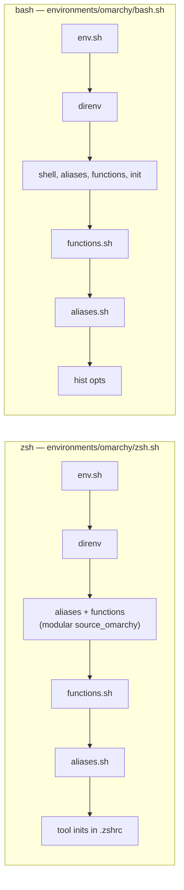

| Concern | zsh | bash |
|---------|-----|------|
| Preset env exports | `env.sh` → `environments/omarchy/env.sh` | same |
| Omarchy interactive hooks | `environments/omarchy/zsh.sh` (aliases + functions) | `environments/omarchy/bash.sh` (shell + aliases + functions + init) |
| `ga` worktree fn | Omarchy functions | Omarchy functions (safe order) |
| `ff` | fastfetch (`aliases.sh` wins) | fastfetch (`aliases.sh` wins) |
| mise / starship | `.zshrc` | Omarchy `init` inside `environments/omarchy/bash.sh` |
| thefuck | `.zshrc` only | not loaded |
| direnv | after `env.sh` (requires direnv) | after `env.sh` (requires direnv) |

---

## Override precedence

Later definitions win **within the same shell**. Bash and zsh now share the same override semantics for the `~/.config/shell` layer.

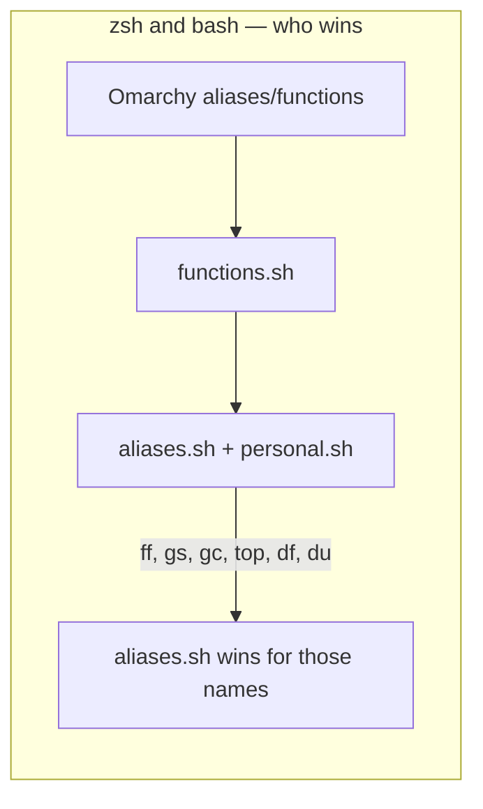

### Reserved names

| Name | Owner | Meaning | Do not |
|------|-------|---------|--------|
| `ga` | Omarchy `fns/worktrees` | `git worktree add` helper | `alias ga='git add'` |
| `gd` | Omarchy `fns/worktrees` | remove worktree + branch | alias over it |
| `n` | Omarchy `aliases` | nvim wrapper function | `alias n='nvim'` (breaks zsh reload) |
| `ff` | `aliases.sh` (override) | fastfetch in all shells | assume Omarchy's fzf meaning |

Use `fzf` directly or Omarchy's `eff` for file picking.

---

## fish (best-effort)

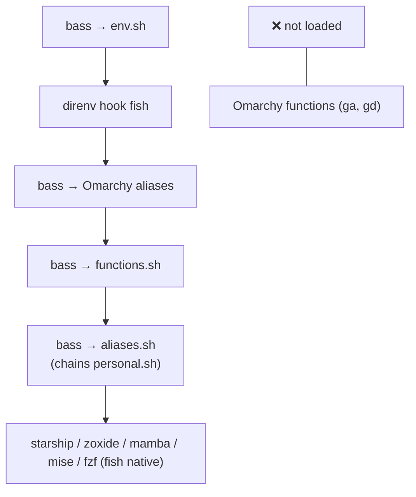

Fish gets PATH/exports, direnv, `functions.sh`, thefuck, Omarchy aliases, and work shortcuts via `aliases.sh` → `personal.sh`. Worktree helpers (`ga`, `gd`) still need fish-native function ports for full parity.

---

## Tool initialization matrix

| Tool | zsh | bash | fish | Where |
|------|-----|------|------|-------|
| direnv | `.zshrc` | `.bashrc` | `config.fish` | `command -v` / `type -q` guard; zsh: shell-aware hook |
| mamba | `.zshrc` | `.bashrc` | `config.fish` | when `mamba` on PATH |
| mise | `.zshrc` | Omarchy `init` | `config.fish` | zsh/fish skip `activate` when shims already on PATH |
| starship | `.zshrc` | Omarchy `init` | `config.fish` | `starship.ex.toml` → `~/.config/starship.toml` (migrate when absent) |
| zoxide | `.zshrc` | Omarchy `init` | `config.fish` | |
| fzf | `.zshrc` | Omarchy `init` | `config.fish` | |
| thefuck | `.zshrc` | — | `config.fish` | native fish only |
| compinit | `.zshrc` | — | — | |
| grok completions | `.zshrc` | — | — | |

---

## Login dotfiles

`bin/migrate.sh` generates login-layer dotfiles when they are **missing** or already **managed** (marker comment present). Hand-edited login files are preserved unless you pass `--force-rc`.

Without these, login shells may miss early PATH or GPG agent setup. Cargo and vite-plus load from `core/env.sh` (vite-plus) — login templates stay minimal.

**`~/.zprofile`** — login zsh only; early PATH via portable env:

```bash
# Managed by ~/.config/shell/bin/migrate.sh
[ -f "$HOME/.config/shell/env.sh" ] && . "$HOME/.config/shell/env.sh"
```

**`~/.zshenv`** — every zsh (including scripts):

```bash
# Managed by ~/.config/shell/bin/migrate.sh
export SHELL=$(command -v zsh 2>/dev/null || echo /usr/bin/zsh)
```

**`~/.profile`** — POSIX login (GPG + portable env):

```bash
# Managed by ~/.config/shell/bin/migrate.sh
export GPG_TTY=$(tty)
gpg-connect-agent updatestartuptty /bye >/dev/null 2>&1 || true
[ -f "$HOME/.config/shell/env.sh" ] && . "$HOME/.config/shell/env.sh"
```

**`~/.bash_profile`** — login bash; sources interactive rc only:

```bash
# Managed by ~/.config/shell/bin/migrate.sh
[[ -f ~/.bashrc ]] && . ~/.bashrc
```

After migrate, compare PATH across modes: `zsh -ic path_debug`, `zsh -lc path_debug`, `bash -lc path_debug`.

---

## `migrate.sh` behavior

**One-liner install** (pipe bootstrap from GitHub):

```bash
curl -fsSL https://raw.githubusercontent.com/p10ns11y/shellyxz.sh/refs/heads/master/bin/migrate.sh | bash
```

When piped, or when `lib.sh` / helper scripts are missing, migrate fetches the full tracked tree from `SHELL_CONFIG_RAW` (same URL base). Use `--bootstrap` to retry fetching any still-missing files. Fork/branch: `SHELL_CONFIG_RAW=https://raw.githubusercontent.com/you/shellyxz.sh/refs/heads/main`.

Re-running `bin/migrate.sh`:

| Action | Behavior |
|--------|----------|
| `env.sh`, `aliases.sh`, `functions.sh` | **Preserved** if they already exist |
| `personal.sh` | **Fetched on bootstrap** if missing; edit for your machine; `aliases.sh` sources it when present |
| `lib.sh`, `bin/recover-shell.sh`, `bin/check-shell.sh` | **Fetched on bootstrap** (`curl …/migrate.sh \| bash` or `--bootstrap`); not generated from inline templates |
| `~/.zshrc`, `~/.bashrc`, fish config | **Refreshed** only if missing or marked managed; **skipped** if hand-edited |
| Login dotfiles (`~/.zprofile`, `~/.profile`, `~/.bash_profile`, `~/.zshenv`) | **Generated** when missing or managed; **skipped** if hand-edited |
| `~/.config/starship.toml` | **Copied** from `starship.ex.toml` when absent; existing file preserved |
| `--force-rc` | Overwrites managed rc and login dotfiles even when hand-edited |
| `--sync-rc` | Refreshes managed rc/login dotfiles that already have the migrate marker (no `--force-rc` needed) |
| Dotfile backups | Written to `backups/TIMESTAMP/` (gitignored) with `revert.sh` |
| `completions/` | Empty placeholder directory created; reserved for future shell completions |
| Package installs (Arch) | Tries `paru -S yazi thefuck procs difftastic` when missing; warns on failure |
| Git | `git init` + initial commit if `~/.config/shell/.git` absent; `git add -A` + commit on every run (no-op if clean) |

Managed rc files include the marker comment `Managed by ~/.config/shell/bin/migrate.sh`. Edit `~/.config/shell/*` modules for day-to-day changes; use `--force-rc` when you intentionally want template updates in rc files.

**direnv note:** zsh/bash templates wrap hooks in `command -v direnv` (fish uses `type -q`). zsh template also uses a ZSH/BASH guard so `source ~/.zshrc` from bash does not run the zsh hook.

**Starship / mamba:** `env.sh` sets `CONDA_CHANGEPS1=false` so Starship's `[conda]` module owns `(env)` inline. migrate copies `starship.ex.toml` to `~/.config/starship.toml` when absent.

Run `bin/check-shell.sh` after migrate to confirm nothing drifted.

### `check-shell.sh` checks

| Always (default) | With `--audit` |
|------------------|----------------|
| Load-order grep (bash/zsh environment hooks before aliases) | `dev.env` file mode (recommend 600) |
| Reserved names (`ga`, `n`) in repo files | `recover-shell.sh` executable |
| zsh runtime: `n`/`ga`/`gd` resolve to functions | `lib.sh` present |
| `personal.sh` chained from `aliases.sh` | `check-template-sync.sh` |
| migrate preserve/`--force-rc`/`--sync-rc` policy | |
| **PATH contract** vs `core/env.sh` + omarchy | |
| `path_drop`, `local/overwrite.sh` hook, env re-entry guard | |
| fish tier-1 hooks (when fish config exists) | |
| **shellcheck** on every `*.sh` under `~/.config/shell` | |
| Login shell vs process identity (with `$SHELL` caveat) | |
| Login dotfiles present and delegate to `env.sh` | |
| Starship + `CONDA_CHANGEPS1` pairing (when starship installed) | |
| Direnv hook guards when direnv absent | |

---

## Operations

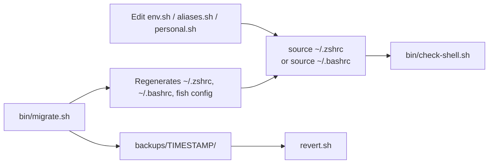

| Task | Command |
|------|---------|
| Verify config + shell identity | `~/.config/shell/bin/check-shell.sh` (shellcheck always; `--audit` for secrets permissions) |
| Nuclear recovery (broken rc) | `bash --norc ~/.config/shell/bin/recover-shell.sh` |
| Debug "why is $SHELL still bash after exec/chsh" | `shell_debug` |
| Reload current shell | `reload` (bash or zsh, depending on what you're in right now) |
| (or manual) | `source ~/.zshrc` or `source ~/.bashrc` |
| Replace current process with default login shell | `exec /usr/bin/zsh -l` (or the shell from `getent passwd $USER`) |
| Re-apply template | `~/.config/shell/bin/migrate.sh` |
| Roll back dotfiles | `~/.config/shell/backups/<timestamp>/revert.sh` |

---

## Gotchas checklist

- [x] **Never alias `ga`** — Omarchy defines it as a git-worktree function; aliasing before the function breaks bash.
- [x] **`ff` consistent across shells** — `aliases.sh` loads after Omarchy in bash and zsh; `ff` = fastfetch everywhere.
- [x] **`functions.sh` wired** — sourced in bash and zsh rc files after Omarchy, before `aliases.sh`.
- [x] **`personal.sh` chained from `aliases.sh`** — not sourced directly by rc files.
- [x] **Omarchy envs not duplicated in zsh** — only via `env.sh`.
- [x] **direnv hooked** in bash and zsh when installed.
- [x] **migrate preserves modules** — won't overwrite existing `env.sh` / `aliases.sh` / `functions.sh`.
- [x] **PATH centralized** — `path_prepend`/`path_append` in `env.sh`; login files delegate; last prepend wins; use `path_debug`.
- [x] **secrets outside shell repo** — `~/.config/secrets/dev.env`; no `.envrc` in workspace.
- [ ] **fish is partial** — requires bass plugin; no `ga`/`gd` (direnv, fzf, `functions.sh`, thefuck added).
- [x] **migrate rc policy** — skips hand-edited rc files; refreshes managed ones; `--force-rc` to overwrite.
- [x] **login dotfiles generated** — migrate creates `~/.zprofile`, `~/.profile`, `~/.bash_profile`, `~/.zshenv` when missing or managed.
- [x] **secrets via load_secrets_file** — no `set -a` in `personal.sh`; `dev.env` mode 600 recommended.
- [x] **external loaders hardened** — `source_if_safe` for vite-plus; `path_prepend` for cargo; `path_drop` for inherited junk; no `../bin` prepends.
- [x] **nuclear recovery** — `bin/recover-shell.sh` works without loading rc files.

---

## Related files

| Path | Purpose |
|------|---------|
| [README.md](../README.md) | Philosophy, switching shells, where to add aliases, maintenance |
| [env.sh](../env.sh) | Portable environment |
| [aliases.sh](../aliases.sh) | Shared aliases + `personal.sh` chain |
| [personal.sh](../personal.sh) | Work-specific shortcuts |
| [functions.sh](../functions.sh) | Custom functions |
| [bin/migrate.sh](../bin/migrate.sh) | Setup script and dotfile templates |
| [lib.sh](../lib.sh) | Safe sourcing helpers |
| [bin/recover-shell.sh](../bin/recover-shell.sh) | Nuclear recovery |
| [bin/check-shell.sh](../bin/check-shell.sh) | Load-order + shellcheck verification |
| [SHELL-env-var-behavior.md](SHELL-env-var-behavior.md) | Why `$SHELL` is stale before config load; truth seeker overrides |