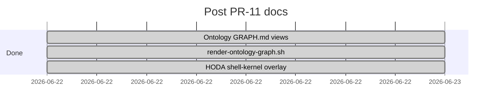
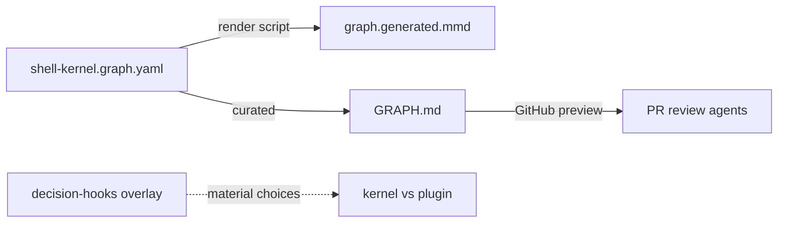

# Done — ontology viz + HODA overlay (PR #12)

**Branch:** `ontology-viz-hoda-overlay` · **PR:** [#12](https://github.com/p10ns11y/shellyxz.sh/pull/12) · **Status:** merged  
**Depends on:** [sn-o0-sn4a-pr11.md](sn-o0-sn4a-pr11.md)

---

## Merge checklist

- [x] Curated Mermaid subgraphs in `.agents/ontology/GRAPH.md`
- [x] `bin/render-ontology-graph.sh` (YAML → Mermaid, `--subgraph` filter)
- [x] GitHub-compatible Mermaid edge syntax (`-->|label|`, not `==>|label|`)
- [x] HODA overlay `arch-design/overlays/shell-kernel-decision-hooks.md`
- [x] `coming-next.md` trajectory forces + PR #11 archive links
- [x] `planned-features/done/sn-o0-sn4a-pr11.md` archive

---

## Sprint gantt (completed)

---

## Done log (commits)

| Item | Commit | Area |
|------|--------|------|
| Ontology viz + HODA + coming-next | `c6df2b1` | `.agents/ontology/`, `arch-design/`, `bin/` |
| Mermaid GitHub syntax fix | `16f964e` | `GRAPH.md`, `render-ontology-graph.sh` |

---

## Architecture snapshot

---

## Follow-ups (SN-O1)

| Item | Track |
|------|-------|
| VerificationBridge nodes in graph | O1a |
| `shell-kernel-ontology` skill + router rule | O1b |
| `check-ontology.sh` drift gate | O1c |
| Wire render script into check-ontology | O1c optional |
