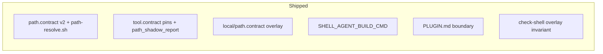

# Done — PATH contract v2 (PR #6)

**Merged:** 2026-06 · **PR:** [#6](https://github.com/p10ns11y/shellyxz.sh/pull/6) · **Merge commit:** `fb80386`

Establishes declarative PATH kernel, local overlay, tool pins, and PLUGIN boundary.

---

## What shipped

| # | Item | Key commits | Files |
|---|------|-------------|-------|
| 1 | `local/path.contract` overlay | `d52e40e`, `6b24738` | `path-resolve.sh`, debloated `core/path.contract` |
| 2 | `SHELL_AGENT_BUILD_CMD` | `6b24738` | `agent-build-layout.sh`, `local/personal.sh` |
| 3 | `PLUGIN.md` kernel vs plugin | `6b24738` | `PLUGIN.md` |
| 4 | Overlay invariant | `76b8073` | `check-shell.sh` line-order guard |

**PR commits:** `d52e40e` PATH v2 · `6b24738` local overlay + PLUGIN · `76b8073` check-shell guard · `fb80386` merge

---

## Evolution context

This epic unlocked the Jun 2026 sprint ([sprint-jun-2026-pr8.md](sprint-jun-2026-pr8.md)): project `phase:project`, agent strict PATH, and cockpit-mcp all assume PATH contract v2 + local overlay semantics.

**Scorecard at ship (historical):**

| Area | Grade | Note |
|------|-------|------|
| PATH declarative + verify | A | `path_contract_verify` |
| Kernel forkability | A- | personal paths in `local/` |
| Per-project PATH | C+ | direnv hooked; fragment deferred to SN-2 |

See [architecture.md](../../arch-design/architecture.md) for **current** grades.
