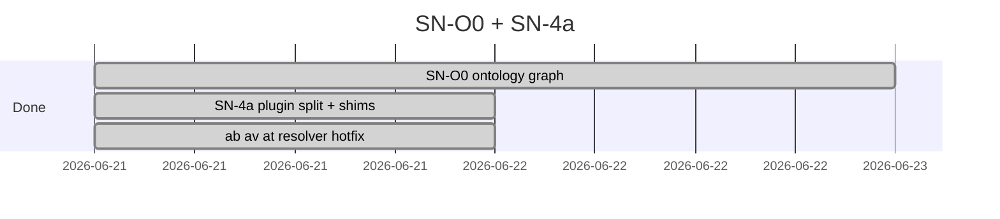

# Done — SN-O0 + SN-4a (PR #11)

**Branch:** `sn-o0-ontology` · **PR:** [#11](https://github.com/p10ns11y/shellyxz.sh/pull/11) · **Status:** merged  
**Merge:** `45108ab` on `master`

---

## Merge checklist

- [x] SN-O0 ontology graph (PATH + boundary + load order)
- [x] SN-4a `plugins/verification/` physical split
- [x] Stable `bin/*` shims + `SHELL_VERIFICATION_*` env
- [x] `verification_script_path` / `verification_lib_dir` resolver (`ab`/`av`/`at` fix)
- [x] Remote bootstrap fetches full plugin tree
- [x] `architecture.md` scorecard updated
- [x] Plan: [shell-kernel-ontology.md](../../arch-design/plans/shell-kernel-ontology.md)

---

## Sprint gantt (completed)

---

## Done log (commits)

| SN | Item | Commit | Area |
|----|------|--------|------|
| SN-O0 | Ontology graph + schema + fusion-state | `b117c98` | `.agents/ontology/` |
| SN-4a | `plugins/verification/` tree + bin shims | `69810d7` | `plugins/`, `bin/`, `core/env.sh` |
| Hotfix | Resolver + `BASH_SOURCE` shims | `bcfa862` | `core/lib.sh`, `core/functions.sh` |
| Follow-up | Bootstrap + architecture scorecard | `0d060ef` | `migrate-common.sh`, `architecture.md` |
| Docs | Plain-language alignment | `4dad2f4` | arch-design |

---

## Architecture snapshot

---

## Follow-ups (not in PR #11)

| Item | Track |
|------|-------|
| SN-O1 | **Shipped** — [sn-o1-ontology-verification.md](sn-o1-ontology-verification.md) |
| SN-4b | Optional separate verification repo |
| HODA overlay | **Shipped** — [#12](ontology-viz-hoda-pr12.md) |
| Graph viz | **Shipped** — [#12](ontology-viz-hoda-pr12.md) |
