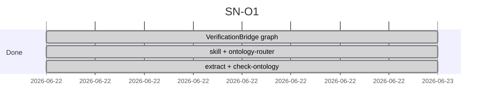
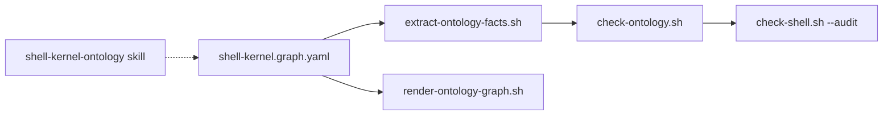

# Done — SN-O1 ontology verification slice

**Branch:** `sn-o1-ontology-verification` · **Status:** local (pre-PR)  
**Depends on:** [sn-o0-sn4a-pr11.md](sn-o0-sn4a-pr11.md), [ontology-viz-hoda-pr12.md](ontology-viz-hoda-pr12.md)

---

## Merge checklist

- [x] O1a — VerificationBridge nodes (`ab`, `av`, `at`, resolver, cockpit-mcp) in graph
- [x] O1b — `shell-kernel-ontology` skill + `ontology-router.mdc`
- [x] O1c — `extract-ontology-facts.sh` + `check-ontology.sh` (render smoke + audit wire)
- [x] `fusion-state.json` verification-bridge abstraction
- [x] GRAPH.md verify subgraph + INDEX update
- [x] `coming-next.md` — SN-O1 → done

---

## Sprint gantt (completed)

---

## Architecture snapshot

---

## Follow-ups

| Item | Track |
|------|-------|
| SN-4b | Optional separate verification repo |
| JSON-LD export | Optional `exports/shell-kernel.jsonld` |
