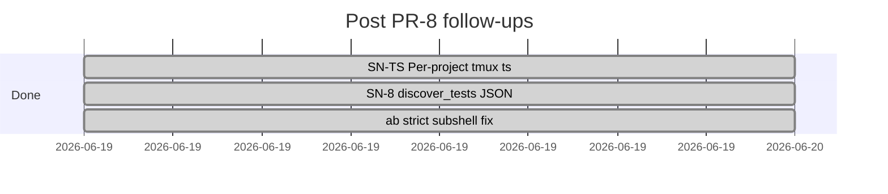
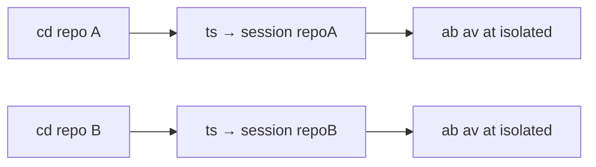
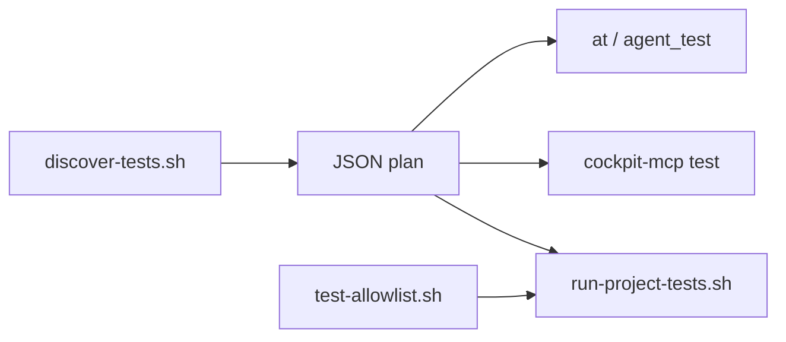

# Done — SN-TS + SN-8 (PR #9)

**Branch:** `sn-ts-sn-8` · **PR:** [#9](https://github.com/p10ns11y/shellyxz.sh/pull/9) · **Status:** open (pre-merge doc)  
**Depends on:** [sprint-jun-2026-pr8.md](sprint-jun-2026-pr8.md)

---

## Merge checklist (PR #9)

- [x] SN-TS `ts()` per-project tmux session
- [x] SN-TS docs (`VERIFICATION.md` t vs ts, template sync)
- [x] SN-8 `discover-tests.sh` canonical emitter
- [x] SN-8 `test-allowlist.sh` shared allowlist
- [x] SN-8 py/sh JSON parity contract test
- [x] Fix `ab --strict` subshell (`path_shadow_report` in current shell)
- [x] `strict-path.test.sh` regression guard
- [x] `capture-shell-init.sh` `--force` wired for `--apply` gate
- [x] Doc triage (`architecture.md`, `coming-next.md`, this archive)

---

## Sprint gantt (completed)

---

## Done log (commits)

| SN | Item | Commit | Area |
|----|------|--------|------|
| SN-TS | `ts()` attach-or-create from git basename | `c4d0639` | `core/functions.sh`, `templates/core/functions.sh` |
| SN-TS | t vs ts docs | `c4d0639` | `arch-design/VERIFICATION.md` |
| SN-8 | `discover-tests.sh` emitter | `c4d0639` | `bin/lib/discover-tests.sh` |
| SN-8 | Shared allowlist + run consumer refactor | `c4d0639` | `test-allowlist.sh`, `parse-project-tests-run.sh` |
| SN-8 | py/sh parity + `max_run=0` align | `c4d0639` | `parse-project-tests.py`, `parse-project-tests.test.sh` |
| — | `ab --strict` subshell fix | `c4d0639` | `bin/lib/verify-launch.sh` |

---

## SN-TS · Per-project tmux session (`ts`)

**Problem:** Omarchy `t` → one session (`Work`). Multi-repo work hijacks shared `build`/`verify` windows.

| File | Work |
|------|------|
| `core/functions.sh` | `ts()` + `_ts_session_name()` |
| `templates/core/functions.sh` | template sync |
| `arch-design/VERIFICATION.md` | `t` vs `ts` table |

**Done when:** `ts` from repo A and B → two sessions; isolated `ab`/`av`/`at`.

**Verify:** `reload` → `ts` in two git repos → `tmux ls` shows two session names.

**Deferred:** `tls` — only if `tmux ls` insufficient. Same git basename across forks → session collision (documented; hash suffix if needed later).

---

## SN-8 · Unified test discovery JSON

**Problem:** `discover()` duplicated in py, sh discover shim, and run allowlists — drift tax on every `at` / cockpit change.

| File | Work |
|------|------|
| `bin/lib/discover-tests.sh` | `discover_tests(root) → JSON` |
| `bin/lib/test-allowlist.sh` | single sh allowlist |
| `parse-project-tests-discover.sh` | shim → discover-tests |
| `parse-project-tests-run.sh` | consumer (no duplicate discovery) |
| `bin/test/parse-project-tests.test.sh` | py/sh parity contract |

**Done when:** one sh source of truth; parity test passes; fewer tokens on bridge edits.

**Verify:** `bash bin/test/parse-project-tests.test.sh` — includes `py/sh discover_tests JSON parity`.

---

## Post-merge follow-ups (backlog)

| ID | Item | Tracking |
|----|------|----------|
| SN-4 | Physical `plugins/verification/` split | [coming-next.md](../../arch-design/coming-next.md) |

---

## Bridge scope lock (unchanged)

Navigators stay. Fair game: parser complexity, python default for full YAML. SN-4 moves files without re-splitting discover logic.
