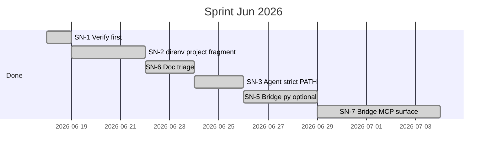
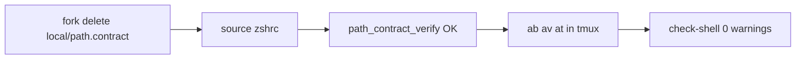
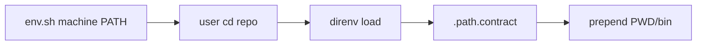
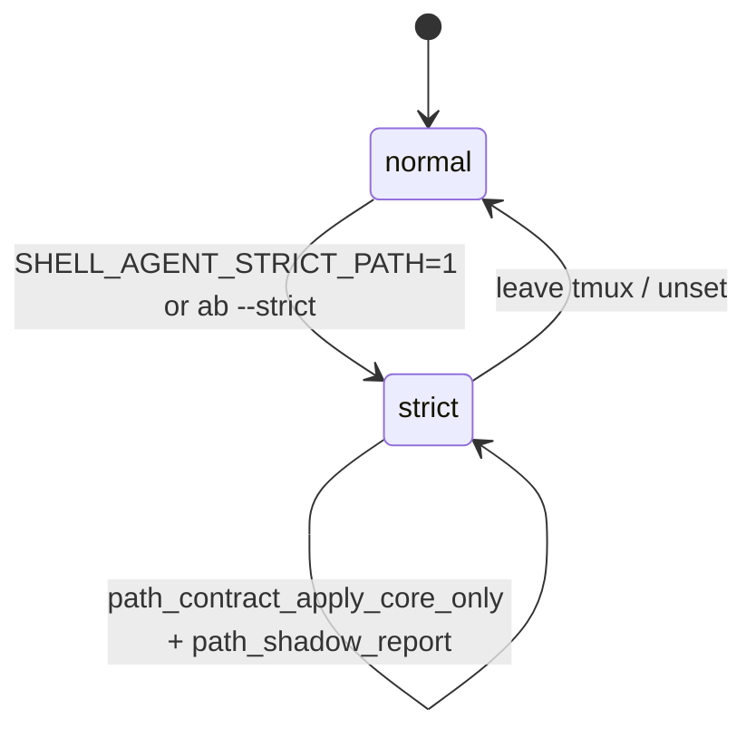
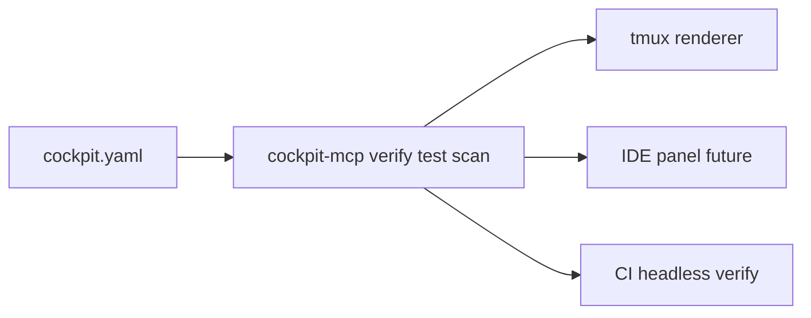
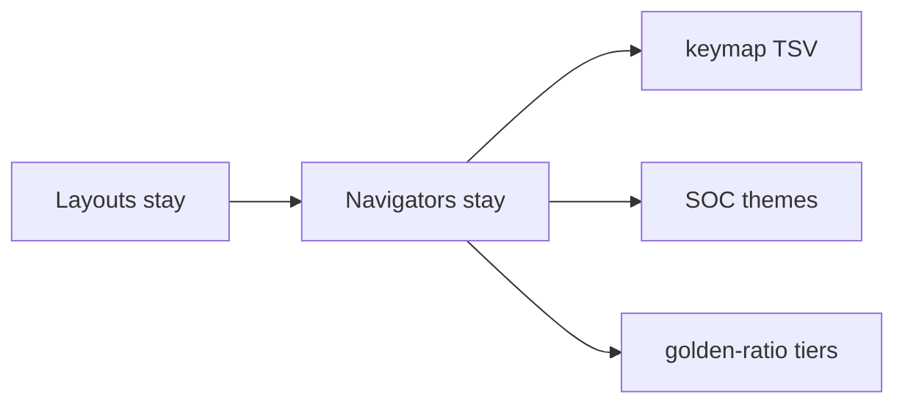
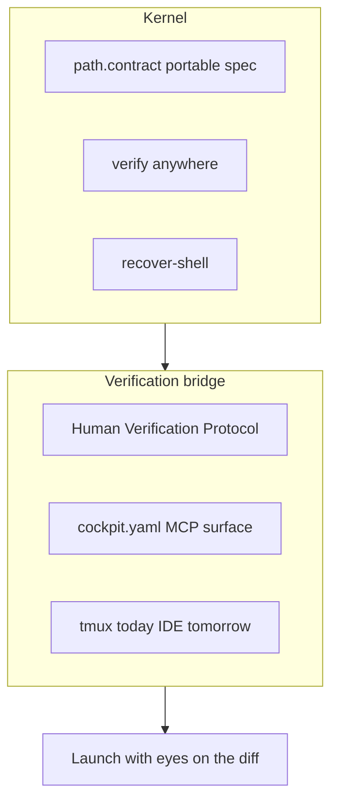

# Done — Sprint Jun 2026: kernel bridge (PR #8)

**Branch:** `sn-2-direnv-project-fragment` · **PR:** [#8](https://github.com/p10ns11y/shellyxz.sh/pull/8) · **Status:** merged to `master`  
**Depends on:** [path-contract-v2-pr6.md](path-contract-v2-pr6.md)

---

## Merge checklist (PR #8)

- [x] SN-1 verify first
- [x] SN-2 `phase:project` + direnv hook
- [x] SN-3 agent strict PATH + `ab --strict`
- [x] SN-5 sh test discovery (python optional)
- [x] SN-6 doc triage + omarchy overlay example
- [x] SN-7 `cockpit-mcp.sh` headless verbs
- [x] `tool_contract_which` alias/function fix
- [x] Doc split (`architecture.md` / `coming-next` / `planned-features/done/`)
- [x] Mermaid parse fix (`shell.md`)
- [x] `capture-shell-init` false-positive fix (managed + login rc)
- [x] `PLUGIN.md` strict PATH portability (`PATH_CONTRACT_STRICT_BASE`, `pin:git`)
- [x] `architecture.md` scorecard + guardrails current post-merge

---

## Sprint gantt (completed)

---

## Done log (commits)

| SN | Item | Commit | Area |
|----|------|--------|------|
| SN-1 | Verify first | — | manual verify |
| SN-2 | `phase:project` direnv fragment | `afb4fc0` | `path-contract-project.sh`, `path-resolve.sh` |
| SN-6 | Doc triage + omarchy overlay | `f7dafb1` | `arch-design/README.md`, `local/omarchy.sh.example` |
| SN-3 | Agent strict PATH | `2c76358` | `agent-build-layout.sh`, `tool.contract` |
| — | `which` alias fix | `1891f57` | `path-resolve.sh` |
| SN-5 | sh test discovery | `50f4e52` | `parse-project-tests-discover.sh` |
| SN-7 | cockpit-mcp headless | `c589765` | `bin/cockpit-mcp.sh`, `VERIFICATION.md` |
| — | Doc split + architecture living doc | `4bfedc6` | `arch-design/architecture.md`, `planned-features/done/` |
| — | Mermaid parse fix | `0d204d2` | `arch-design/shell.md` |
| — | capture-shell-init false positives | `c0496d9` | `bin/capture-shell-init.sh`, tests |
| — | PR #8 merge close-out (docs) | `876abf0` | `PLUGIN.md`, backlog triage |

---

## Post-merge follow-ups (backlog)

| ID | Item | Tracking |
|----|------|----------|
| SN-4 | Physical `plugins/verification/` split | [coming-next.md](../../arch-design/coming-next.md) |

**Shipped in PR #9:** [sn-ts-sn8-pr9.md](sn-ts-sn8-pr9.md) — SN-TS, SN-8, `ab --strict` subshell fix.

---

## SN-1 · Verify first

**Problem:** Lock in kernel trust before expanding the bridge.

---

## SN-2 · direnv `phase:project` fragment

| File | Change |
|------|--------|
| `core/path-resolve.sh` | `phase:project` filter, `PWD/*` tokens, `path_contract_apply_project` |
| `bin/path-contract-project.sh` | direnv hook |
| `.envrc.example`, `.path.contract.example` | project templates |
| `arch-design/shell.md` | PATH layer precedence |

---

## SN-3 · Agent strict PATH (plugin only)

---

## SN-5 · Cockpit simplify (python optional)

| Cut / simplify | Keep |
|----------------|------|
| `parse-project-tests.py` optional | keymap TSV, SOC themes, golden-ratio |
| sh-only default test discovery | `cockpit.yaml`, `verify_workflow_root` |

**Verify:** `source ~/.zshrc` on VPS without python; `at` uses sh discover.

---

## SN-7 · Verification bridge MCP surface

**Shipped:** `bin/cockpit-mcp.sh` — full MCP server wrapper deferred.

---

## SN-6 · Doc triage

| ID | Action |
|----|--------|
| SN-6a | Canonical trio in `arch-design/README.md` |
| SN-6b | `.cursor/skills` → `.agents/skills` |
| SN-6c | `local/omarchy.sh.example` |

---

## Bridge scope lock (user decision)

Navigators **not** archived. Fair game: parser complexity, python default for full YAML.

---

## Ten-year thrive picture (2036)

*Archived from backlog planning — still valid north star.*

Full analysis: [test-of-travelled-time-from-future.md](../../arch-design/test-of-travelled-time-from-future.md).

---

## Musk five-step (applied to this sprint)

| Step | Verdict |
|------|---------|
| ④ Accelerate verify | `path_check` + check-shell ✓ |
| ③ Simplify | sh default tests ✓ |
| ⑤ Automate MCP | cockpit-mcp CLI ✓ (server later) |
| ② Delete | skills symlink ✓ |

Method refs: [collab-finder reports](https://github.com/p10ns11y/collab-finder/tree/main/reports).
