# Shell environment architecture

How `~/.config/shell/` layers portable environment, Omarchy, and shell-native tooling across **zsh**, **bash**, and **fish**.

For day-to-day editing guidance see [README.md](README.md). This document is the **accurate load-order reference** — verified against live dotfiles and `bin/migrate.sh`.

**Prerequisites:** Omarchy (`~/.local/share/omarchy`), direnv (for managed zsh/bash rc), bass (fish only). See [README — Getting started](README.md#getting-started).

---

## Overview

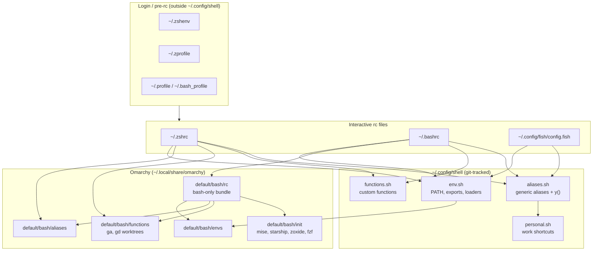

**Key idea:** `env.sh` is the portable foundation (including Omarchy envs). Omarchy aliases and functions load next. `functions.sh` and `aliases.sh` load after Omarchy so your overrides win. `personal.sh` chains from the tail of `aliases.sh`. **Bash and zsh integrate Omarchy differently** — modular in zsh, `rc` bundle in bash — but override semantics match.

---

## Startup files: what rc, profile mean

Unix shells do not read one config file. They read **different files depending on shell name, login vs non-login, and interactive vs non-interactive**. Your setup keeps heavy logic in `~/.config/shell/` and uses home-directory files as thin entrypoints.

### The files on this machine

| File | Role | Loaded when | What it does here |
|------|------|-------------|-------------------|
| `~/.zshenv` | zsh env | **Every** zsh (including scripts) | `cargo/env`, vite-plus — runs before everything else in zsh |
| `~/.zprofile` | zsh login | Login zsh only (`zsh -l`, some terminals) | Sources `env.sh` for early PATH on login |
| `~/.zshrc` | zsh interactive | Interactive zsh (normal terminal) | Full stack: `env.sh` → direnv → Omarchy → `functions.sh` → `aliases.sh` → tool inits |
| `~/.profile` | POSIX login | Login sh/bash (when `bash_profile` absent) | GPG agent, `env.sh`, cargo, vite-plus |
| `~/.bash_profile` | bash login | Login bash | Sources `~/.bashrc`, then vite-plus again |
| `~/.bashrc` | bash interactive | Interactive bash | Full stack via Omarchy `rc` bundle + your modules |
| `~/.config/fish/config.fish` | fish main | Interactive fish | Fish has no separate profile/rc split — one file does it all |

Files **outside** `~/.config/shell/` but in the chain: Omarchy under `~/.local/share/omarchy/`, plus optional `~/.cargo/env`, `~/.vite-plus/env`.

### Login vs interactive vs non-interactive

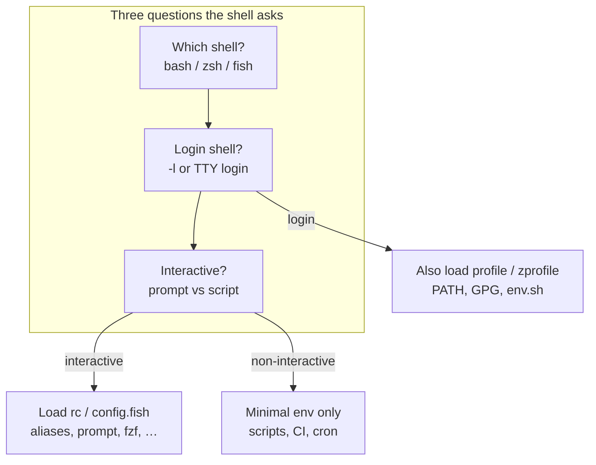

| Session type | Example | Typical files read (zsh) |
|--------------|---------|---------------------------|
| Interactive login | New terminal tab (most emulators) | `zshenv` → `zprofile` → `zshrc` |
| Interactive non-login | `zsh` from inside bash | `zshenv` → `zshrc` |
| Non-interactive | `zsh -c 'npm test'`, CI | `zshenv` only (often nothing you care about) |
| Script shebang | `#!/usr/bin/env bash` in Makefile | **No rc** unless bash is invoked as login/interactive |

That is why `path_debug` can differ between `zsh` and `zsh -l`: login adds `zprofile` → `env.sh` an extra time.

### Where to put changes

| You want to… | Edit this | Not this |
|--------------|-----------|----------|
| Add an alias | `aliases.sh` or `personal.sh` | `~/.zshrc` |
| Fix PATH | `env.sh` | `~/.zprofile` (already delegates to `env.sh`) |
| Add a function | `functions.sh` | rc files |
| Change load order or add a tool init | `migrate.sh` template, then `--force-rc` | hand-edit rc without migrating |
| One-off experiment | `exec fish` / `bash -l` | `chsh` |

### Switching shells

**Default shell** (what new login sessions use) is stored in `/etc/passwd`, changed with:

```bash
chsh -s /usr/bin/zsh   # list options: chsh -l
```

**Current shell** is the running process. `echo $SHELL` is the default, not the current. Use `echo $0` or `ps -p $$ -o comm=` to see what is running.

| Action | Command | Effect |
|--------|---------|--------|
| Temporary switch | `exec zsh` / `exec bash` / `exec fish` | Replaces current process; `exit` closes terminal |
| Subshell try-out | `fish` or `bash` (no exec) | Nested; `exit` returns to parent |
| Login simulation | `bash -l`, `zsh -l` | Runs profile + rc — good for PATH debugging |
| Non-interactive test | `bash -c 'cmd'` | Does not load your interactive aliases |

Fish is **opt-in**: use `exec fish` to try it without changing `chsh`. Switch back by opening a new terminal (if zsh is default) or `exec zsh`.

### Workflow: edit → reload → verify

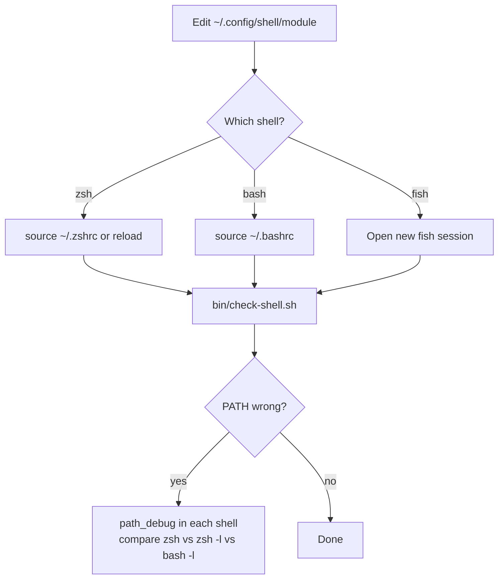

### When you actually need another shell

| Use case | Shell | Notes |
|----------|-------|-------|
| Local daily work | zsh | Default; all tools wired |
| Remote SSH, VPS, Docker exec | bash | Often only `/bin/bash`; your `env.sh` layer still applies if dotfiles synced |
| Vendor install script | bash | Run as `bash ./install.sh`, not `source` |
| Reproduce user bug | match their shell | `bash -l` vs `bash` changes PATH |
| Portable script / CI | `#!/usr/bin/env bash` or `sh` | Do not source `aliases.sh`; set explicit env in script |
| Fish autosuggestions experiment | fish (temporary) | `ga`/`gd` not ported; use zsh for git worktrees |

You rarely need `chsh`. Most switching is **temporary** (`exec bash` on a server session) or **implicit** (scripts spawn their own shell from shebang).

---

## `~/.config/shell` modules

| File | Role | Sourced by |
|------|------|------------|
| `env.sh` | `path_prepend`/`path_append`, exports (SSH, GPG, threads), Omarchy envs, cargo/vite loaders | zsh, bash, fish (via bass) |
| `aliases.sh` | yazi `y()`, monitoring aliases, `ff`/`lg`/`n`, git shortcuts; **chains** `personal.sh` | zsh, bash, fish (via bass) |
| `personal.sh` | Work aliases (`agrepos`, …); loads `~/.config/secrets/dev.env` | via `aliases.sh` tail only |
| `functions.sh` | Custom functions (`path_debug`, …) | zsh, bash rc files; fish (via bass) |
| `bin/migrate.sh` | Generates dotfiles, backups; preserves existing modules | manual run |
| `bin/check-shell.sh` | Verifies load order, direnv hooks, reserved names | manual run |

### What `env.sh` sets up

```mermaid
flowchart LR
    subgraph path_prepend["path_prepend (last call wins)"]
        p1["tool bins: bun, pnpm, cargo, …"]
        p2["mamba"]
        p3["mise shims"]
        p4["~/bin"]
        p5["~/.local/bin (highest)"]
    end

    subgraph path_append["path_append (fallbacks)"]
        a1["condabin"]
        a2["/opt/rocm/bin"]
    end

    subgraph exports["exports"]
        e1["PNPM_HOME"]
        e2["PIP_CACHE_DIR, TMPDIR"]
        e3["OMP/MKL threads, HSA_OVERRIDE"]
        e4["SSH_AUTH_SOCK, GPG_TTY"]
    end

    subgraph loaders["optional dotfiles"]
        l1["Omarchy envs"]
        l2["~/.local/bin/env"]
        l3["~/.vite-plus/env"]
        l4["~/.cargo/env"]
    end

    path_prepend --> path_append --> exports --> loaders
```

---

## Login vs interactive layers

Some environment is applied **before** `~/.zshrc` or `~/.bashrc` run.

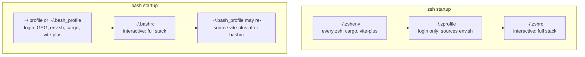

**Caveat:** PATH is built in `env.sh` via `path_prepend` (last call = highest priority) and `path_append` (fallbacks). Omarchy envs then prepend `omarchy/bin` again. Login files delegate to `env.sh`. Use `path_debug` when troubleshooting. `path_add` remains as an alias for `path_prepend`.

---

## zsh load order (live `~/.zshrc`)

Recommended daily driver. Omarchy is sourced **modularly** (not via `rc`). Omarchy envs load only via `env.sh` (not duplicated in `.zshrc`).

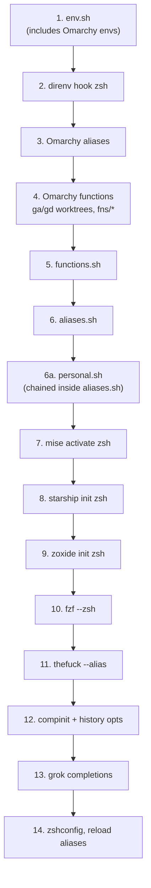

| Step | File / command | Notes |
|------|----------------|-------|
| 1 | `env.sh` | Single source for Omarchy envs |
| 4 | Omarchy `functions` | Defines `ga()` git-worktree helper — **never alias `ga`** |
| 6 | `aliases.sh` | `ff` = **fastfetch** (wins over Omarchy) |
| 7–11 | tool inits | All in `.zshrc`, not Omarchy `init` |

---

## bash load order (live `~/.bashrc`)

Bash uses Omarchy's monolithic `rc` bundle instead of modular parts. Load order now matches zsh override semantics.

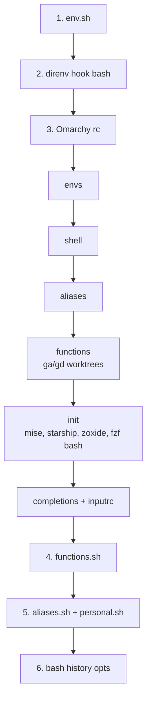

Omarchy functions like `ga()` load **before** `aliases.sh`, so bash does not hit `syntax error near unexpected token '('` if someone re-adds `alias ga=`.

---

## Omarchy integration: zsh vs bash

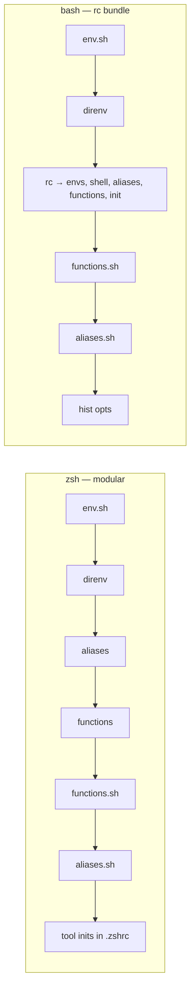

| Concern | zsh | bash |
|---------|-----|------|
| Omarchy envs | via `env.sh` only | via `env.sh` + rc (harmless duplicate) |
| `ga` worktree fn | Omarchy functions | Omarchy functions (safe order) |
| `ff` | fastfetch (`aliases.sh` wins) | fastfetch (`aliases.sh` wins) |
| mise / starship | `.zshrc` | Omarchy `init` inside rc |
| thefuck | `.zshrc` only | not loaded |
| direnv | after `env.sh` | after `env.sh` |

---

## Override precedence

Later definitions win **within the same shell**. Bash and zsh now share the same override semantics for the `~/.config/shell` layer.

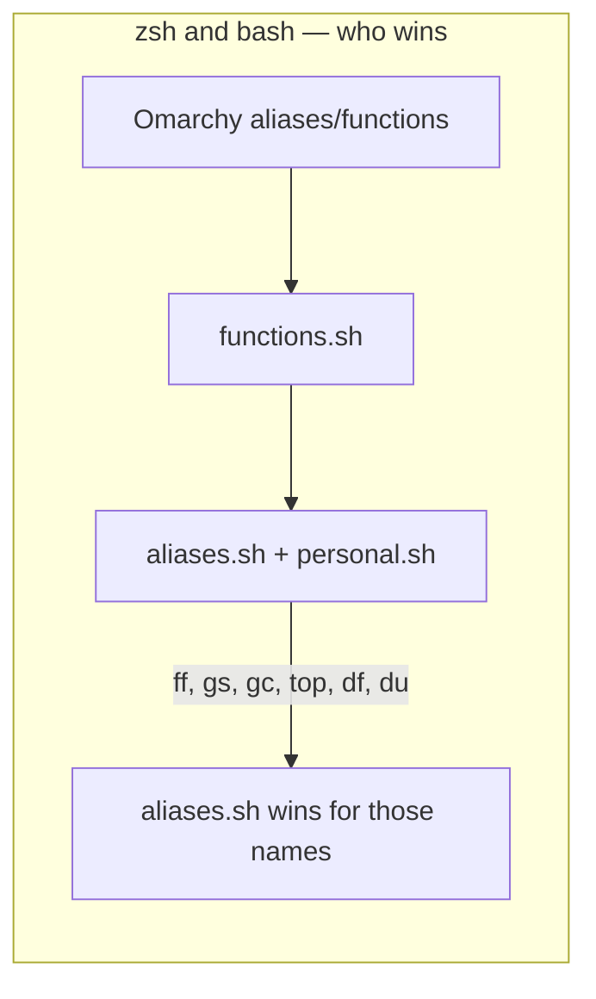

### Reserved names

| Name | Owner | Meaning | Do not |
|------|-------|---------|--------|
| `ga` | Omarchy `fns/worktrees` | `git worktree add` helper | `alias ga='git add'` |
| `gd` | Omarchy `fns/worktrees` | remove worktree + branch | alias over it |
| `ff` | `aliases.sh` (override) | fastfetch in all shells | assume Omarchy's fzf meaning |

Use `fzf` directly or Omarchy's `eff` for file picking.

---

## fish (best-effort)

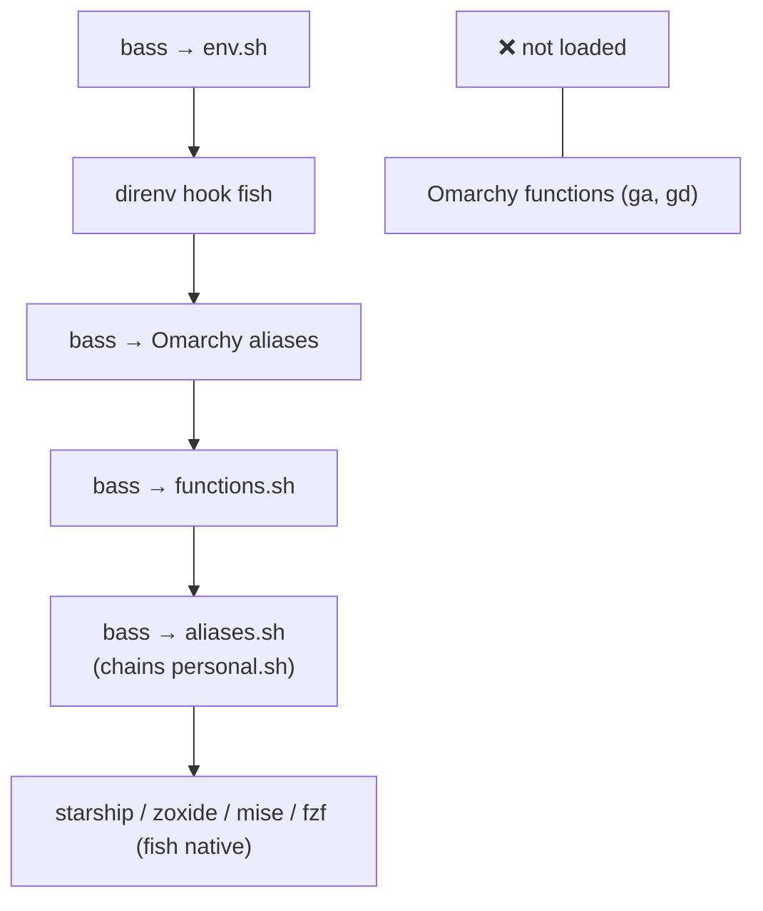

Fish gets PATH/exports, direnv, `functions.sh`, thefuck, Omarchy aliases, and work shortcuts via `aliases.sh` → `personal.sh`. Worktree helpers (`ga`, `gd`) still need fish-native function ports for full parity.

---

## Tool initialization matrix

| Tool | zsh | bash | fish | Where |
|------|-----|------|------|-------|
| direnv | `.zshrc` | `.bashrc` | `config.fish` | hook after `env.sh` |
| mise | `.zshrc` | Omarchy `init` | `config.fish` | |
| starship | `.zshrc` | Omarchy `init` | `config.fish` | |
| zoxide | `.zshrc` | Omarchy `init` | `config.fish` | |
| fzf | `.zshrc` | Omarchy `init` | `config.fish` | |
| thefuck | `.zshrc` | — | `config.fish` | native fish only |
| compinit | `.zshrc` | — | — | |
| grok completions | `.zshrc` | — | — | |

---

## Login dotfiles (manual setup)

`bin/migrate.sh` **backs up** login-layer dotfiles but does **not** generate them. Without these, login shells may miss early PATH, GPG agent, cargo, or vite-plus setup.

Copy or create these in `$HOME` (templates match a typical Omarchy + portable-env setup):

**`~/.zprofile`** — login zsh only; early PATH via portable env:

```bash
# Login PATH — delegate to portable env (~/.config/shell/env.sh)
[ -f "$HOME/.config/shell/env.sh" ] && . "$HOME/.config/shell/env.sh"
```

**`~/.zshenv`** — every zsh (including scripts):

```bash
. "$HOME/.cargo/env"

# Vite+ bin (https://viteplus.dev)
. "$HOME/.vite-plus/env"
```

**`~/.profile`** — POSIX login (GPG, env, cargo, vite-plus):

```bash
. "$HOME/.local/bin/env"
export GPG_TTY=$(tty)
gpg-connect-agent updatestartuptty /bye >/dev/null 2>&1 || true

# Portable PATH and exports (~/.config/shell/env.sh)
[ -f "$HOME/.config/shell/env.sh" ] && . "$HOME/.config/shell/env.sh"

. "$HOME/.cargo/env"

# Vite+ bin (https://viteplus.dev)
. "$HOME/.vite-plus/env"
```

**`~/.bash_profile`** — login bash; sources interactive rc then vite-plus:

```bash
[[ -f ~/.bashrc ]] && . ~/.bashrc

# Vite+ bin (https://viteplus.dev)
. "$HOME/.vite-plus/env"
```

After creating login files, compare PATH across modes: `zsh -ic path_debug`, `zsh -lc path_debug`, `bash -lc path_debug`.

---

## `migrate.sh` behavior

Re-running `bin/migrate.sh`:

| Action | Behavior |
|--------|----------|
| `env.sh`, `aliases.sh`, `functions.sh` | **Preserved** if they already exist |
| `personal.sh` | **Not generated** — create manually or copy from repo; `aliases.sh` sources it if present |
| `~/.zshrc`, `~/.bashrc`, fish config | **Refreshed** only if missing or marked managed; **skipped** if hand-edited |
| Login dotfiles (`~/.zprofile`, `~/.profile`, `~/.bash_profile`, `~/.zshenv`) | **Backed up only** — not generated (see [Login dotfiles](#login-dotfiles-manual-setup)) |
| `--force-rc` | Overwrites rc files even when hand-edited |
| Dotfile backups | Written to `backups/TIMESTAMP/` (gitignored) with `revert.sh` |
| `completions/` | Empty placeholder directory created; reserved for future shell completions |
| Package installs (Arch) | Tries `paru -S yazi thefuck` when missing; warns on failure |
| Git | `git init` + initial commit if `~/.config/shell/.git` absent; `git add -A` + commit on every run (no-op if clean) |

Managed rc files include the marker comment `Managed by ~/.config/shell/bin/migrate.sh`. Edit `~/.config/shell/*` modules for day-to-day changes; use `--force-rc` when you intentionally want template updates in rc files.

**direnv note:** Managed zsh/bash templates call `eval "$(direnv hook …)"` without a `command -v` guard (fish template does guard). Install direnv before sourcing rc files, or edit hooks locally.

Run `bin/check-shell.sh` after migrate to confirm nothing drifted.

---

## Operations

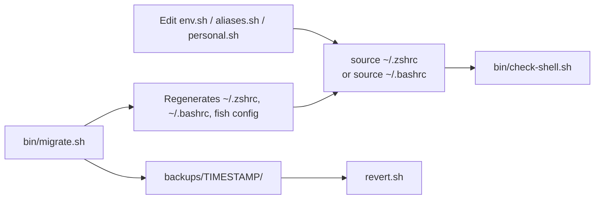

| Task | Command |
|------|---------|
| Verify config | `~/.config/shell/bin/check-shell.sh` |
| Reload zsh | `source ~/.zshrc` or `reload` |
| Reload bash | `source ~/.bashrc` |
| Re-apply template | `~/.config/shell/bin/migrate.sh` |
| Roll back dotfiles | `~/.config/shell/backups/<timestamp>/revert.sh` |

---

## Gotchas checklist

- [x] **Never alias `ga`** — Omarchy defines it as a git-worktree function; aliasing before the function breaks bash.
- [x] **`ff` consistent across shells** — `aliases.sh` loads after Omarchy in bash and zsh; `ff` = fastfetch everywhere.
- [x] **`functions.sh` wired** — sourced in bash and zsh rc files after Omarchy, before `aliases.sh`.
- [x] **`personal.sh` chained from `aliases.sh`** — not sourced directly by rc files.
- [x] **Omarchy envs not duplicated in zsh** — only via `env.sh`.
- [x] **direnv hooked** in bash and zsh when installed.
- [x] **migrate preserves modules** — won't overwrite existing `env.sh` / `aliases.sh` / `functions.sh`.
- [x] **PATH centralized** — `path_prepend`/`path_append` in `env.sh`; login files delegate; last prepend wins; use `path_debug`.
- [x] **secrets outside shell repo** — `~/.config/secrets/dev.env`; no `.envrc` in workspace.
- [ ] **fish is partial** — requires bass plugin; no `ga`/`gd` (direnv, fzf, `functions.sh`, thefuck added).
- [x] **migrate rc policy** — skips hand-edited rc files; refreshes managed ones; `--force-rc` to overwrite.
- [x] **login dotfiles manual** — migrate backs up but does not generate `~/.zprofile`, `~/.profile`, `~/.bash_profile`, `~/.zshenv`.
- [x] **direnv required for managed zsh/bash** — templates hook direnv unconditionally; install before first `source ~/.zshrc`.

---

## Related files

| Path | Purpose |
|------|---------|
| [README.md](README.md) | Philosophy, switching shells, where to add aliases, maintenance |
| [env.sh](env.sh) | Portable environment |
| [aliases.sh](aliases.sh) | Shared aliases + `personal.sh` chain |
| [personal.sh](personal.sh) | Work-specific shortcuts |
| [functions.sh](functions.sh) | Custom functions |
| [bin/migrate.sh](bin/migrate.sh) | Setup script and dotfile templates |
| [bin/check-shell.sh](bin/check-shell.sh) | Load-order verification |