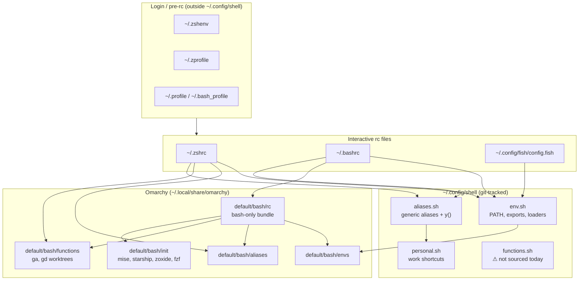
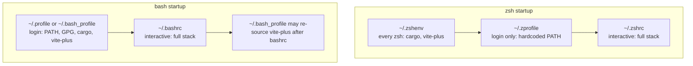
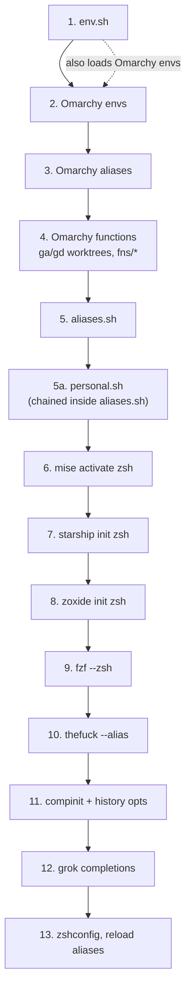
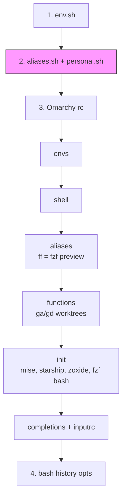
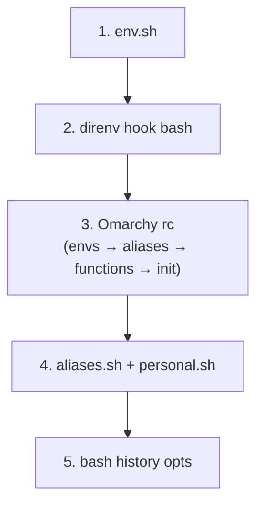
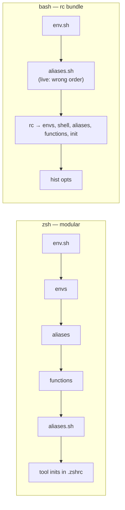
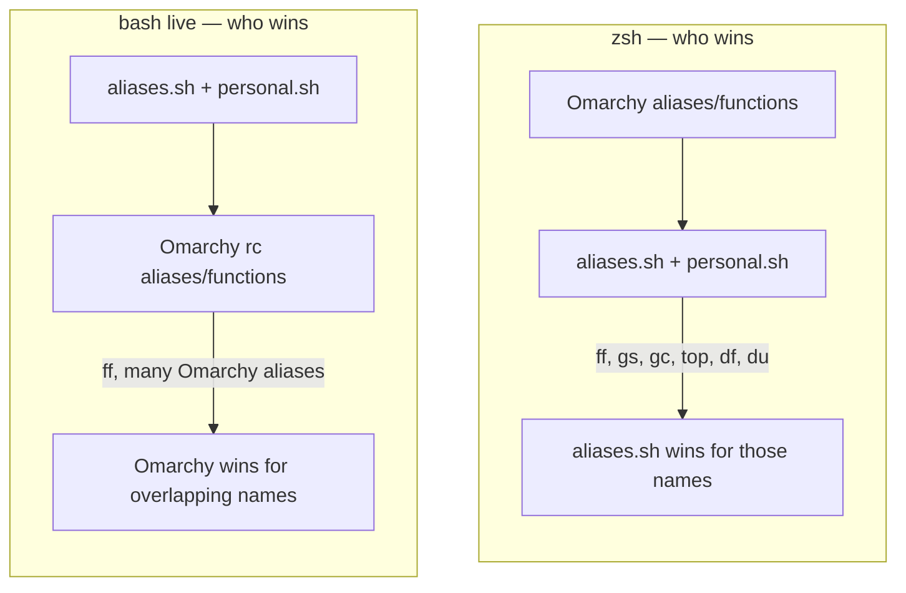
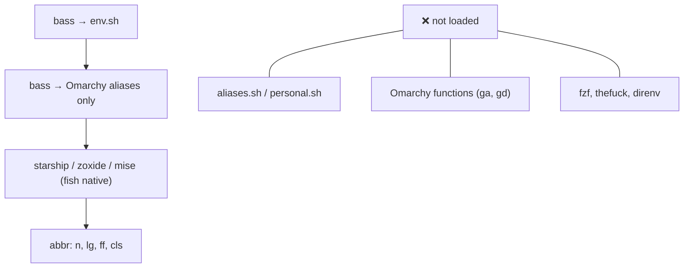
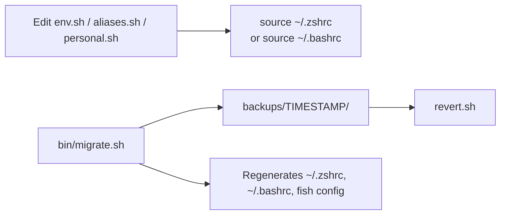

# Shell environment architecture

How `~/.config/shell/` layers portable environment, Omarchy, and shell-native tooling across **zsh**, **bash**, and **fish**.

For day-to-day editing guidance see [README.md](README.md). This document is the **accurate load-order reference** — verified against live dotfiles and `bin/migrate.sh`.

---

## Overview

**Key idea:** `env.sh` is the portable foundation. Omarchy is your personal base layer (aliases, functions, tool hooks). `aliases.sh` adds non-conflicting extras and chains `personal.sh` at the end. **Bash and zsh integrate Omarchy differently** — do not assume one shared order.

---

## `~/.config/shell` modules

| File | Role | Sourced by |
|------|------|------------|
| `env.sh` | `path_add`, exports (SSH, GPG, threads), Omarchy envs, cargo/vite loaders | zsh, bash, fish (via bass) |
| `aliases.sh` | yazi `y()`, monitoring aliases, `ff`/`lg`/`n`, git shortcuts; **chains** `personal.sh` | zsh, bash |
| `personal.sh` | Work aliases (`agrepos`, `agcore`, `agproto`) | via `aliases.sh` tail only |
| `functions.sh` | Placeholder for custom functions | **nothing today** |
| `bin/migrate.sh` | Generates dotfiles, backups, intended load order | manual run |

### What `env.sh` sets up

```mermaid
flowchart LR
    subgraph path_add["path_add (deduped, prepended)"]
        p1["~/.local/bin"]
        p2["~/bin"]
        p3["mise shims"]
        p4["bun, opencode, solana, pnpm, cargo, risc0, grok"]
        p5["mamba (late)"]
    end

    subgraph exports["exports"]
        e1["PNPM_HOME"]
        e2["PIP_CACHE_DIR, TMPDIR"]
        e3["OMP/MKL threads, HSA_OVERRIDE"]
        e4["SSH_AUTH_SOCK, GPG_TTY"]
    end

    subgraph loaders["optional dotfiles"]
        l1["Omarchy envs"]
        l2["~/.local/bin/env"]
        l3["~/.vite-plus/env"]
        l4["~/.cargo/env"]
    end

    path_add --> exports --> loaders
```

---

## Login vs interactive layers

Some environment is applied **before** `~/.zshrc` or `~/.bashrc` run.

**Caveat:** PATH is built in multiple places (`path_add` in `env.sh`, Omarchy `OMARCHY_PATH/bin`, hardcoded exports in `~/.zprofile`). Later entries do not always win — `path_add` prepends, so order inside `env.sh` matters.

---

## zsh load order (live `~/.zshrc`)

Recommended daily driver. Omarchy is sourced **modularly** (not via `rc`).

| Step | File / command | Notes |
|------|----------------|-------|
| 1 | `env.sh` | Already sources Omarchy `envs` — step 2 duplicates that file |
| 4 | Omarchy `functions` | Defines `ga()` git-worktree helper — **never alias `ga`** |
| 5 | `aliases.sh` | `ff` = **fastfetch** (wins over Omarchy here) |
| 6–10 | tool inits | All in `.zshrc`, not Omarchy `init` |

**Intended (migrate.sh):** inserts `direnv hook zsh` after `env.sh`. Live `~/.zshrc` does **not** have direnv yet.

---

## bash load order

Bash uses Omarchy's monolithic `rc` bundle instead of modular parts.

### Live `~/.bashrc` (current)

The pink step is the problem: **`aliases.sh` runs before Omarchy `rc`**. Omarchy aliases loaded later can override yours — notably `ff` means **fzf** in bash but **fastfetch** in zsh.

### Intended (`migrate.sh` template)

This order matches zsh semantics: Omarchy functions like `ga()` load **before** `aliases.sh`, so bash does not hit `syntax error near unexpected token '('` if someone re-adds `alias ga=`.

---

## Omarchy integration: zsh vs bash

| Concern | zsh | bash (live) | bash (migrate template) |
|---------|-----|-------------|-------------------------|
| Omarchy envs | twice (env.sh + .zshrc) | via rc | via rc |
| `ga` worktree fn | Omarchy functions | Omarchy functions (if no `alias ga` first) | safe order |
| `ff` | fastfetch | fzf (Omarchy wins) | fastfetch if order fixed |
| mise / starship | `.zshrc` | Omarchy `init` inside rc | Omarchy `init` |
| thefuck | `.zshrc` only | not loaded | not loaded |
| direnv | missing live | missing live | after env.sh |

---

## Override precedence

Later definitions win **within the same shell**, but bash and zsh load Omarchy at different points.

### Reserved names

| Name | Owner | Meaning | Do not |
|------|-------|---------|--------|
| `ga` | Omarchy `fns/worktrees` | `git worktree add` helper | `alias ga='git add'` |
| `gd` | Omarchy `fns/worktrees` | remove worktree + branch | alias over it |
| `ff` | **conflict** | fastfetch (zsh) vs fzf (bash live) | assume same across shells |

---

## fish (best-effort)

Fish gets PATH/exports and some Omarchy aliases. Work shortcuts (`agrepos`, etc.) and worktree helpers are **not** available unless you add fish-native equivalents.

---

## Tool initialization matrix

| Tool | zsh | bash | fish | Where |
|------|-----|------|------|-------|
| direnv | migrate only | migrate only | — | hook after `env.sh` |
| mise | `.zshrc` | Omarchy `init` | `config.fish` | |
| starship | `.zshrc` | Omarchy `init` | `config.fish` | |
| zoxide | `.zshrc` | Omarchy `init` | `config.fish` | |
| fzf | `.zshrc` | Omarchy `init` | — | |
| thefuck | `.zshrc` | — | — | |
| compinit | `.zshrc` | — | — | |
| grok completions | `.zshrc` | — | — | |

---

## Live vs `migrate.sh` drift

Re-running `bin/migrate.sh` regenerates dotfiles. Your live configs may differ:

| Item | Live | migrate.sh generates |
|------|------|----------------------|
| bash Omarchy order | aliases **before** rc | rc **before** aliases |
| direnv | absent | hooked in bash + zsh |
| `aliases.sh` → `personal.sh` | chained in live file | not in migrate heredoc |

Align live dotfiles with migrate (or update migrate to match your edits) before the next migration run.

---

## Operations

| Task | Command |
|------|---------|
| Reload zsh | `source ~/.zshrc` or `reload` |
| Reload bash | `source ~/.bashrc` |
| Re-apply template | `~/.config/shell/bin/migrate.sh` |
| Roll back dotfiles | `~/.config/shell/backups/<timestamp>/revert.sh` |

---

## Gotchas checklist

- [ ] **Never alias `ga`** — Omarchy defines it as a git-worktree function; aliasing first breaks bash with a syntax error.
- [ ] **`ff` differs by shell** on live bash (fzf) vs zsh (fastfetch) due to load order.
- [ ] **`functions.sh` is documented but unused** — wire it into rc files or remove from README.
- [ ] **`personal.sh` is not sourced by rc directly** — only via the tail of `aliases.sh`.
- [ ] **Omarchy envs load twice in zsh** — harmless but redundant.
- [ ] **PATH is set in `env.sh`, Omarchy, and `~/.zprofile`** — debug with `echo $PATH` per shell.
- [ ] **fish is partial** — no `ga`, no `personal.sh`, no `thefuck`/`fzf`.
- [ ] **migrate overwrites** manual `~/.bashrc` / `~/.zshrc` fixes unless migrate.sh is updated first.

---

## Related files

| Path | Purpose |
|------|---------|
| [README.md](README.md) | Philosophy, where to add aliases, maintenance |
| [env.sh](env.sh) | Portable environment |
| [aliases.sh](aliases.sh) | Shared aliases + `personal.sh` chain |
| [personal.sh](personal.sh) | Work-specific shortcuts |
| [bin/migrate.sh](bin/migrate.sh) | Setup script and intended dotfile templates |
