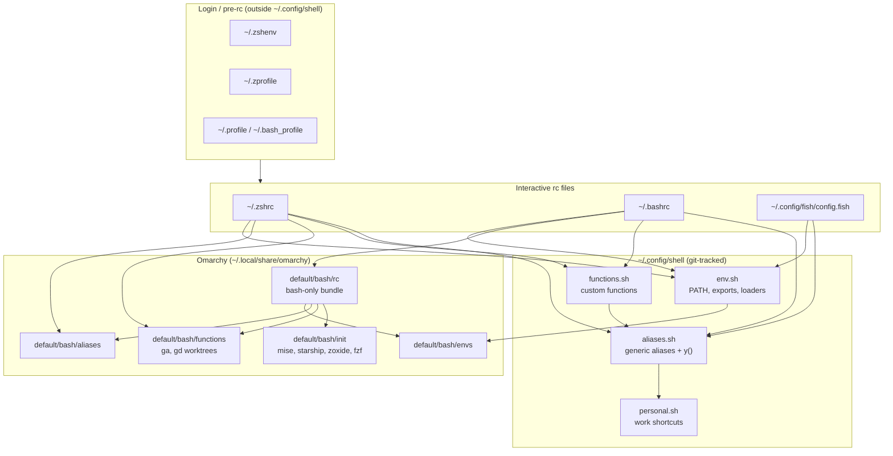
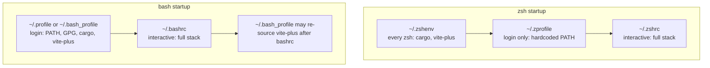
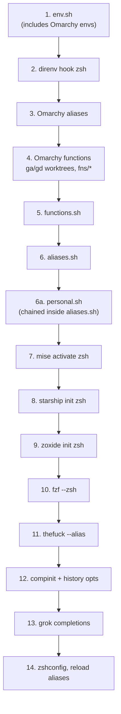
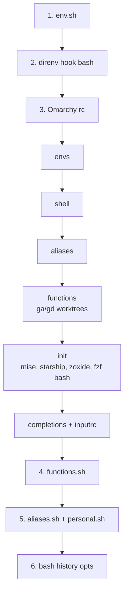
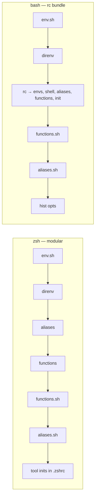
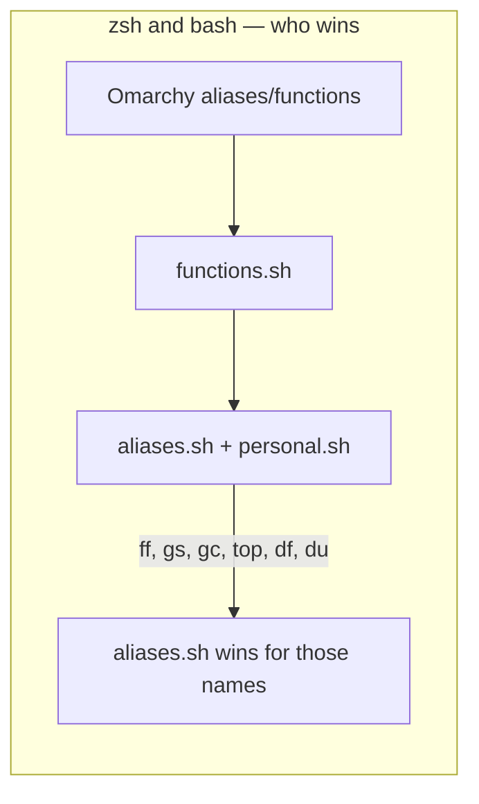
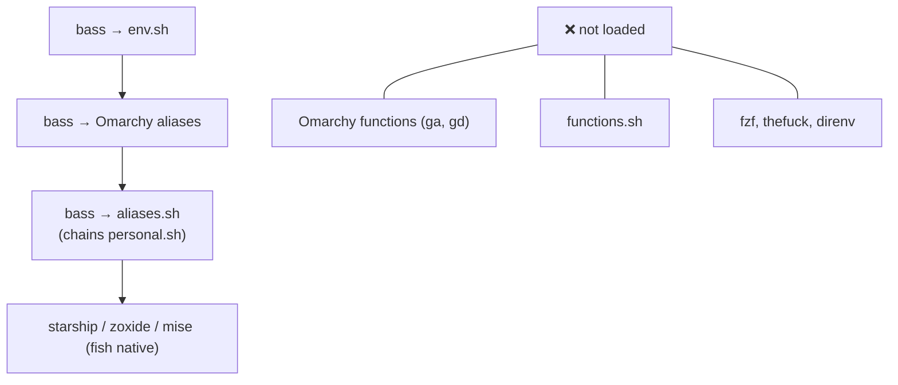
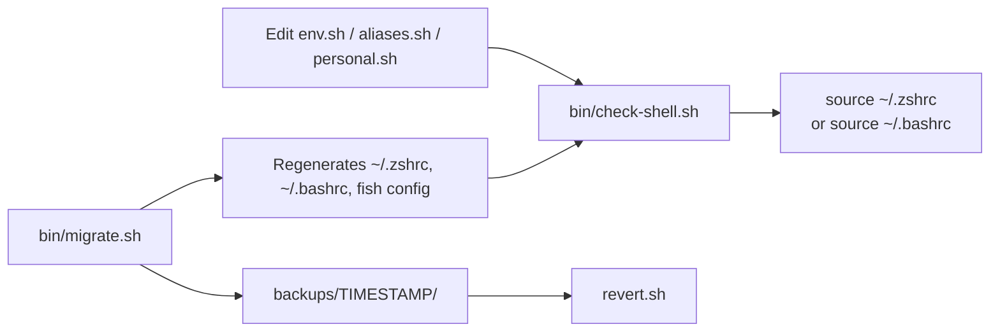

# Shell environment architecture

How `~/.config/shell/` layers portable environment, Omarchy, and shell-native tooling across **zsh**, **bash**, and **fish**.

For day-to-day editing guidance see [README.md](README.md). This document is the **accurate load-order reference** — verified against live dotfiles and `bin/migrate.sh`.

---

## Overview

**Key idea:** `env.sh` is the portable foundation (including Omarchy envs). Omarchy aliases and functions load next. `functions.sh` and `aliases.sh` load after Omarchy so your overrides win. `personal.sh` chains from the tail of `aliases.sh`. **Bash and zsh integrate Omarchy differently** — modular in zsh, `rc` bundle in bash — but override semantics match.

---

## `~/.config/shell` modules

| File | Role | Sourced by |
|------|------|------------|
| `env.sh` | `path_add`, exports (SSH, GPG, threads), Omarchy envs, cargo/vite loaders | zsh, bash, fish (via bass) |
| `aliases.sh` | yazi `y()`, monitoring aliases, `ff`/`lg`/`n`, git shortcuts; **chains** `personal.sh` | zsh, bash, fish (via bass) |
| `personal.sh` | Work aliases (`agrepos`, `agcore`, `agproto`) | via `aliases.sh` tail only |
| `functions.sh` | Custom functions (placeholder today) | zsh, bash rc files |
| `bin/migrate.sh` | Generates dotfiles, backups; preserves existing modules | manual run |
| `bin/check-shell.sh` | Verifies load order, direnv hooks, reserved names | manual run |

### What `env.sh` sets up

```mermaid
flowchart LR
    subgraph path_add["path_add (deduped, prepended)"]
        p1["~/.local/bin"]
        p2["~/bin"]
        p3["mise shims"]
        p4["bun, opencode, solana, pnpm, cargo, risc0, grok"]
        p5["mamba (late)"]
    end

    subgraph exports["exports"]
        e1["PNPM_HOME"]
        e2["PIP_CACHE_DIR, TMPDIR"]
        e3["OMP/MKL threads, HSA_OVERRIDE"]
        e4["SSH_AUTH_SOCK, GPG_TTY"]
    end

    subgraph loaders["optional dotfiles"]
        l1["Omarchy envs"]
        l2["~/.local/bin/env"]
        l3["~/.vite-plus/env"]
        l4["~/.cargo/env"]
    end

    path_add --> exports --> loaders
```

---

## Login vs interactive layers

Some environment is applied **before** `~/.zshrc` or `~/.bashrc` run.

**Caveat:** PATH is built in multiple places (`path_add` in `env.sh`, Omarchy `OMARCHY_PATH/bin`, hardcoded exports in `~/.zprofile`). Later entries do not always win — `path_add` prepends, so order inside `env.sh` matters.

---

## zsh load order (live `~/.zshrc`)

Recommended daily driver. Omarchy is sourced **modularly** (not via `rc`). Omarchy envs load only via `env.sh` (not duplicated in `.zshrc`).

| Step | File / command | Notes |
|------|----------------|-------|
| 1 | `env.sh` | Single source for Omarchy envs |
| 4 | Omarchy `functions` | Defines `ga()` git-worktree helper — **never alias `ga`** |
| 6 | `aliases.sh` | `ff` = **fastfetch** (wins over Omarchy) |
| 7–11 | tool inits | All in `.zshrc`, not Omarchy `init` |

---

## bash load order (live `~/.bashrc`)

Bash uses Omarchy's monolithic `rc` bundle instead of modular parts. Load order now matches zsh override semantics.

Omarchy functions like `ga()` load **before** `aliases.sh`, so bash does not hit `syntax error near unexpected token '('` if someone re-adds `alias ga=`.

---

## Omarchy integration: zsh vs bash

| Concern | zsh | bash |
|---------|-----|------|
| Omarchy envs | via `env.sh` only | via `env.sh` + rc (harmless duplicate) |
| `ga` worktree fn | Omarchy functions | Omarchy functions (safe order) |
| `ff` | fastfetch (`aliases.sh` wins) | fastfetch (`aliases.sh` wins) |
| mise / starship | `.zshrc` | Omarchy `init` inside rc |
| thefuck | `.zshrc` only | not loaded |
| direnv | after `env.sh` | after `env.sh` |

---

## Override precedence

Later definitions win **within the same shell**. Bash and zsh now share the same override semantics for the `~/.config/shell` layer.

### Reserved names

| Name | Owner | Meaning | Do not |
|------|-------|---------|--------|
| `ga` | Omarchy `fns/worktrees` | `git worktree add` helper | `alias ga='git add'` |
| `gd` | Omarchy `fns/worktrees` | remove worktree + branch | alias over it |
| `ff` | `aliases.sh` (override) | fastfetch in all shells | assume Omarchy's fzf meaning |

Use `fzf` directly or Omarchy's `eff` for file picking.

---

## fish (best-effort)

Fish gets PATH/exports, Omarchy aliases, and work shortcuts via `aliases.sh` → `personal.sh`. Worktree helpers (`ga`, `gd`) need fish-native rewrites or wrappers.

---

## Tool initialization matrix

| Tool | zsh | bash | fish | Where |
|------|-----|------|------|-------|
| direnv | `.zshrc` | `.bashrc` | — | hook after `env.sh` |
| mise | `.zshrc` | Omarchy `init` | `config.fish` | |
| starship | `.zshrc` | Omarchy `init` | `config.fish` | |
| zoxide | `.zshrc` | Omarchy `init` | `config.fish` | |
| fzf | `.zshrc` | Omarchy `init` | — | |
| thefuck | `.zshrc` | — | — | |
| compinit | `.zshrc` | — | — | |
| grok completions | `.zshrc` | — | — | |

---

## `migrate.sh` behavior

Re-running `bin/migrate.sh`:

| Action | Behavior |
|--------|----------|
| `env.sh`, `aliases.sh`, `functions.sh` | **Preserved** if they already exist |
| `~/.zshrc`, `~/.bashrc`, fish config | **Regenerated** from templates |
| Dotfile backups | Written to `backups/TIMESTAMP/` with `revert.sh` |

Templates match live load order: Omarchy before `aliases.sh`, direnv hooked, `functions.sh` wired, `personal.sh` chained in generated `aliases.sh`.

Run `bin/check-shell.sh` after migrate to confirm nothing drifted.

---

## Operations

| Task | Command |
|------|---------|
| Verify config | `~/.config/shell/bin/check-shell.sh` |
| Reload zsh | `source ~/.zshrc` or `reload` |
| Reload bash | `source ~/.bashrc` |
| Re-apply template | `~/.config/shell/bin/migrate.sh` |
| Roll back dotfiles | `~/.config/shell/backups/<timestamp>/revert.sh` |

---

## Gotchas checklist

- [x] **Never alias `ga`** — Omarchy defines it as a git-worktree function; aliasing before the function breaks bash.
- [x] **`ff` consistent across shells** — `aliases.sh` loads after Omarchy in bash and zsh; `ff` = fastfetch everywhere.
- [x] **`functions.sh` wired** — sourced in bash and zsh rc files after Omarchy, before `aliases.sh`.
- [x] **`personal.sh` chained from `aliases.sh`** — not sourced directly by rc files.
- [x] **Omarchy envs not duplicated in zsh** — only via `env.sh`.
- [x] **direnv hooked** in bash and zsh when installed.
- [x] **migrate preserves modules** — won't overwrite existing `env.sh` / `aliases.sh` / `functions.sh`.
- [ ] **PATH is set in `env.sh`, Omarchy, and `~/.zprofile`** — debug with `echo $PATH` per shell.
- [ ] **fish is partial** — no `ga`/`gd`, no `functions.sh`, no `thefuck`/`fzf`/`direnv`.
- [ ] **migrate still regenerates** `~/.bashrc` / `~/.zshrc` — update migrate templates before re-running if you've hand-edited rc files.

---

## Related files

| Path | Purpose |
|------|---------|
| [README.md](README.md) | Philosophy, where to add aliases, maintenance |
| [env.sh](env.sh) | Portable environment |
| [aliases.sh](aliases.sh) | Shared aliases + `personal.sh` chain |
| [personal.sh](personal.sh) | Work-specific shortcuts |
| [functions.sh](functions.sh) | Custom functions |
| [bin/migrate.sh](bin/migrate.sh) | Setup script and dotfile templates |
| [bin/check-shell.sh](bin/check-shell.sh) | Load-order verification |